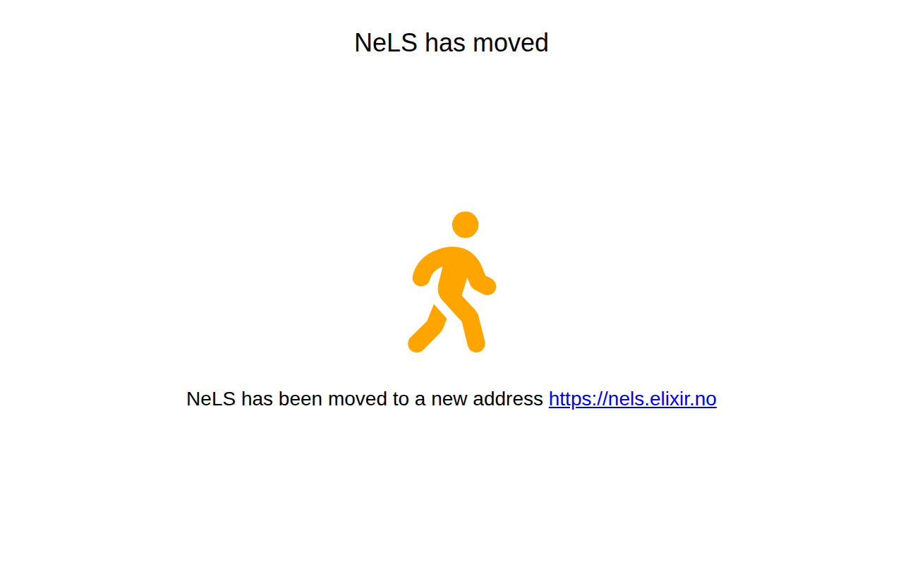

# bioinfo.no — 10.04.2026

[← bioinfo.no](../) &middot; [← All domains](../../)

Subdomains queried from [crt.sh](https://crt.sh/?q=%.bioinfo.no).

## Summary

| Metric | Count |
|-------:|------:|
| Total subdomains found | 11 |
| Online | 3 |
| ERR_NAME_NOT_RESOLVED | 8 |

## Online Subdomains

| Subdomain | Screenshot |
|-----------|-----------|
| `bioinfo.no` |  |
| `nels.bioinfo.no` |  |
| `www.bioinfo.no` |  |

## Other Results

| Subdomain | Status |
|-----------|--------|
| `docker.bioinfo.no` | `ERR_NAME_NOT_RESOLVED` |
| `galaxy-nmbu.bioinfo.no` | `ERR_NAME_NOT_RESOLVED` |
| `galaxy-ntnu.bioinfo.no` | `ERR_NAME_NOT_RESOLVED` |
| `galaxy-uib.bioinfo.no` | `ERR_NAME_NOT_RESOLVED` |
| `galaxy-uio.bioinfo.no` | `ERR_NAME_NOT_RESOLVED` |
| `galaxy-uit.bioinfo.no` | `ERR_NAME_NOT_RESOLVED` |
| `jexpress.bioinfo.no` | `ERR_NAME_NOT_RESOLVED` |
| `maas-test.bioinfo.no` | `ERR_NAME_NOT_RESOLVED` |
