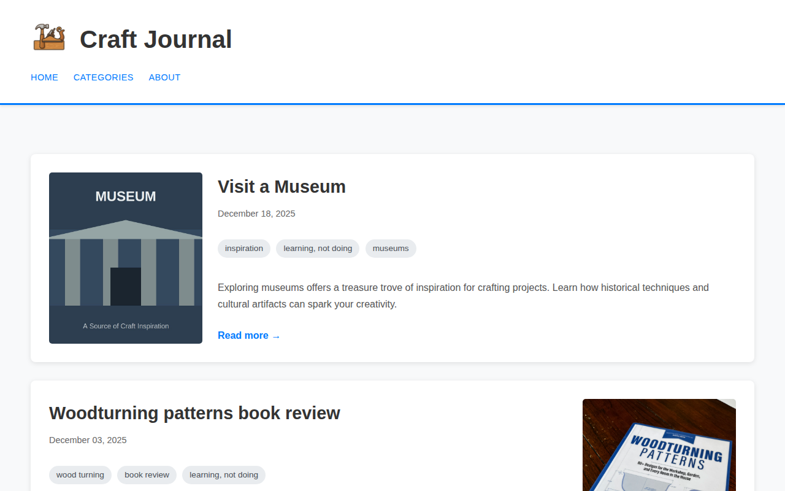
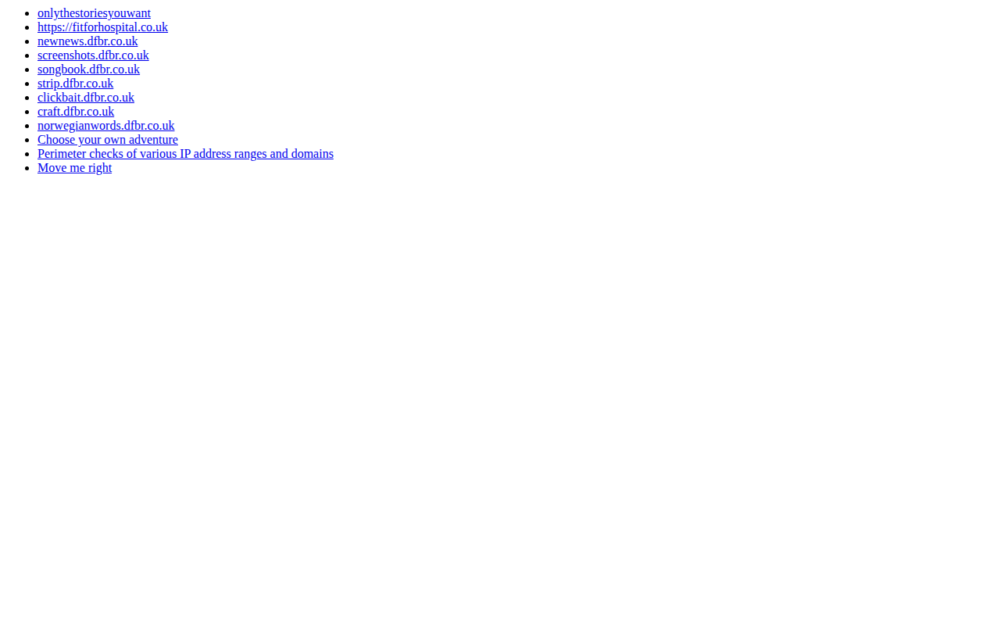
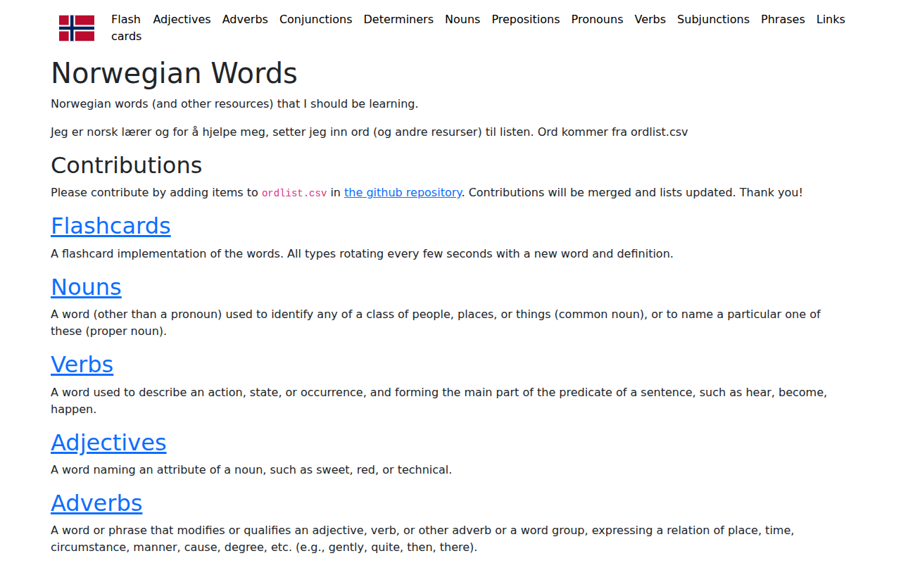
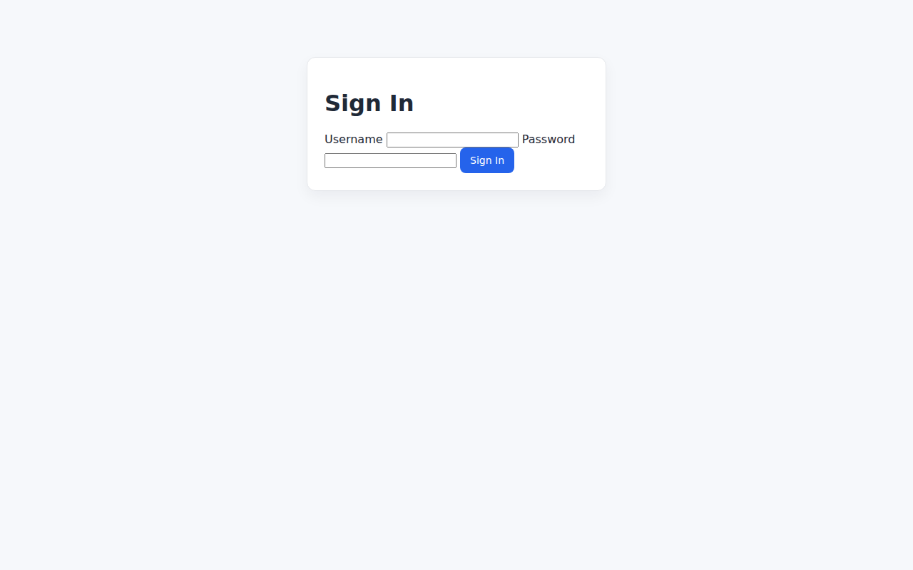
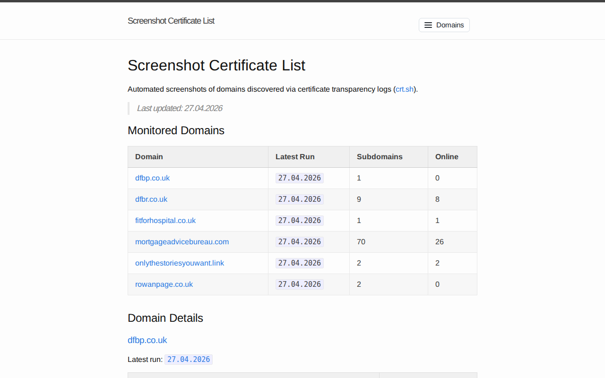
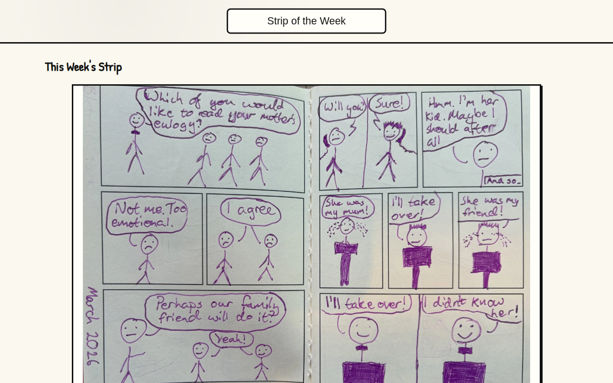

# dfbr.co.uk — 28.04.2026

[← dfbr.co.uk](../) &middot; [← All domains](../../)

Subdomains queried from [crt.sh](https://crt.sh/?q=%.dfbr.co.uk).

## Summary

| Metric | Count |
|-------:|------:|
| Total subdomains found | 9 |
| Online | 8 |
| HTTP 404 | 1 |

## Online Subdomains

| Subdomain | Screenshot |
|-----------|-----------|
| `clickbait.dfbr.co.uk` |  |
| `craft.dfbr.co.uk` |  |
| `dfbr.co.uk` |  |
| `newnews.dfbr.co.uk` |  |
| `norwegianwords.dfbr.co.uk` |  |
| `perimeter.dfbr.co.uk` |  |
| `screenshots.dfbr.co.uk` |  |
| `strip.dfbr.co.uk` |  |

## Other Results

| Subdomain | Status |
|-----------|--------|
| `movemeright.dfbr.co.uk` | `HTTP 404` |
