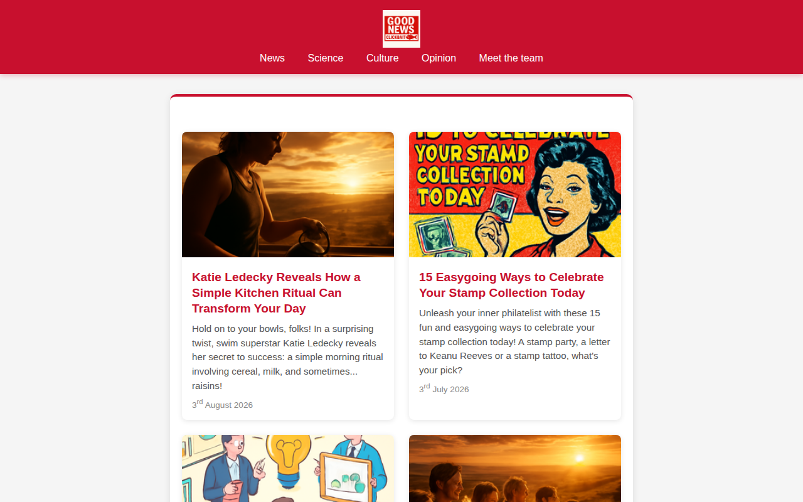
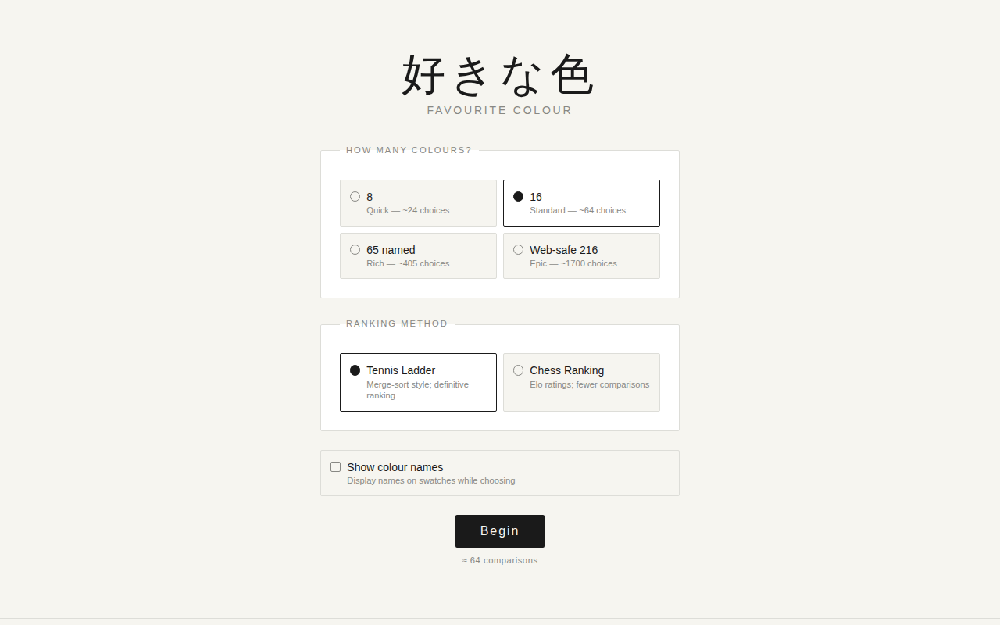
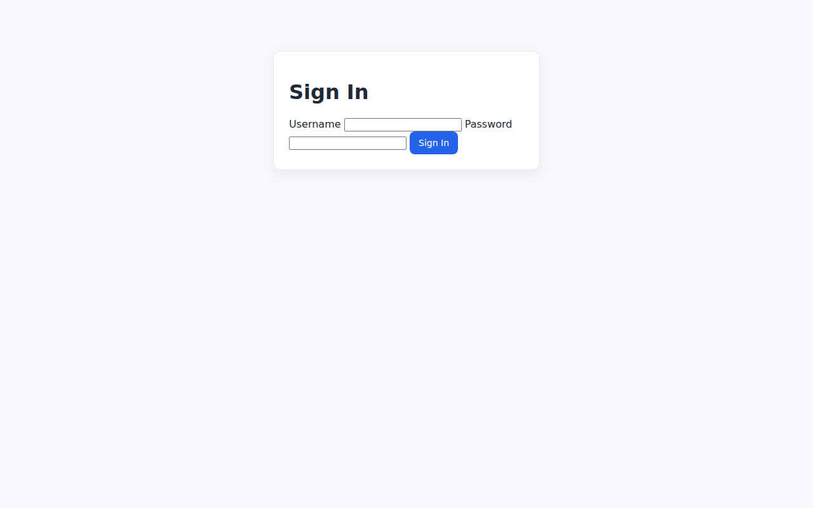
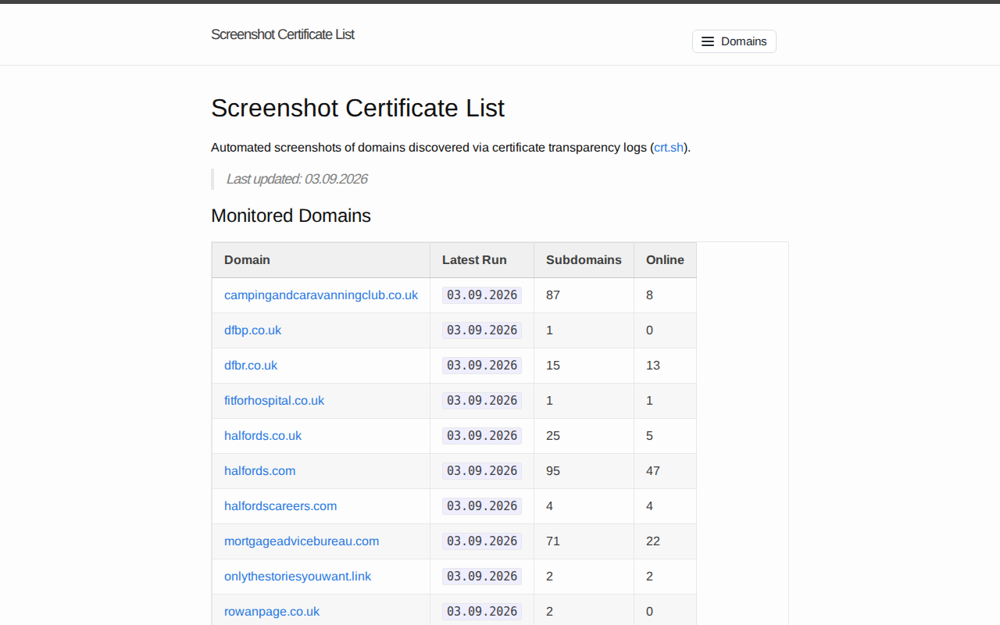
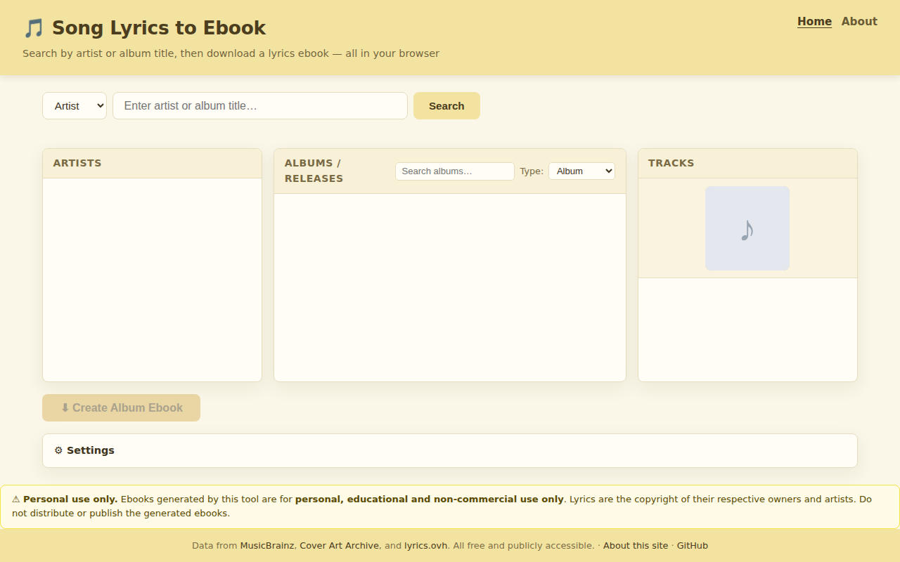
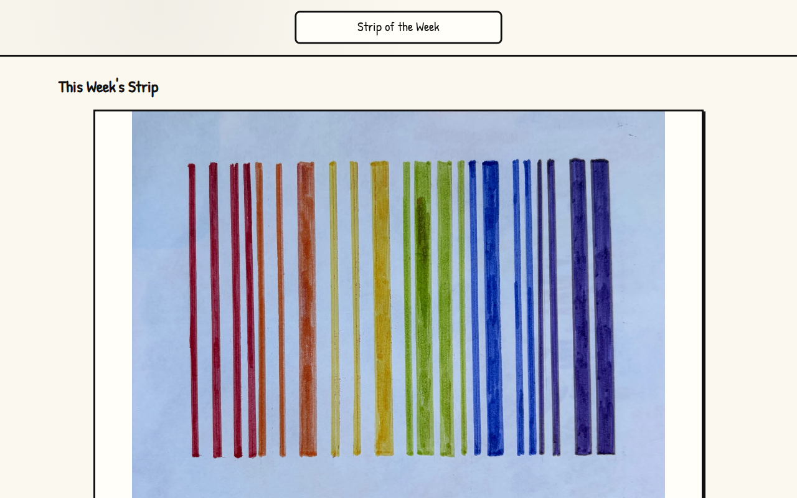

# dfbr.co.uk — 04.09.2026

[← dfbr.co.uk](../) &middot; [← All domains](../../)

Subdomains queried from [crt.sh](https://crt.sh/?q=%.dfbr.co.uk).

## Summary

| Metric | Count |
|-------:|------:|
| Total subdomains found | 15 |
| Online | 13 |
| HTTP 401 | 1 |
| HTTP 404 | 1 |

## Online Subdomains

| Subdomain | Certificate Expires | Screenshot |
|-----------|---------------------|-----------|
| `allthenews.dfbr.co.uk` | `2026-11-27` |  |
| `clickbait.dfbr.co.uk` | `2026-11-10` |  |
| `colours.dfbr.co.uk` | `2026-10-22` |  |
| `craft.dfbr.co.uk` | `2026-11-16` |  |
| `cyoa.dfbr.co.uk` | `2026-11-24` |  |
| `dfbr.co.uk` | `2026-10-01` |  |
| `essays.dfbr.co.uk` | `2026-11-05` |  |
| `newnews.dfbr.co.uk` | `2026-11-16` |  |
| `norwegianwords.dfbr.co.uk` | `2026-11-16` |  |
| `perimeter.dfbr.co.uk` | `2026-09-24` |  |
| `screenshots.dfbr.co.uk` | `2026-11-11` |  |
| `songbook.dfbr.co.uk` | `2026-10-02` |  |
| `strip.dfbr.co.uk` | `2026-11-10` |  |

## Other Results

| Subdomain | Certificate Expires | Status |
|-----------|---------------------|--------|
| `movemeright.dfbr.co.uk` | `2026-07-21` | `HTTP 404` |
| `pagephotos.dfbr.co.uk` | `2026-10-01` | `HTTP 401` |
