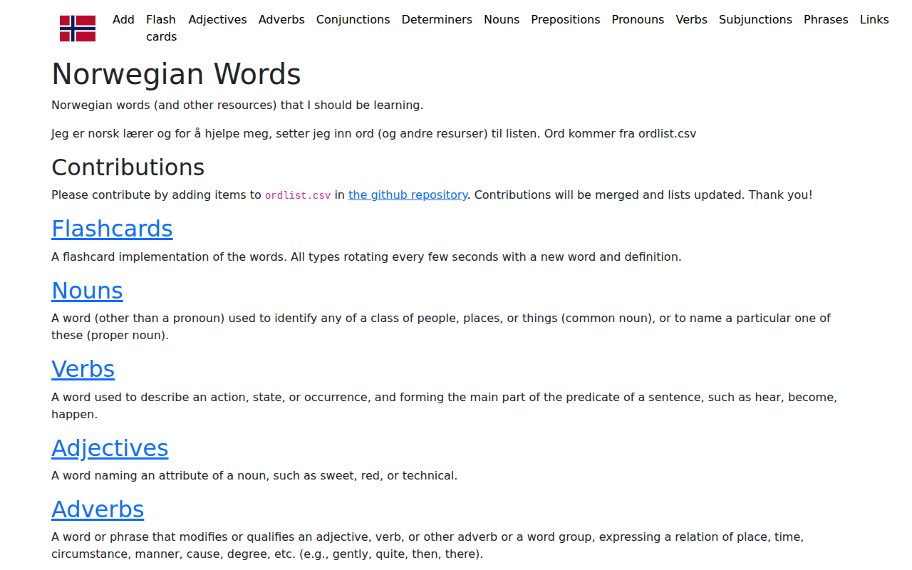

  

    

      <figure class="gallery-item">
        <a href="https://dfbr.github.io" target="_blank" rel="noopener noreferrer">
          
          <figcaption>dfbr.github.io</figcaption>
        </a>
      </figure>
    

  

