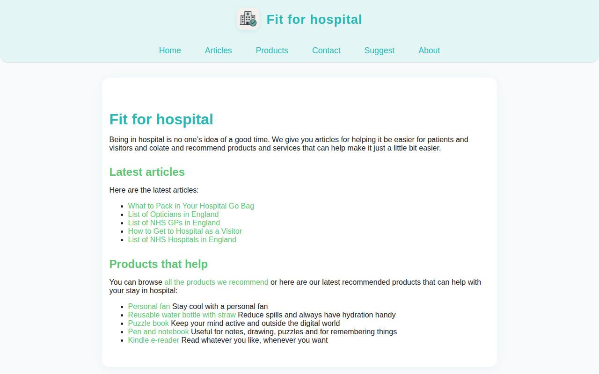

# fitforhospital.co.uk — 2026-04-07_06-19-08

[← fitforhospital.co.uk](../) &middot; [← All domains](../../)

Subdomains queried from [crt.sh](https://crt.sh/?q=%.fitforhospital.co.uk).

## Summary

| Metric | Count |
|-------:|------:|
| Total subdomains found | 1 |
| Online | 1 |

## Online Subdomains

| Subdomain | Screenshot |
|-----------|-----------|
| `fitforhospital.co.uk` |  |
