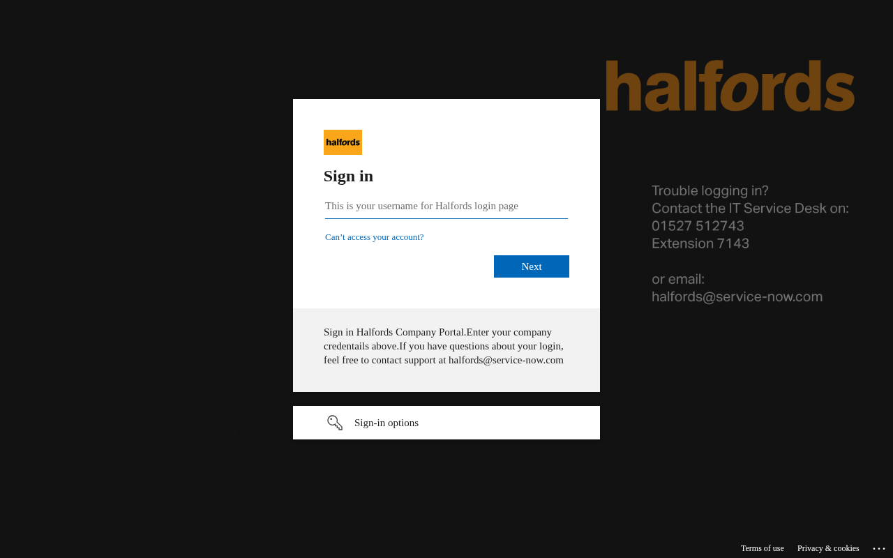

# halfords.co.uk — 03.07.2026

[← halfords.co.uk](../) &middot; [← All domains](../../)

Subdomains queried from [crt.sh](https://crt.sh/?q=%.halfords.co.uk).

## Summary

| Metric | Count |
|-------:|------:|
| Total subdomains found | 25 |
| Online | 5 |
| ERR_NAME_NOT_RESOLVED | 12 |
| HTTP 404 | 4 |
| timeout | 4 |

## Online Subdomains

| Subdomain | Certificate Expires | Screenshot |
|-----------|---------------------|-----------|
| `halfords.co.uk` | `2027-02-07` |  |
| `safetyportal.halfords.co.uk` | `2026-12-17` |  |
| `safetyportalqa.halfords.co.uk` | `2026-12-17` |  |
| `sftp.halfords.co.uk` | `2026-10-30` |  |
| `www.halfords.co.uk` | `2027-02-07` |  |

## Other Results

| Subdomain | Certificate Expires | Status |
|-----------|---------------------|--------|
| `api.halfords.co.uk` | `2026-10-12` | `HTTP 404` |
| `dev.api.halfords.co.uk` | `2026-10-12` | `HTTP 404` |
| `env.api.halfords.co.uk` | `2027-03-01` | `ERR_NAME_NOT_RESOLVED` |
| `fbcoexist.halfords.co.uk` | `2020-09-09` | `timeout` |
| `hfd-dmz-dc1.int.halfords.co.uk` | `2026-06-23` | `ERR_NAME_NOT_RESOLVED` |
| `hfd-st-arc-1.head-office.int.halfords.co.uk` | `2020-04-13` | `ERR_NAME_NOT_RESOLVED` |
| `hfd-t-xchk-hapi.head-test.int.halfords.co.uk` | `2022-09-06` | `ERR_NAME_NOT_RESOLVED` |
| `hfd-xchk-hapi.head-office.int.halfords.co.uk` | `2023-05-31` | `ERR_NAME_NOT_RESOLVED` |
| `hfd-xchk-restapi-clone.head-office.int.halfords.co.uk` | `2023-05-31` | `timeout` |
| `hfd-xchk-restapi.head-office.int.halfords.co.uk` | `2023-05-31` | `timeout` |
| `iservereport.halfords.co.uk` | `2025-09-23` | `HTTP 404` |
| `landeskcsa.halfords.co.uk` | `2026-06-12` | `timeout` |
| `mail.halfords.co.uk` | `2020-09-09` | `ERR_NAME_NOT_RESOLVED` |
| `qa.api.halfords.co.uk` | `2026-10-12` | `HTTP 404` |
| `qaloginproxy.halfords.co.uk` | `2026-10-26` | `ERR_NAME_NOT_RESOLVED` |
| `qaserviceproxy.halfords.co.uk` | `2026-10-26` | `ERR_NAME_NOT_RESOLVED` |
| `www.hfd-xchk-hapi.head-office.int.halfords.co.uk` | `2023-05-31` | `ERR_NAME_NOT_RESOLVED` |
| `www.hfd-xchk-restapi-clone.head-office.int.halfords.co.uk` | `2023-05-31` | `ERR_NAME_NOT_RESOLVED` |
| `www.hfd-xchk-restapi.head-office.int.halfords.co.uk` | `2023-05-31` | `ERR_NAME_NOT_RESOLVED` |
| `www.landeskcsa.halfords.co.uk` | `2022-07-09` | `ERR_NAME_NOT_RESOLVED` |
