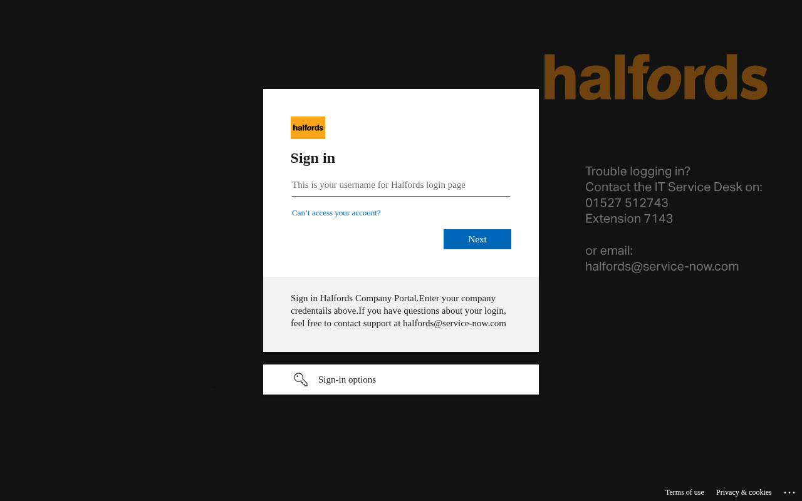

  

    

      <figure class="gallery-item">
        <a href="https://halfords.co.uk" target="_blank" rel="noopener noreferrer">
          
          <figcaption>halfords.co.uk</figcaption>
        </a>
      </figure>
      <figure class="gallery-item">
        <a href="https://safetyportal.halfords.co.uk" target="_blank" rel="noopener noreferrer">
          
          <figcaption>safetyportal.halfords.co.uk</figcaption>
        </a>
      </figure>
      <figure class="gallery-item">
        <a href="https://safetyportalqa.halfords.co.uk" target="_blank" rel="noopener noreferrer">
          
          <figcaption>safetyportalqa.halfords.co.uk</figcaption>
        </a>
      </figure>
      <figure class="gallery-item">
        <a href="https://sftp.halfords.co.uk" target="_blank" rel="noopener noreferrer">
          
          <figcaption>sftp.halfords.co.uk</figcaption>
        </a>
      </figure>
      <figure class="gallery-item">
        <a href="https://www.halfords.co.uk" target="_blank" rel="noopener noreferrer">
          
          <figcaption>www.halfords.co.uk</figcaption>
        </a>
      </figure>
    

  

