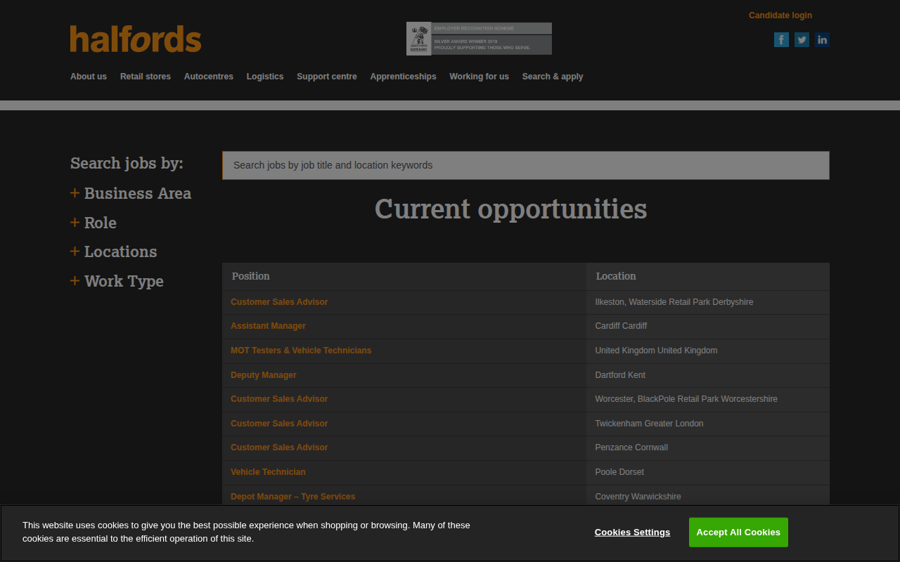

# halfordscareers.com — 03.09.2026

[← halfordscareers.com](../) &middot; [← All domains](../../)

Subdomains queried from [crt.sh](https://crt.sh/?q=%.halfordscareers.com).

## Summary

| Metric | Count |
|-------:|------:|
| Total subdomains found | 4 |
| Online | 4 |

## Online Subdomains

| Subdomain | Certificate Expires | Screenshot |
|-----------|---------------------|-----------|
| `careers.halfordscareers.com` | `2026-10-29` |  |
| `halfordscareers.com` | `2026-09-30` |  |
| `jobs.halfordscareers.com` | `2019-12-11` |  |
| `www.halfordscareers.com` | `2026-09-30` |  |
