# manutd.com — 14.04.2026

[← manutd.com](../) &middot; [← All domains](../../)

Subdomains queried from [crt.sh](https://crt.sh/?q=%.manutd.com).

## Summary

| Metric | Count |
|-------:|------:|
| Total subdomains found | 164 |
| Online | 32 |
| ERR_CONNECTION_REFUSED | 5 |
| ERR_CONNECTION_RESET | 1 |
| ERR_NAME_NOT_RESOLVED | 60 |
| HTTP 400 | 2 |
| HTTP 401 | 22 |
| HTTP 403 | 8 |
| HTTP 404 | 7 |
| HTTP 500 | 7 |
| HTTP 503 | 10 |
| HTTP 504 | 1 |
| Page.goto: Download is starting | 4 |
| timeout | 5 |

## Online Subdomains

| Subdomain | Screenshot |
|-----------|-----------|
| `asfalis.manutd.com` |  |
| `asfalisins-stg.manutd.com` |  |
| `assets4.manutd.com` |  |
| `beta.manutd.com` |  |
| `calendar.manutd.com` | [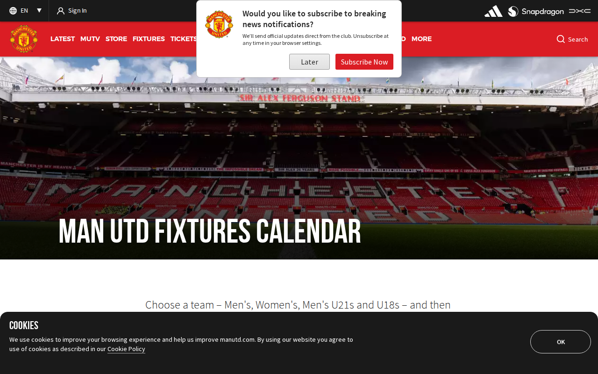](screenshots/calendar.manutd.com.png) |
| `cms-beta.manutd.com` | [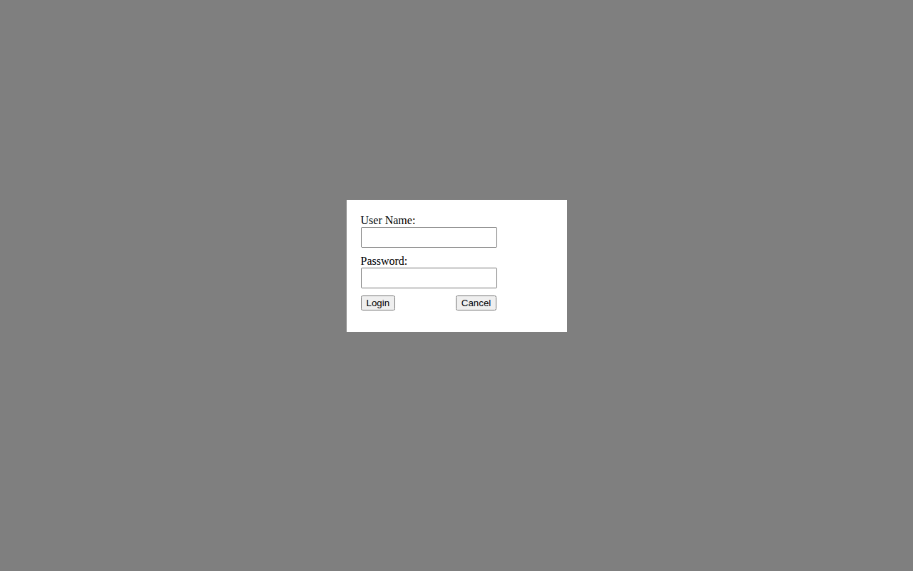](screenshots/cms-beta.manutd.com.png) |
| `cms-stg.manutd.com` |  |
| `collaboration.manutd.com` |  |
| `collectibles.manutd.com` |  |
| `csr.manutd.com` | [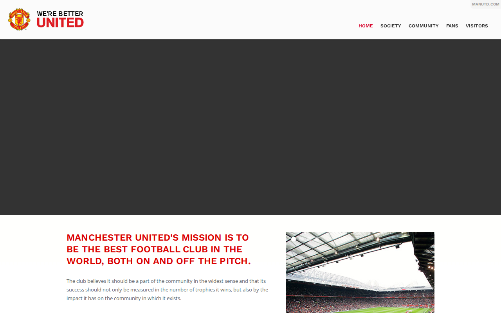](screenshots/csr.manutd.com.png) |
| `ir.manutd.com` | [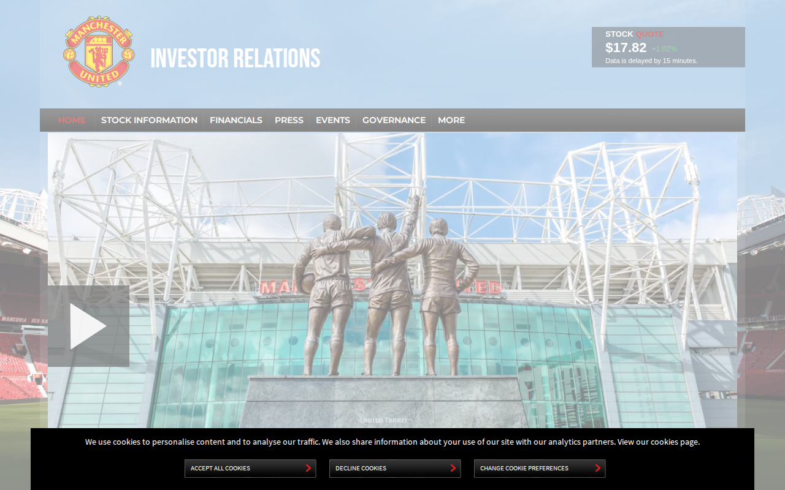](screenshots/ir.manutd.com.png) |
| `login-dev.manutd.com` |  |
| `login-stg.manutd.com` |  |
| `login.manutd.com` | [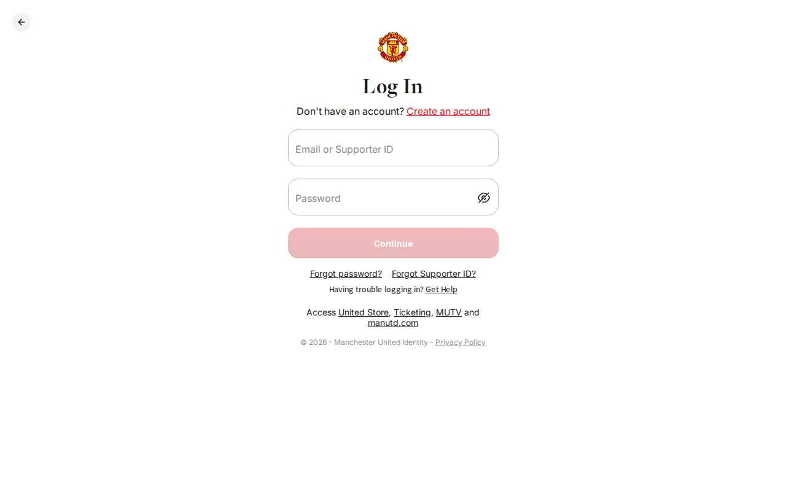](screenshots/login.manutd.com.png) |
| `m.store.manutd.com` | [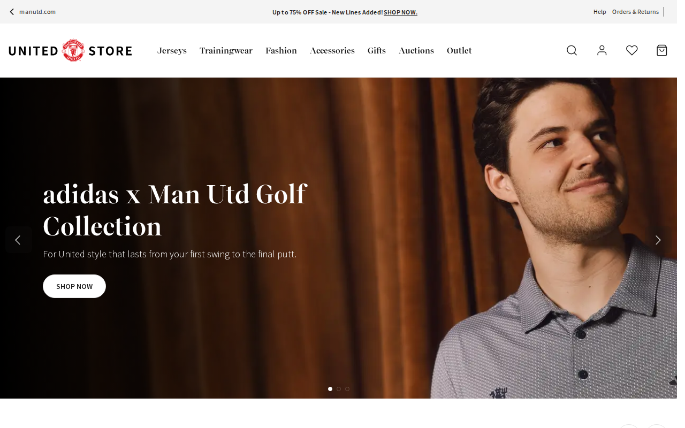](screenshots/m.store.manutd.com.png) |
| `manutd.com` | [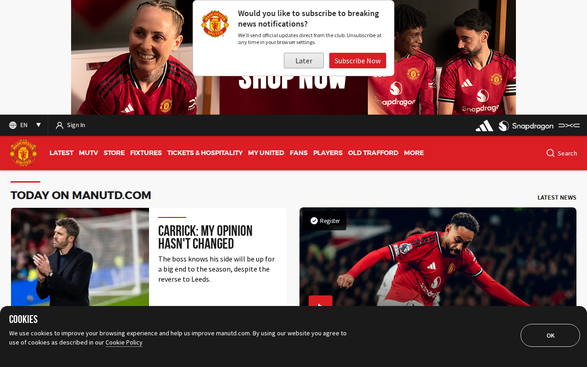](screenshots/manutd.com.png) |
| `mutv.manutd.com` | [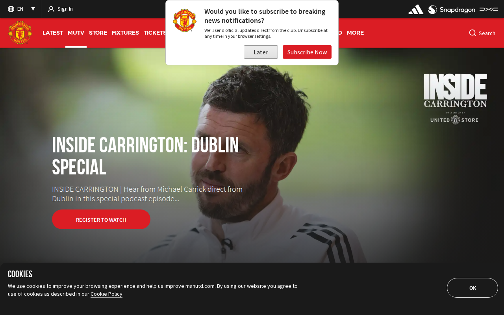](screenshots/mutv.manutd.com.png) |
| `payments.manutd.com` |  |
| `portal-stg.manutd.com` |  |
| `portal.manutd.com` |  |
| `resource.manutd.com` |  |
| `stg.payments.manutd.com` | [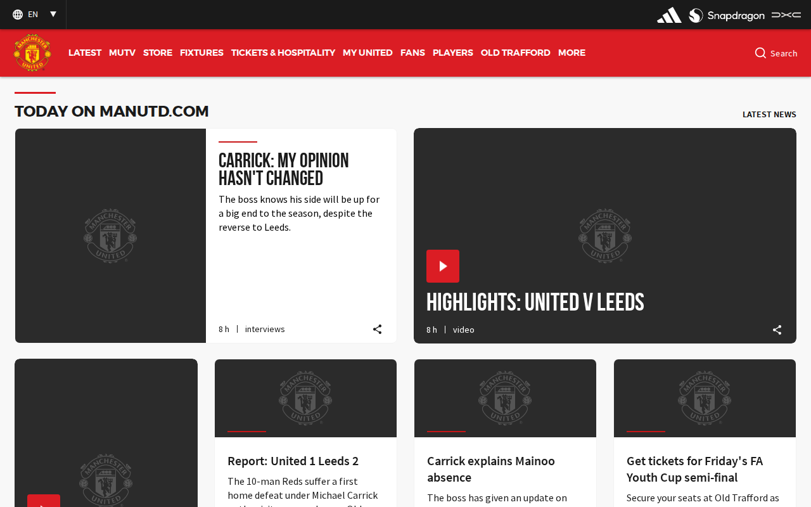](screenshots/stg.payments.manutd.com.png) |
| `store.manutd.com` |  |
| `store2.manutd.com` |  |
| `store3.manutd.com` |  |
| `store4.manutd.com` |  |
| `tickets-dev.manutd.com` | [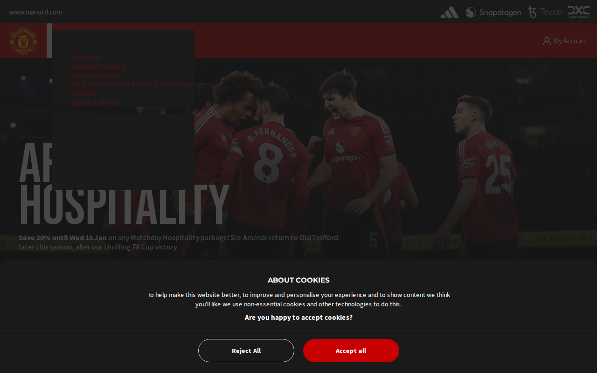](screenshots/tickets-dev.manutd.com.png) |
| `us.store.manutd.com` | [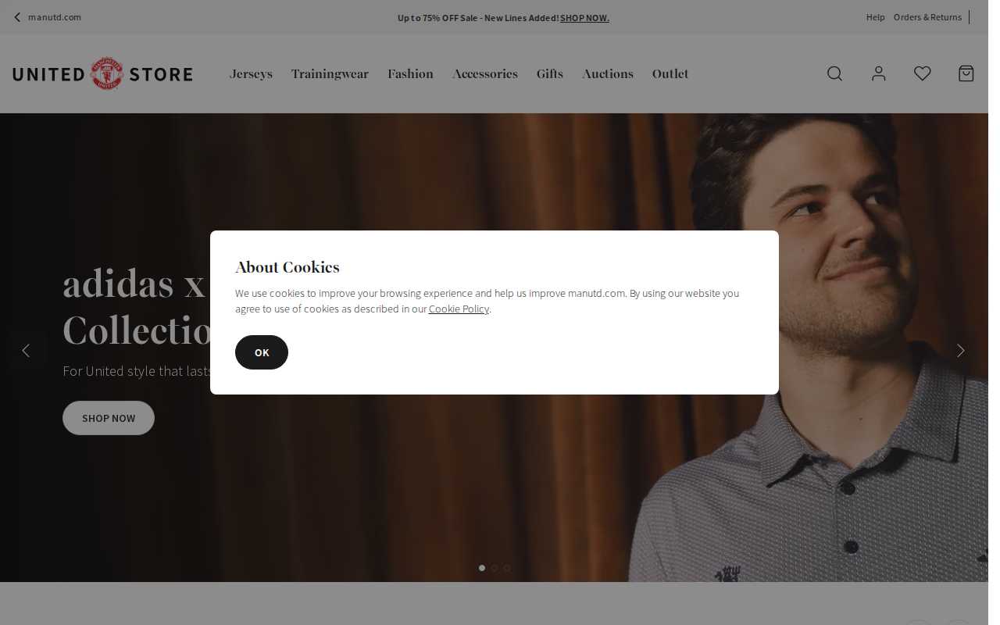](screenshots/us.store.manutd.com.png) |
| `www.executiveclub.manutd.com` | [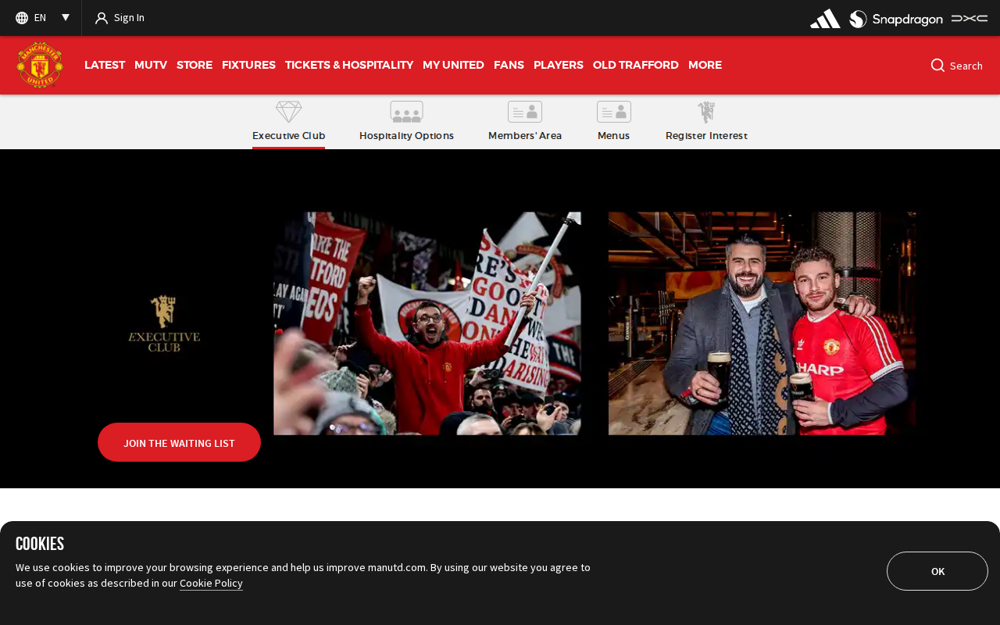](screenshots/www.executiveclub.manutd.com.png) |
| `www.manutd.com` | [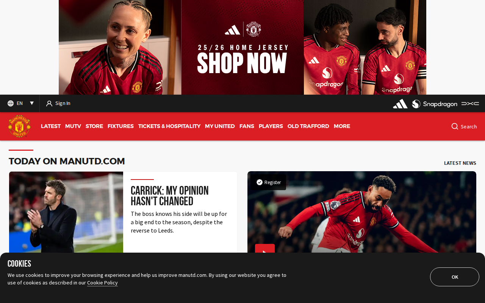](screenshots/www.manutd.com.png) |
| `www.matchdayvip.manutd.com` | [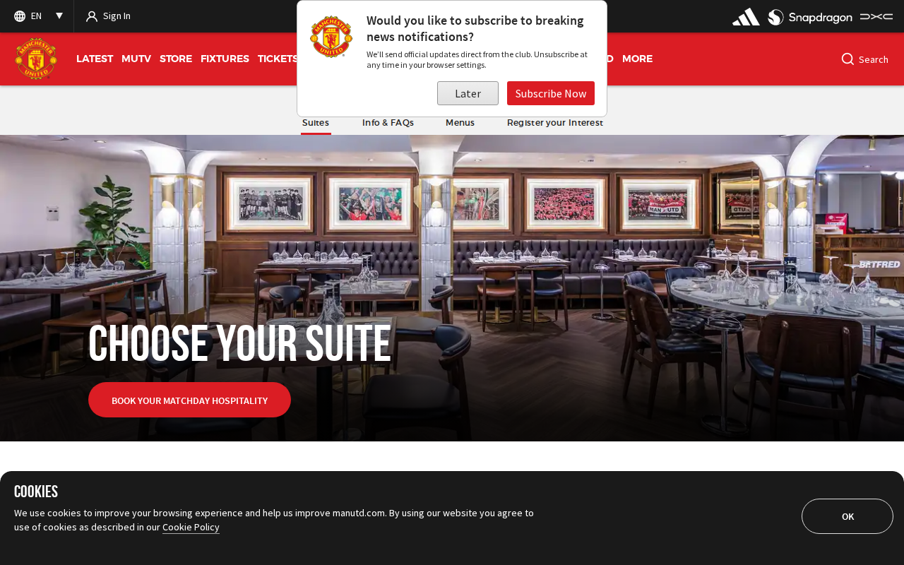](screenshots/www.matchdayvip.manutd.com.png) |
| `www.partner.manutd.com` | [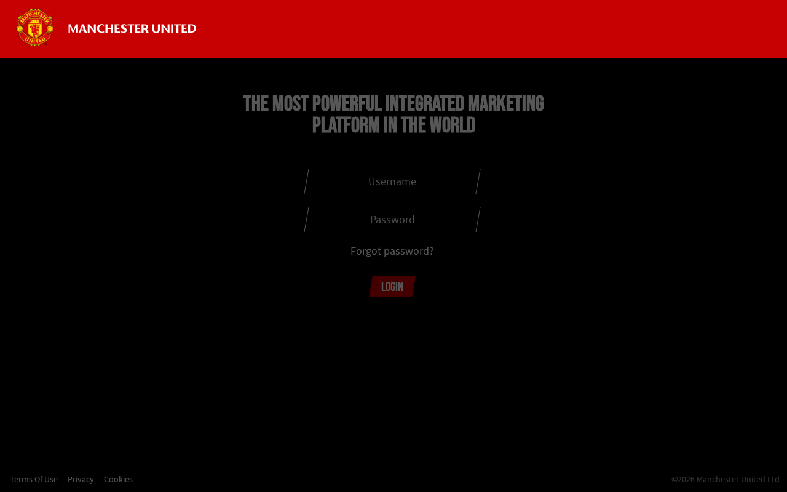](screenshots/www.partner.manutd.com.png) |

## Other Results

| Subdomain | Status |
|-----------|--------|
| `account-stg.manutd.com` | `HTTP 404` |
| `account.manutd.com` | `HTTP 403` |
| `admin-stg.manutd.com` | `ERR_CONNECTION_REFUSED` |
| `admin.manutd.com` | `timeout` |
| `api-stg.manutd.com` | `HTTP 500` |
| `api.manutd.com` | `HTTP 500` |
| `asfalisins-dev.manutd.com` | `timeout` |
| `assets-dev.manutd.com` | `HTTP 401` |
| `assets-int.manutd.com` | `HTTP 503` |
| `assets-mt.manutd.com` | `HTTP 404` |
| `assets-qa.manutd.com` | `HTTP 401` |
| `assets-stg.manutd.com` | `HTTP 403` |
| `assets.manutd.com` | `Page.goto: Download is starting` |
| `assets1-dev.manutd.com` | `HTTP 401` |
| `assets1-int.manutd.com` | `HTTP 503` |
| `assets1-qa.manutd.com` | `ERR_NAME_NOT_RESOLVED` |
| `assets1-stg.manutd.com` | `HTTP 403` |
| `assets1.manutd.com` | `Page.goto: Download is starting` |
| `assets2-dev.manutd.com` | `HTTP 401` |
| `assets2-int.manutd.com` | `HTTP 503` |
| `assets2-qa.manutd.com` | `ERR_NAME_NOT_RESOLVED` |
| `assets2-stg.manutd.com` | `HTTP 403` |
| `assets2.manutd.com` | `Page.goto: Download is starting` |
| `assets3-dev.manutd.com` | `HTTP 401` |
| `assets3-int.manutd.com` | `HTTP 401` |
| `assets3-qa.manutd.com` | `ERR_NAME_NOT_RESOLVED` |
| `assets3-stg.manutd.com` | `HTTP 403` |
| `assets3.manutd.com` | `Page.goto: Download is starting` |
| `assets4-dev.manutd.com` | `HTTP 401` |
| `assets4-int.manutd.com` | `HTTP 500` |
| `assets4-qa.manutd.com` | `ERR_NAME_NOT_RESOLVED` |
| `assets4-stg.manutd.com` | `HTTP 403` |
| `broadband.manutd.com` | `timeout` |
| `cdnapi-dev.manutd.com` | `HTTP 503` |
| `cdnapi-int.manutd.com` | `HTTP 500` |
| `cdnapi-mt.manutd.com` | `HTTP 503` |
| `cdnapi-qa.manutd.com` | `HTTP 503` |
| `cdnapi-stg.manutd.com` | `HTTP 500` |
| `cdnapi.manutd.com` | `HTTP 500` |
| `click.email.manutd.com` | `ERR_NAME_NOT_RESOLVED` |
| `clicks.manutd.com` | `HTTP 404` |
| `cloud.email.manutd.com` | `ERR_NAME_NOT_RESOLVED` |
| `cms.cloud.manutd.com` | `ERR_NAME_NOT_RESOLVED` |
| `csr-beta.manutd.com` | `HTTP 503` |
| `csr-dev.manutd.com` | `HTTP 401` |
| `csr-int.manutd.com` | `HTTP 401` |
| `csr-mt.manutd.com` | `HTTP 401` |
| `csr-qa.manutd.com` | `HTTP 401` |
| `csr-stg.manutd.com` | `HTTP 503` |
| `dam-stg.manutd.com` | `ERR_CONNECTION_REFUSED` |
| `dam.manutd.com` | `ERR_CONNECTION_REFUSED` |
| `data-api.collectibles.manutd.com` | `ERR_NAME_NOT_RESOLVED` |
| `delivery.adserver.manutd.com` | `HTTP 500` |
| `dev.manutd.com` | `HTTP 401` |
| `dev.payments.manutd.com` | `HTTP 504` |
| `executiveclub-beta.manutd.com` | `ERR_NAME_NOT_RESOLVED` |
| `executiveclub-dev.manutd.com` | `ERR_NAME_NOT_RESOLVED` |
| `executiveclub-int.manutd.com` | `ERR_NAME_NOT_RESOLVED` |
| `executiveclub-mt.manutd.com` | `ERR_NAME_NOT_RESOLVED` |
| `executiveclub-qa.manutd.com` | `ERR_NAME_NOT_RESOLVED` |
| `executiveclub-stg.manutd.com` | `ERR_NAME_NOT_RESOLVED` |
| `extranet.manutd.com` | `timeout` |
| `foundationvideo.manutd.com` | `ERR_CONNECTION_RESET` |
| `frontend-all-phases.collectibles.manutd.com` | `ERR_NAME_NOT_RESOLVED` |
| `help.store.manutd.com` | `ERR_NAME_NOT_RESOLVED` |
| `image.email.manutd.com` | `ERR_NAME_NOT_RESOLVED` |
| `int.manutd.com` | `HTTP 401` |
| `login-webhooks-dev.manutd.com` | `ERR_NAME_NOT_RESOLVED` |
| `mandate.manutd.com` | `timeout` |
| `master-stg.manutd.com` | `HTTP 503` |
| `master.manutd.com` | `ERR_NAME_NOT_RESOLVED` |
| `matchdayvip-beta.manutd.com` | `ERR_NAME_NOT_RESOLVED` |
| `matchdayvip-dev.manutd.com` | `ERR_NAME_NOT_RESOLVED` |
| `matchdayvip-int.manutd.com` | `ERR_NAME_NOT_RESOLVED` |
| `matchdayvip-mt.manutd.com` | `ERR_NAME_NOT_RESOLVED` |
| `matchdayvip-qa.manutd.com` | `ERR_NAME_NOT_RESOLVED` |
| `matchdayvip-stg.manutd.com` | `ERR_NAME_NOT_RESOLVED` |
| `mt.manutd.com` | `HTTP 401` |
| `mu.tv.manutd.com` | `ERR_NAME_NOT_RESOLVED` |
| `mufoundation-stg.manutd.com` | `ERR_NAME_NOT_RESOLVED` |
| `pages.manutd.com` | `HTTP 400` |
| `payments.store.manutd.com` | `ERR_NAME_NOT_RESOLVED` |
| `paymentsmutv.manutd.com` | `ERR_NAME_NOT_RESOLVED` |
| `portal-qa.manutd.com` | `ERR_NAME_NOT_RESOLVED` |
| `portal.extreme.manutd.com` | `ERR_NAME_NOT_RESOLVED` |
| `qa.manutd.com` | `HTTP 401` |
| `resource-beta.manutd.com` | `HTTP 503` |
| `resource-dev.manutd.com` | `HTTP 401` |
| `resource-int.manutd.com` | `HTTP 401` |
| `resource-qa.manutd.com` | `ERR_NAME_NOT_RESOLVED` |
| `resource-stg.manutd.com` | `HTTP 401` |
| `secure.manutd.com` | `HTTP 404` |
| `secure.tv.manutd.com` | `HTTP 400` |
| `slave-stg.manutd.com` | `HTTP 404` |
| `slave.manutd.com` | `HTTP 404` |
| `stash-stg.manutd.com` | `ERR_CONNECTION_REFUSED` |
| `stash.manutd.com` | `ERR_CONNECTION_REFUSED` |
| `stg.manutd.com` | `HTTP 401` |
| `store-int.manutd.com` | `HTTP 401` |
| `store-prd.manutd.com` | `HTTP 401` |
| `store-stg.manutd.com` | `HTTP 401` |
| `strack.store.manutd.com` | `ERR_NAME_NOT_RESOLVED` |
| `tickets-stg.manutd.com` | `HTTP 403` |
| `tickets.manutd.com` | `HTTP 403` |
| `uat.secure.manutd.com` | `HTTP 404` |
| `unitedevents-stg.manutd.com` | `ERR_NAME_NOT_RESOLVED` |
| `unitedinbusiness.manutd.com` | `ERR_NAME_NOT_RESOLVED` |
| `view.email.manutd.com` | `ERR_NAME_NOT_RESOLVED` |
| `webmail.manutd.com` | `ERR_NAME_NOT_RESOLVED` |
| `www.account-stg.manutd.com` | `ERR_NAME_NOT_RESOLVED` |
| `www.account.manutd.com` | `ERR_NAME_NOT_RESOLVED` |
| `www.admin-stg.manutd.com` | `ERR_NAME_NOT_RESOLVED` |
| `www.assets-stg.manutd.com` | `ERR_NAME_NOT_RESOLVED` |
| `www.betting.manutd.com` | `ERR_NAME_NOT_RESOLVED` |
| `www.cms-stg.manutd.com` | `ERR_NAME_NOT_RESOLVED` |
| `www.csr-beta.manutd.com` | `ERR_NAME_NOT_RESOLVED` |
| `www.csr-stg.manutd.com` | `ERR_NAME_NOT_RESOLVED` |
| `www.executiveclub-beta.manutd.com` | `ERR_NAME_NOT_RESOLVED` |
| `www.executiveclub-stg.manutd.com` | `ERR_NAME_NOT_RESOLVED` |
| `www.extranet.manutd.com` | `ERR_NAME_NOT_RESOLVED` |
| `www.master-stg.manutd.com` | `ERR_NAME_NOT_RESOLVED` |
| `www.master.manutd.com` | `ERR_NAME_NOT_RESOLVED` |
| `www.matchdayvip-beta.manutd.com` | `ERR_NAME_NOT_RESOLVED` |
| `www.matchdayvip-stg.manutd.com` | `ERR_NAME_NOT_RESOLVED` |
| `www.mufoundation-stg.manutd.com` | `ERR_NAME_NOT_RESOLVED` |
| `www.portal-stg.manutd.com` | `ERR_NAME_NOT_RESOLVED` |
| `www.slave-stg.manutd.com` | `ERR_NAME_NOT_RESOLVED` |
| `www.slave.manutd.com` | `ERR_NAME_NOT_RESOLVED` |
| `www.stash-stg.manutd.com` | `ERR_NAME_NOT_RESOLVED` |
| `www.stash.manutd.com` | `ERR_NAME_NOT_RESOLVED` |
| `www.unitedevents-stg.manutd.com` | `ERR_NAME_NOT_RESOLVED` |
| `www.us.store.manutd.com` | `ERR_NAME_NOT_RESOLVED` |
