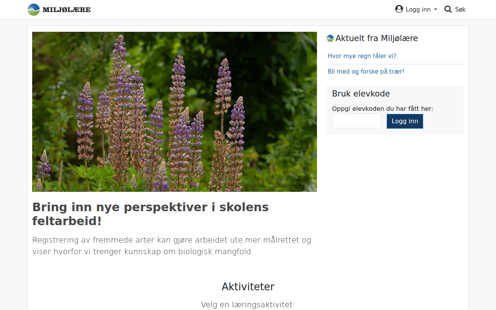

# miljolare.no — 10.04.2026

[← miljolare.no](../) &middot; [← All domains](../../)

Subdomains queried from [crt.sh](https://crt.sh/?q=%.miljolare.no).

## Summary

| Metric | Count |
|-------:|------:|
| Total subdomains found | 6 |
| Online | 4 |
| HTTP 403 | 2 |

## Online Subdomains

| Subdomain | Screenshot |
|-----------|-----------|
| `beagle.miljolare.no` |  |
| `co2.miljolare.no` |  |
| `miljolare.no` |  |
| `www.miljolare.no` |  |

## Other Results

| Subdomain | Status |
|-----------|--------|
| `beta.miljolare.no` | `HTTP 403` |
| `ipt.miljolare.no` | `HTTP 403` |
