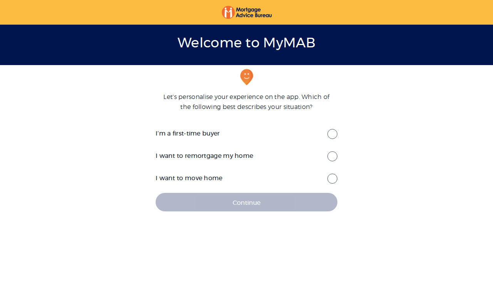
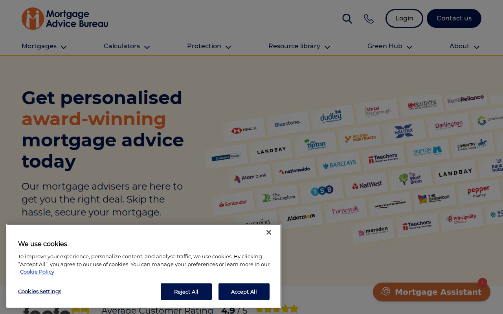
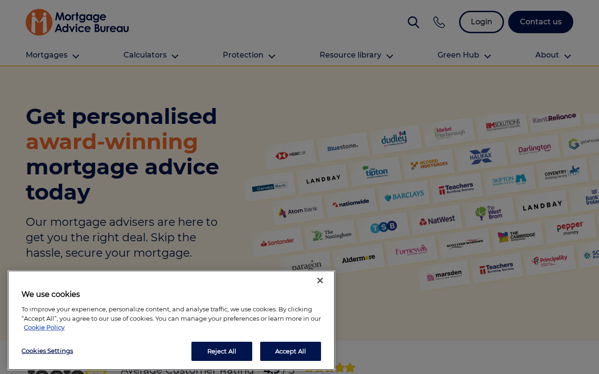
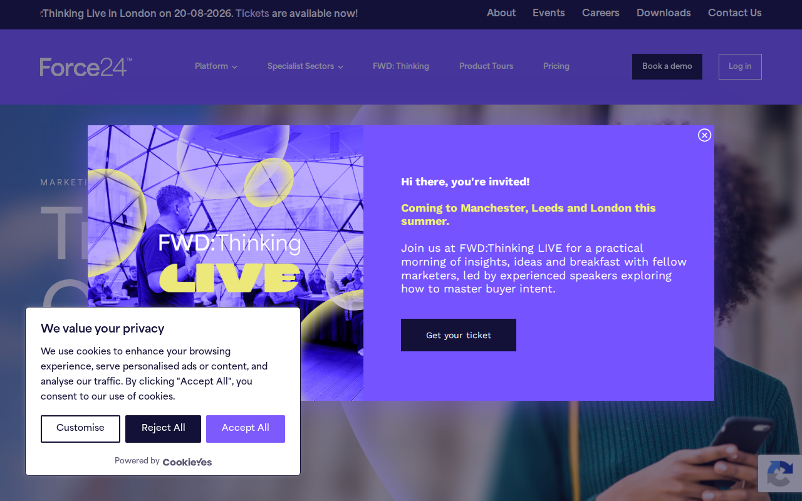
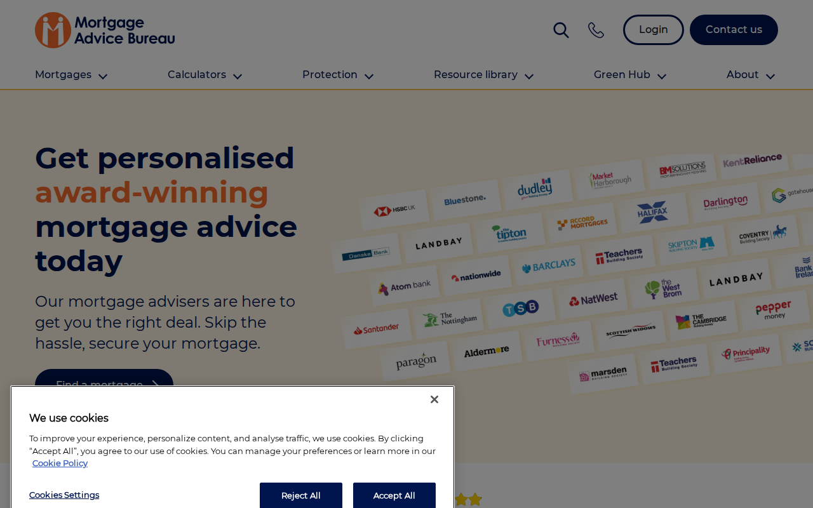
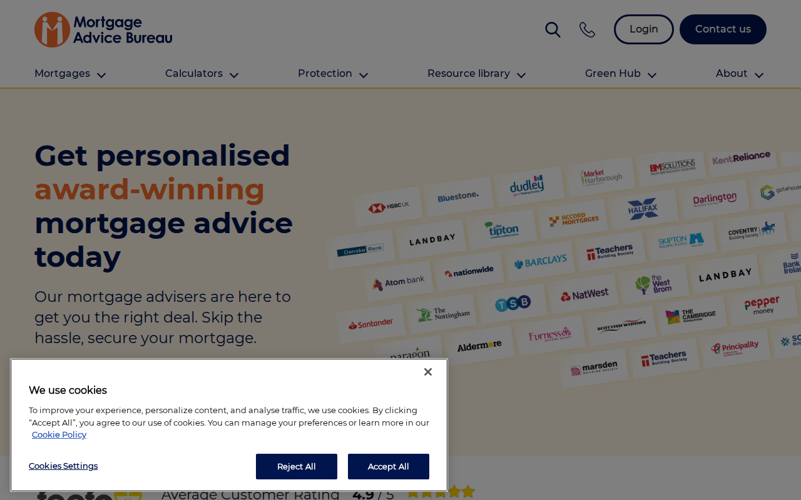

# mortgageadvicebureau.com — 17.07.2026

[← mortgageadvicebureau.com](../) &middot; [← All domains](../../)

Subdomains queried from [crt.sh](https://crt.sh/?q=%.mortgageadvicebureau.com).

## Summary

| Metric | Count |
|-------:|------:|
| Total subdomains found | 71 |
| Online | 22 |
| ERR_NAME_NOT_RESOLVED | 30 |
| HTTP 401 | 1 |
| HTTP 403 | 8 |
| HTTP 404 | 7 |
| HTTP 500 | 2 |
| timeout | 1 |

## Online Subdomains

| Subdomain | Certificate Expires | Screenshot |
|-----------|---------------------|-----------|
| `admin.mortgageadvicebureau.com` | `2026-08-20` |  |
| `app.mortgageadvicebureau.com` | `2026-09-16` |  |
| `assets.no-reply.mortgageadvicebureau.com` | `2026-09-22` |  |
| `blog.mortgageadvicebureau.com` | `2026-08-20` |  |
| `ecard.mortgageadvicebureau.com` | `2026-08-19` |  |
| `forum.mortgageadvicebureau.com` | `2026-08-20` |  |
| `home.app.mortgageadvicebureau.com` | `2026-09-16` |  |
| `homebuyer.mortgageadvicebureau.com` | `2027-02-13` |  |
| `mab.mortgageadvicebureau.com` | `2024-09-05` |  |
| `mail.mortgageadvicebureau.com` | `2026-08-20` |  |
| `main.mortgageadvicebureau.com` | `2026-08-20` |  |
| `midas.mortgageadvicebureau.com` | `2026-08-20` |  |
| `mortgageadvicebureau.com` | `2026-11-11` |  |
| `newserver.mortgageadvicebureau.com` | `2026-08-20` |  |
| `no-reply.mortgageadvicebureau.com` | `2026-10-12` |  |
| `notrack.no-reply.mortgageadvicebureau.com` | `2026-08-05` |  |
| `stage.app.mortgageadvicebureau.com` | `2026-10-08` |  |
| `stage.homebuyer.mortgageadvicebureau.com` | `2027-02-04` |  |
| `view.email.mortgageadvicebureau.com` | `2027-02-28` |  |
| `webmail.mortgageadvicebureau.com` | `2026-08-20` |  |
| `www.homebuyer.mortgageadvicebureau.com` | `2027-02-13` |  |
| `www.mortgageadvicebureau.com` | `2024-08-15` |  |

## Other Results

| Subdomain | Certificate Expires | Status |
|-----------|---------------------|--------|
| `365.mortgageadvicebureau.com` | `2019-08-13` | `ERR_NAME_NOT_RESOLVED` |
| `australia.mortgageadvicebureau.com` | `2023-11-15` | `ERR_NAME_NOT_RESOLVED` |
| `buddy.mortgageadvicebureau.com` | `2024-05-16` | `ERR_NAME_NOT_RESOLVED` |
| `calculator.mortgageadvicebureau.com` | `2025-06-20` | `ERR_NAME_NOT_RESOLVED` |
| `chat-api.dev.morty.mortgageadvicebureau.com` | `2026-09-14` | `ERR_NAME_NOT_RESOLVED` |
| `chat-api.prod.morty.mortgageadvicebureau.com` | `2026-08-27` | `ERR_NAME_NOT_RESOLVED` |
| `chat.dev.morty.mortgageadvicebureau.com` | `2026-09-01` | `ERR_NAME_NOT_RESOLVED` |
| `chat.prod.morty.mortgageadvicebureau.com` | `2026-09-11` | `ERR_NAME_NOT_RESOLVED` |
| `chat.staging.morty.mortgageadvicebureau.com` | `2025-07-03` | `ERR_NAME_NOT_RESOLVED` |
| `click.email.mortgageadvicebureau.com` | `2027-02-28` | `HTTP 403` |
| `cloud.email.mortgageadvicebureau.com` | `2027-02-28` | `HTTP 404` |
| `content.app.mortgageadvicebureau.com` | `2026-11-01` | `timeout` |
| `debug-frontend.dev.morty.mortgageadvicebureau.com` | `2026-09-13` | `ERR_NAME_NOT_RESOLVED` |
| `debug-frontend.prod.morty.mortgageadvicebureau.com` | `2026-09-02` | `ERR_NAME_NOT_RESOLVED` |
| `dev-api.morty.mortgageadvicebureau.com` | `2025-07-15` | `ERR_NAME_NOT_RESOLVED` |
| `dev.app.mortgageadvicebureau.com` | `2026-10-08` | `HTTP 403` |
| `dev.home.app.mortgageadvicebureau.com` | `2026-10-08` | `HTTP 403` |
| `dev.homeowner.mortgageadvicebureau.com` | `2024-07-15` | `ERR_NAME_NOT_RESOLVED` |
| `dev.morty.mortgageadvicebureau.com` | `2025-06-29` | `ERR_NAME_NOT_RESOLVED` |
| `expert.mortgageadvicebureau.com` | `2026-09-22` | `HTTP 403` |
| `hello.mortgageadvicebureau.com` | `2026-08-22` | `HTTP 404` |
| `homeowner.mortgageadvicebureau.com` | `2024-07-17` | `ERR_NAME_NOT_RESOLVED` |
| `image.email.mortgageadvicebureau.com` | `2027-03-09` | `HTTP 403` |
| `intro.mortgageadvicebureau.com` | `2024-08-15` | `HTTP 404` |
| `legacy.mortgageadvicebureau.com` | `2023-10-12` | `ERR_NAME_NOT_RESOLVED` |
| `monitor.mortgageadvicebureau.com` | `2025-07-18` | `HTTP 404` |
| `prod-api.morty.mortgageadvicebureau.com` | `2025-07-28` | `ERR_NAME_NOT_RESOLVED` |
| `prod.morty.mortgageadvicebureau.com` | `2025-07-28` | `ERR_NAME_NOT_RESOLVED` |
| `selfbranded-staging.mortgageadvicebureau.com` | `2023-12-29` | `HTTP 403` |
| `selfbranded.mortgageadvicebureau.com` | `2025-11-25` | `HTTP 404` |
| `stage.home.app.mortgageadvicebureau.com` | `2026-10-08` | `HTTP 401` |
| `stage.homeowner.mortgageadvicebureau.com` | `2024-07-16` | `ERR_NAME_NOT_RESOLVED` |
| `staging.mortgageadvicebureau.com` | `2022-04-13` | `ERR_NAME_NOT_RESOLVED` |
| `test.app.mortgageadvicebureau.com` | `2026-10-08` | `HTTP 403` |
| `test.home.app.mortgageadvicebureau.com` | `2026-10-08` | `HTTP 403` |
| `test.homeowner.mortgageadvicebureau.com` | `2024-07-16` | `ERR_NAME_NOT_RESOLVED` |
| `track.no-reply.mortgageadvicebureau.com` | `2026-08-25` | `HTTP 404` |
| `uat-temp-origin.mortgageadvicebureau.com` | `2021-06-27` | `ERR_NAME_NOT_RESOLVED` |
| `uat.mortgageadvicebureau.com` | `2022-04-13` | `HTTP 404` |
| `uat2.mortgageadvicebureau.com` | `2023-08-28` | `ERR_NAME_NOT_RESOLVED` |
| `umbraco.mortgageadvicebureau.com` | `2022-03-07` | `ERR_NAME_NOT_RESOLVED` |
| `www.365.mortgageadvicebureau.com` | `2018-08-01` | `ERR_NAME_NOT_RESOLVED` |
| `www.app.mortgageadvicebureau.com` | `2026-09-16` | `HTTP 500` |
| `www.buddy.mortgageadvicebureau.com` | `2024-05-16` | `ERR_NAME_NOT_RESOLVED` |
| `www.ecard.mortgageadvicebureau.com` | `2022-04-29` | `ERR_NAME_NOT_RESOLVED` |
| `www.hello.mortgageadvicebureau.com` | `2018-05-20` | `ERR_NAME_NOT_RESOLVED` |
| `www.home.app.mortgageadvicebureau.com` | `2026-09-16` | `HTTP 500` |
| `www.homeowner.mortgageadvicebureau.com` | `2024-07-17` | `ERR_NAME_NOT_RESOLVED` |
| `www2.mortgageadvicebureau.com` | `2023-09-09` | `ERR_NAME_NOT_RESOLVED` |
