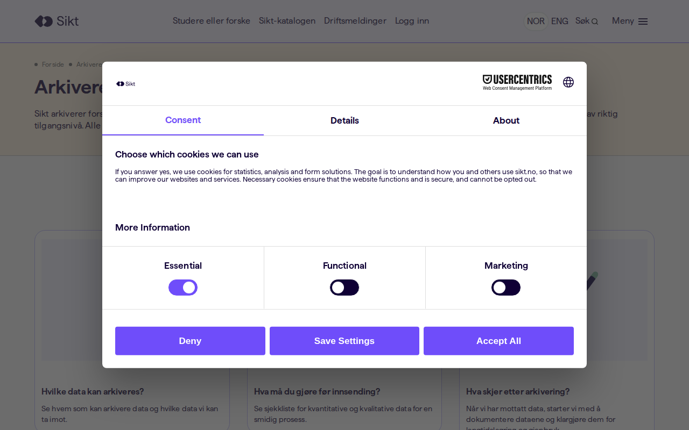
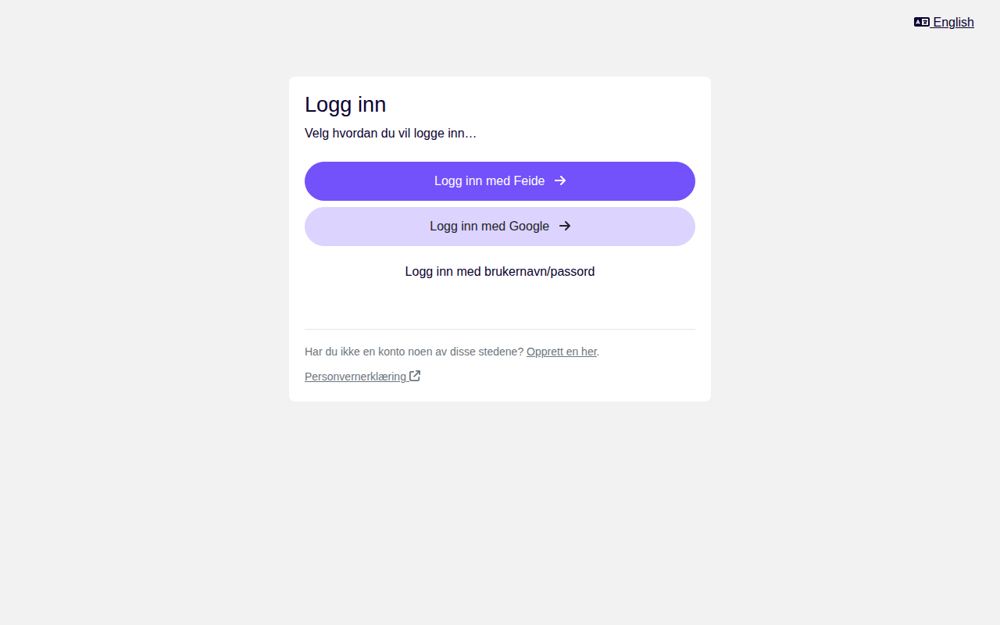
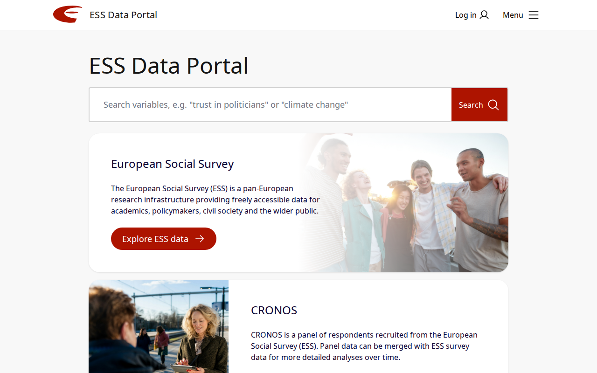
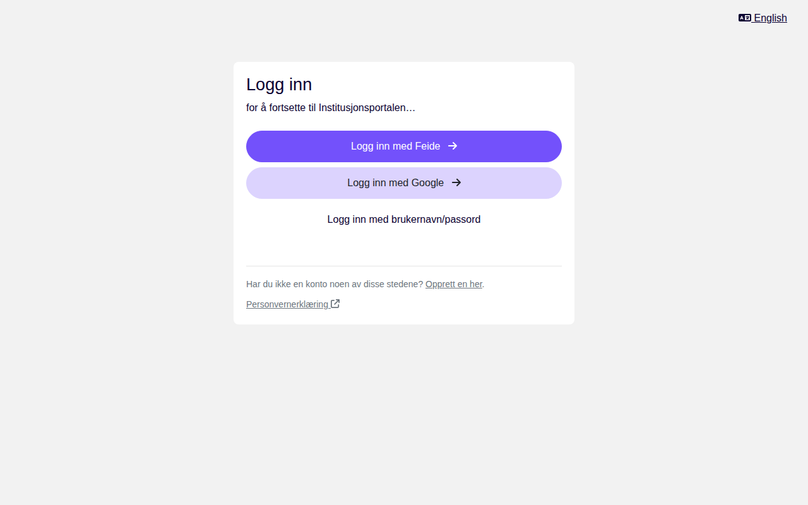
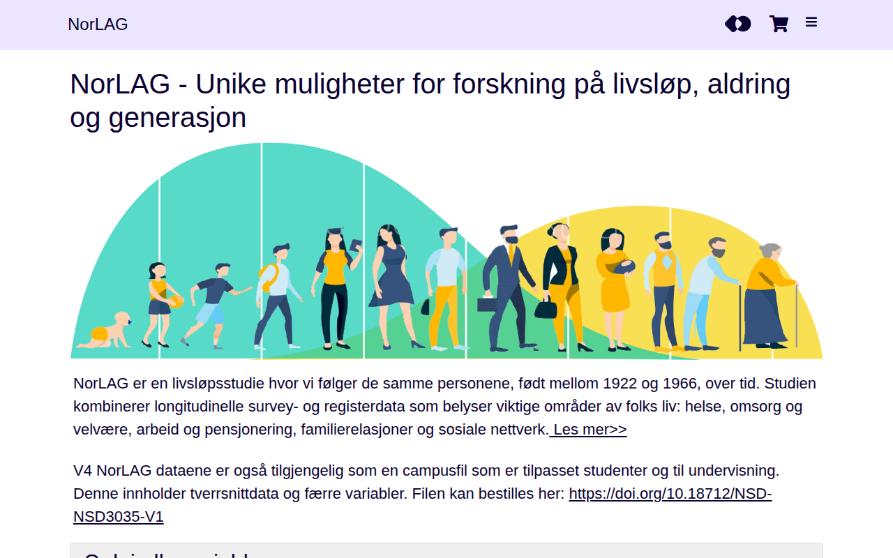
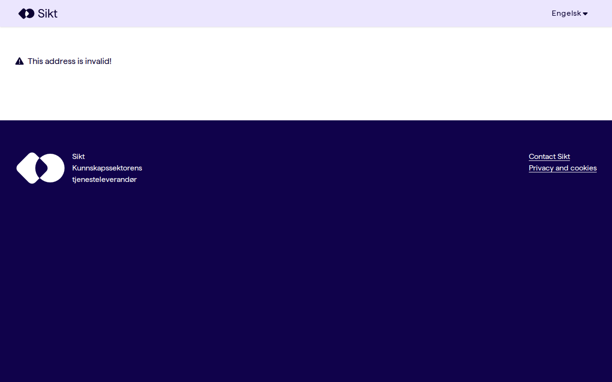
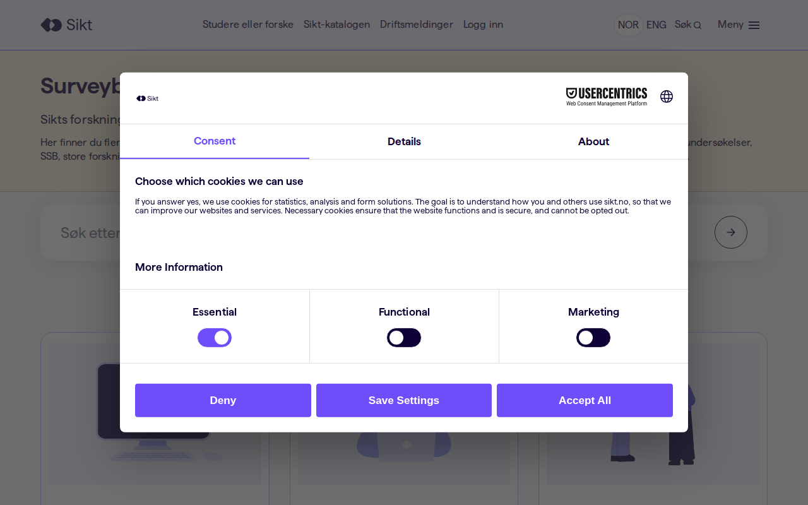

# nsd.no — 09.04.2026

[← nsd.no](../) &middot; [← All domains](../../)

Subdomains queried from [crt.sh](https://crt.sh/?q=%.nsd.no).

## Summary

| Metric | Count |
|-------:|------:|
| Total subdomains found | 84 |
| Online | 26 |
| ERR_CONNECTION_REFUSED | 1 |
| ERR_NAME_NOT_RESOLVED | 34 |
| HTTP 401 | 22 |
| timeout | 1 |

## Online Subdomains

| Subdomain | Screenshot |
|-----------|-----------|
| `admin.nsd.no` |  |
| `arkivering.nsd.no` |  |
| `arkiveringsportalen.nsd.no` |  |
| `data-download-tracker.nsd.no` |  |
| `dataarkivering.nsd.no` |  |
| `databestilling.nsd.no` |  |
| `dmp.nsd.no` |  |
| `dmpoversikt.nsd.no` |  |
| `dus.nsd.no` |  |
| `eosc-provenance.nsd.no` |  |
| `ess-search.nsd.no` |  |
| `ess-usage.nsd.no` |  |
| `ess.nsd.no` |  |
| `institusjon.nsd.no` |  |
| `invitasjon.nsd.no` |  |
| `meldeskjema.nsd.no` |  |
| `meldingsarkiv.nsd.no` |  |
| `minside.nsd.no` |  |
| `norlag.nsd.no` |  |
| `nsd.no` |  |
| `per.nsd.no` |  |
| `signering.nsd.no` |  |
| `skolevalg.nsd.no` |  |
| `surveybanken.nsd.no` |  |
| `uptime.nsd.no` |  |
| `www.nsd.no` |  |

## Other Results

| Subdomain | Status |
|-----------|--------|
| `admin-stage.nsd.no` | `HTTP 401` |
| `arkivering-stage.nsd.no` | `ERR_NAME_NOT_RESOLVED` |
| `arkivering2-stage.nsd.no` | `ERR_NAME_NOT_RESOLVED` |
| `arkivering2.nsd.no` | `ERR_NAME_NOT_RESOLVED` |
| `arkiveringsportalen-stage.nsd.no` | `ERR_NAME_NOT_RESOLVED` |
| `beta.nsd.no` | `ERR_NAME_NOT_RESOLVED` |
| `chat-stage.nsd.no` | `ERR_NAME_NOT_RESOLVED` |
| `chat.nsd.no` | `ERR_NAME_NOT_RESOLVED` |
| `colectica-cloud-demo.nsd.no` | `ERR_NAME_NOT_RESOLVED` |
| `colectica-sandbox-repository.nsd.no` | `ERR_NAME_NOT_RESOLVED` |
| `data-download-tracker-stage.nsd.no` | `HTTP 401` |
| `dataarkivering-stage.nsd.no` | `HTTP 401` |
| `dataarkivering.stage.nsd.no` | `ERR_NAME_NOT_RESOLVED` |
| `databestilling-stage.nsd.no` | `HTTP 401` |
| `dmp-stage.nsd.no` | `HTTP 401` |
| `dmpoversikt-stage.nsd.no` | `HTTP 401` |
| `docs-stage.nsd.no` | `ERR_NAME_NOT_RESOLVED` |
| `docs.nsd.no` | `ERR_NAME_NOT_RESOLVED` |
| `dus-stage.nsd.no` | `HTTP 401` |
| `ess-search-stage.nsd.no` | `HTTP 401` |
| `ess-stage.nsd.no` | `HTTP 401` |
| `ess-test.nsd.no` | `ERR_NAME_NOT_RESOLVED` |
| `ess-usage-stage.nsd.no` | `HTTP 401` |
| `fagskole.nsd.no` | `ERR_NAME_NOT_RESOLVED` |
| `institusjon-stage.nsd.no` | `HTTP 401` |
| `invitasjon-stage.nsd.no` | `HTTP 401` |
| `kibana-stage.nsd.no` | `ERR_NAME_NOT_RESOLVED` |
| `kibana.nsd.no` | `ERR_NAME_NOT_RESOLVED` |
| `komponenter.nsd.no` | `ERR_NAME_NOT_RESOLVED` |
| `lyncdiscover.nsd.no` | `ERR_NAME_NOT_RESOLVED` |
| `meldeskjema-stage.nsd.no` | `HTTP 401` |
| `meldingsarkiv-stage.nsd.no` | `HTTP 401` |
| `minside-stage.nsd.no` | `HTTP 401` |
| `norlag-stage.nsd.no` | `HTTP 401` |
| `o-stage.nsd.no` | `ERR_NAME_NOT_RESOLVED` |
| `o.nsd.no` | `ERR_NAME_NOT_RESOLVED` |
| `oslo-mstgw1.nsd.no` | `ERR_CONNECTION_REFUSED` |
| `per-stage.nsd.no` | `HTTP 401` |
| `pilot-api-stage.nsd.no` | `ERR_NAME_NOT_RESOLVED` |
| `pilot-sso-stage.nsd.no` | `ERR_NAME_NOT_RESOLVED` |
| `pvoportal.nsd.no` | `ERR_NAME_NOT_RESOLVED` |
| `redirect-stage.nsd.no` | `ERR_NAME_NOT_RESOLVED` |
| `redirect.nsd.no` | `ERR_NAME_NOT_RESOLVED` |
| `resp.nsd.no` | `ERR_NAME_NOT_RESOLVED` |
| `search-stage.nsd.no` | `ERR_NAME_NOT_RESOLVED` |
| `search.nsd.no` | `ERR_NAME_NOT_RESOLVED` |
| `search2-stage.nsd.no` | `ERR_NAME_NOT_RESOLVED` |
| `search2.nsd.no` | `ERR_NAME_NOT_RESOLVED` |
| `signering-stage.nsd.no` | `HTTP 401` |
| `sip.nsd.no` | `ERR_NAME_NOT_RESOLVED` |
| `sip2.nsd.no` | `ERR_NAME_NOT_RESOLVED` |
| `skolevalg-stage.nsd.no` | `HTTP 401` |
| `studio-stage.nsd.no` | `ERR_NAME_NOT_RESOLVED` |
| `studio.nsd.no` | `ERR_NAME_NOT_RESOLVED` |
| `survey-sandbox-stage.nsd.no` | `HTTP 401` |
| `surveybanken-stage.nsd.no` | `HTTP 401` |
| `trd-mstgw1.nsd.no` | `timeout` |
| `www-stage.nsd.no` | `HTTP 401` |
