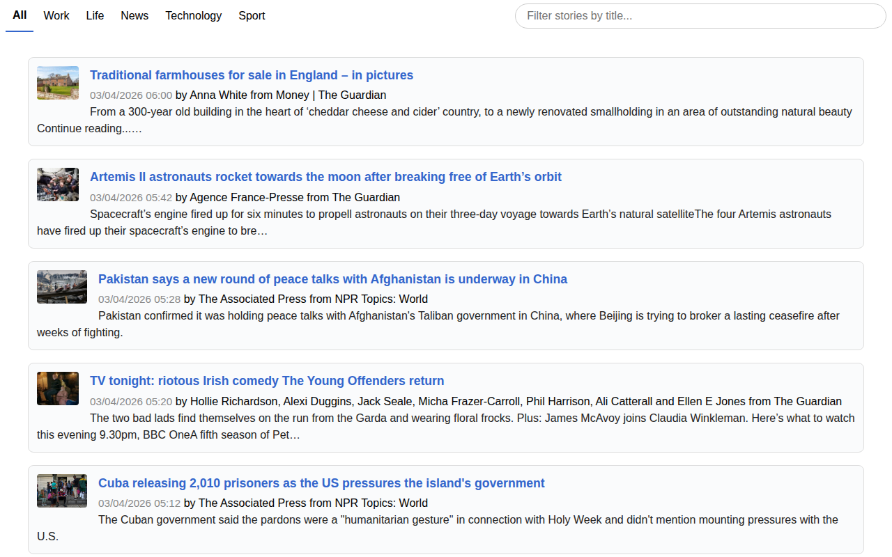

# onlythestoriesyouwant.link — 2026-04-03_06-12-13

[← onlythestoriesyouwant.link](../) &middot; [← All domains](../../)

Subdomains queried from [crt.sh](https://crt.sh/?q=%.onlythestoriesyouwant.link).

## Summary

| Metric | Count |
|-------:|------:|
| Total subdomains found | 1 |
| Online | 1 |

## Online Subdomains

| Subdomain | Screenshot |
|-----------|-----------|
| `onlythestoriesyouwant.link` |  |
