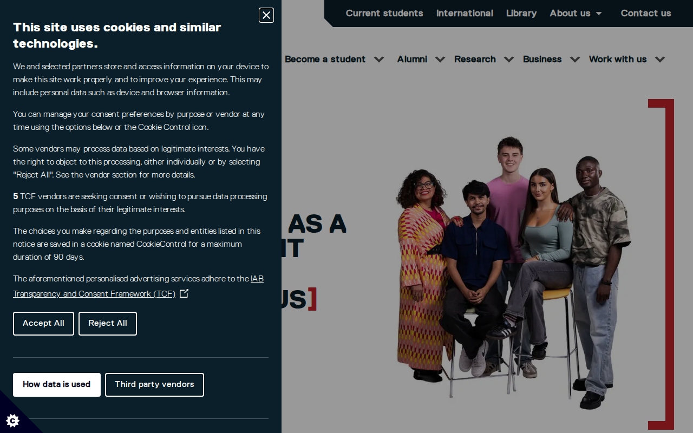

  

    

      <figure class="gallery-item">
        <a href="https://salford.ac.uk" target="_blank" rel="noopener noreferrer">
          
          <figcaption>salford.ac.uk</figcaption>
        </a>
      </figure>
    

  

