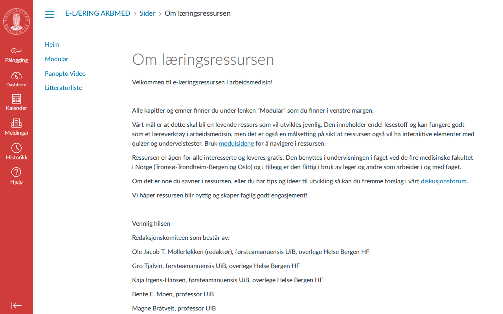

# sars.no — 11.04.2026

[← sars.no](../) &middot; [← All domains](../../)

Subdomains queried from [crt.sh](https://crt.sh/?q=%.sars.no).

## Summary

| Metric | Count |
|-------:|------:|
| Total subdomains found | 2 |
| Online | 2 |

## Online Subdomains

| Subdomain | Screenshot |
|-----------|-----------|
| `sars.no` |  |
| `www.sars.no` |  |
