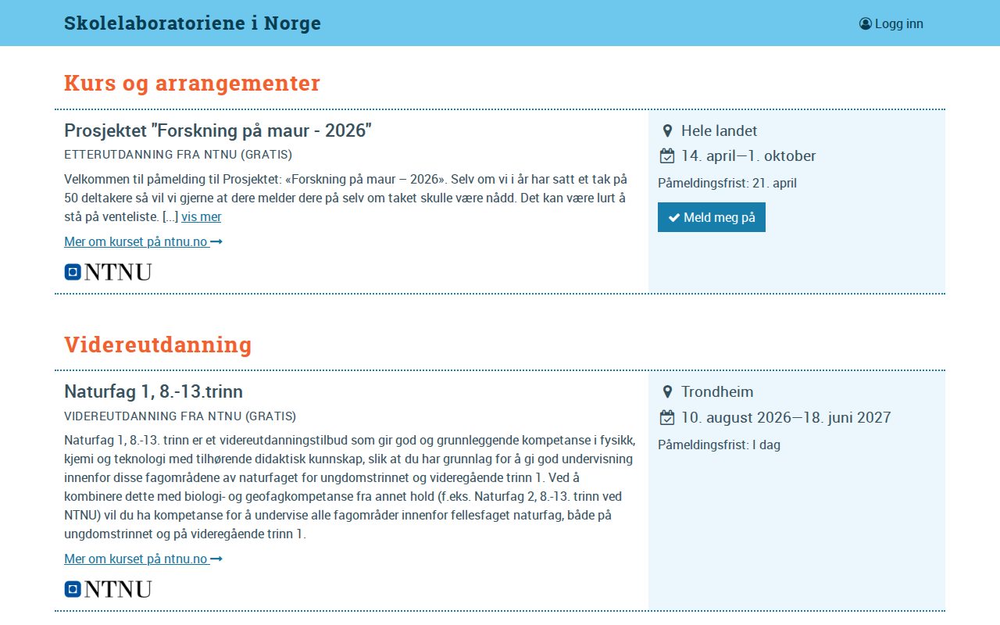

# skolelab.no — 15.04.2026

[← skolelab.no](../) &middot; [← All domains](../../)

Subdomains queried from [crt.sh](https://crt.sh/?q=%.skolelab.no).

## Summary

| Metric | Count |
|-------:|------:|
| Total subdomains found | 3 |
| Online | 2 |
| HTTP 403 | 1 |

## Online Subdomains

| Subdomain | Screenshot |
|-----------|-----------|
| `skolelab.no` |  |
| `www.skolelab.no` |  |

## Other Results

| Subdomain | Status |
|-----------|--------|
| `beta.skolelab.no` | `HTTP 403` |
