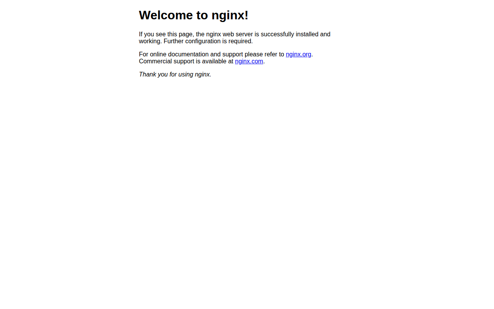

# universitetsmuseet.no — 08.04.2026

[← universitetsmuseet.no](../) &middot; [← All domains](../../)

Subdomains queried from [crt.sh](https://crt.sh/?q=%.universitetsmuseet.no).

## Summary

| Metric | Count |
|-------:|------:|
| Total subdomains found | 6 |
| Online | 4 |
| ERR_NAME_NOT_RESOLVED | 1 |
| timeout | 1 |

## Online Subdomains

| Subdomain | Screenshot |
|-----------|-----------|
| `betal.universitetsmuseet.no` |  |
| `prod.universitetsmuseet.no` |  |
| `universitetsmuseet.no` |  |
| `www.universitetsmuseet.no` |  |

## Other Results

| Subdomain | Status |
|-----------|--------|
| `test.universitetsmuseet.no` | `timeout` |
| `www.betal.universitetsmuseet.no` | `ERR_NAME_NOT_RESOLVED` |
