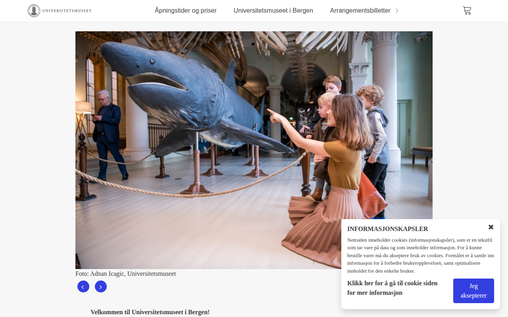
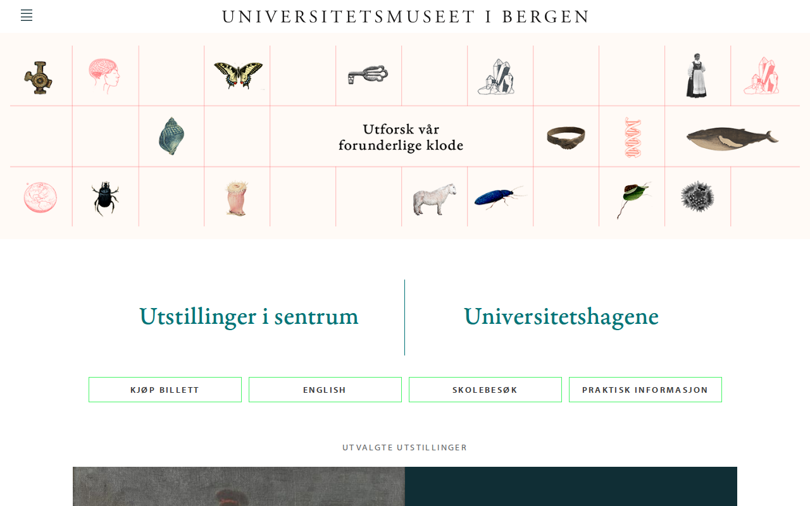

  

    

      <figure class="gallery-item">
        <a href="https://betal.universitetsmuseet.no" target="_blank" rel="noopener noreferrer">
          
          <figcaption>betal.universitetsmuseet.no</figcaption>
        </a>
      </figure>
      <figure class="gallery-item">
        <a href="https://prod.universitetsmuseet.no" target="_blank" rel="noopener noreferrer">
          
          <figcaption>prod.universitetsmuseet.no</figcaption>
        </a>
      </figure>
      <figure class="gallery-item">
        <a href="https://universitetsmuseet.no" target="_blank" rel="noopener noreferrer">
          
          <figcaption>universitetsmuseet.no</figcaption>
        </a>
      </figure>
      <figure class="gallery-item">
        <a href="https://www.universitetsmuseet.no" target="_blank" rel="noopener noreferrer">
          
          <figcaption>www.universitetsmuseet.no</figcaption>
        </a>
      </figure>
    

  

