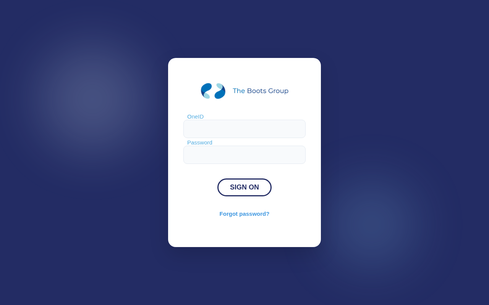
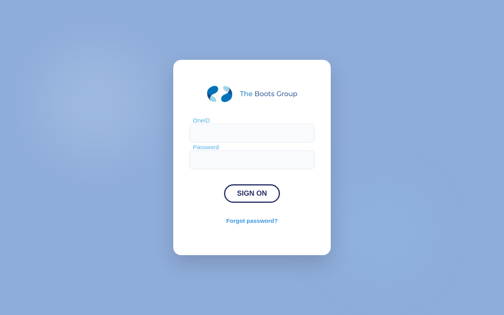

# boots.co.uk — 2026-03-24_12-35-27

Certificates queried from [crt.sh](https://crt.sh/?q=%.boots.co.uk).

## Summary

| Metric | Count |
|-------:|------:|
| Total domains found | 150 |
| Successes | 2 |
| ERR_NAME_NOT_RESOLVED | 115 |
| HTTP 403 | 9 |
| HTTP 404 | 2 |
| timeout | 22 |

## Details

| Domain | Result |
|--------|--------|
| `admin.bootshealthcarelogistics.boots.co.uk` | `HTTP 403` |
| `admin.bootshealthcarelogisticsuat.boots.co.uk` | `HTTP 403` |
| `api.bootshealthcarelogistics.boots.co.uk` | `HTTP 404` |
| `api.bootshealthcarelogisticsuat.boots.co.uk` | `HTTP 404` |
| `appointments.common.int.boots.co.uk` | `ERR_NAME_NOT_RESOLVED` |
| `artifactory.devops.boots.co.uk` | `ERR_NAME_NOT_RESOLVED` |
| `authdev1.boots.co.uk` | `timeout` |
| `authsit1.boots.co.uk` | `timeout` |
| `bitbucket.devops.boots.co.uk` | `ERR_NAME_NOT_RESOLVED` |
| `boots-storefront.boots.co.uk` | `ERR_NAME_NOT_RESOLVED` |
| `boots.co.uk` | `HTTP 403` |
| `bootshealthcarelogistics.boots.co.uk` | `HTTP 403` |
| `bootshealthcarelogisticsuat.boots.co.uk` | `HTTP 403` |
| `bootshealthrecord.pharmacy.int.boots.co.uk` | `ERR_NAME_NOT_RESOLVED` |
| `bootshealthrecordservices.pharmacy.int.boots.co.uk` | `ERR_NAME_NOT_RESOLVED` |
| `cdrapplication.pharmacy.int.boots.co.uk` | `ERR_NAME_NOT_RESOLVED` |
| `columbusdevtestlb.pharmacy.int.boots.co.uk` | `ERR_NAME_NOT_RESOLVED` |
| `confluence.devops.boots.co.uk` | `ERR_NAME_NOT_RESOLVED` |
| `contentsit1.boots.co.uk` | `timeout` |
| `dawnac.boots.co.uk` | `HTTP 403` |
| `delphipp.boots.co.uk` | `timeout` |
| `dev.appointments.common.int.boots.co.uk` | `ERR_NAME_NOT_RESOLVED` |
| `dev1.byservices.boots.co.uk` | `timeout` |
| `docker-hub.devops.boots.co.uk` | `ERR_NAME_NOT_RESOLVED` |
| `dsp.pharmacy.int.boots.co.uk` | `ERR_NAME_NOT_RESOLVED` |
| `dspperformancetest.pharmacy.int.boots.co.uk` | `ERR_NAME_NOT_RESOLVED` |
| `dsppreprod.pharmacy.int.boots.co.uk` | `ERR_NAME_NOT_RESOLVED` |
| `dspprodsupp.pharmacy.int.boots.co.uk` | `ERR_NAME_NOT_RESOLVED` |
| `emarinterface.pharmacy.int.boots.co.uk` | `ERR_NAME_NOT_RESOLVED` |
| `extranet.boots.co.uk` | `ERR_NAME_NOT_RESOLVED` |
| `extranet.eqa.boots.co.uk` | `ERR_NAME_NOT_RESOLVED` |
| `extranet.eqa01.boots.co.uk` | `ERR_NAME_NOT_RESOLVED` |
| `extranet.eqa1.boots.co.uk` | `ERR_NAME_NOT_RESOLVED` |
| `extranet.proxy.boots.co.uk` | `ERR_NAME_NOT_RESOLVED` |
| `extranet.pxy.boots.co.uk` | `ERR_NAME_NOT_RESOLVED` |
| `extranet.test.boots.co.uk` | `ERR_NAME_NOT_RESOLVED` |
| `gawmft.boots.co.uk` | `timeout` |
| `gbrpmseasf00.pharmacy.int.boots.co.uk` | `ERR_NAME_NOT_RESOLVED` |
| `gbrpmseasf10.pharmacy.int.boots.co.uk` | `ERR_NAME_NOT_RESOLVED` |
| `gbrpmseasf20.pharmacy.int.boots.co.uk` | `ERR_NAME_NOT_RESOLVED` |
| `gbrpmseasf30.pharmacy.int.boots.co.uk` | `ERR_NAME_NOT_RESOLVED` |
| `gbrpmseasf40.pharmacy.int.boots.co.uk` | `ERR_NAME_NOT_RESOLVED` |
| `gbrpmseasi00.pharmacy.int.boots.co.uk` | `ERR_NAME_NOT_RESOLVED` |
| `gbrpmseasi10.pharmacy.int.boots.co.uk` | `ERR_NAME_NOT_RESOLVED` |
| `gbrpmseasi20.pharmacy.int.boots.co.uk` | `ERR_NAME_NOT_RESOLVED` |
| `gbrpmseasi30.pharmacy.int.boots.co.uk` | `ERR_NAME_NOT_RESOLVED` |
| `gbrpmseasi40.pharmacy.int.boots.co.uk` | `ERR_NAME_NOT_RESOLVED` |
| `gbrpmseasu00.pharmacy.int.boots.co.uk` | `ERR_NAME_NOT_RESOLVED` |
| `gbrpmseasu10.pharmacy.int.boots.co.uk` | `ERR_NAME_NOT_RESOLVED` |
| `gbrpmsuisf00.pharmacy.int.boots.co.uk` | `ERR_NAME_NOT_RESOLVED` |
| `gbrpmsuisf10.pharmacy.int.boots.co.uk` | `ERR_NAME_NOT_RESOLVED` |
| `gbrpmsuisf20.pharmacy.int.boots.co.uk` | `ERR_NAME_NOT_RESOLVED` |
| `gbrpmsuisf30.pharmacy.int.boots.co.uk` | `ERR_NAME_NOT_RESOLVED` |
| `gbrpmsuisf40.pharmacy.int.boots.co.uk` | `ERR_NAME_NOT_RESOLVED` |
| `gbrpmsuisi00.pharmacy.int.boots.co.uk` | `ERR_NAME_NOT_RESOLVED` |
| `gbrpmsuisi10.pharmacy.int.boots.co.uk` | `ERR_NAME_NOT_RESOLVED` |
| `gbrpmsuisi20.pharmacy.int.boots.co.uk` | `ERR_NAME_NOT_RESOLVED` |
| `gbrpmsuisi30.pharmacy.int.boots.co.uk` | `ERR_NAME_NOT_RESOLVED` |
| `gbrpmsuisi40.pharmacy.int.boots.co.uk` | `ERR_NAME_NOT_RESOLVED` |
| `gbrpmsuisu00.pharmacy.int.boots.co.uk` | `ERR_NAME_NOT_RESOLVED` |
| `gbrpmsuisu10.pharmacy.int.boots.co.uk` | `ERR_NAME_NOT_RESOLVED` |
| `gw.boots.co.uk` | `timeout` |
| `gw.eqa.boots.co.uk` | `timeout` |
| `gw.eqa01.boots.co.uk` | `timeout` |
| `gw.eqa1.boots.co.uk` | `ERR_NAME_NOT_RESOLVED` |
| `gw.pxy.boots.co.uk` | `timeout` |
| `gw.test.boots.co.uk` | `timeout` |
| `hcs-wba-expe-mr1a.boots.co.uk` | `timeout` |
| `hcs-wba-expe-wv1a.boots.co.uk` | `timeout` |
| `healthcarepathways.pharmacy.int.boots.co.uk` | `ERR_NAME_NOT_RESOLVED` |
| `horizon-prod.opticians.int.boots.co.uk` | `ERR_NAME_NOT_RESOLVED` |
| `horizon-stag.opticians.int.boots.co.uk` | `ERR_NAME_NOT_RESOLVED` |
| `horizon-supp.opticians.int.boots.co.uk` | `ERR_NAME_NOT_RESOLVED` |
| `ibmstorefront.boots.co.uk` | `ERR_NAME_NOT_RESOLVED` |
| `id.boots.co.uk` | `HTTP 403` |
| `idtest.boots.co.uk` | `HTTP 403` |
| `insightportal.boots.co.uk` | `timeout` |
| `jenkins-slave.devops.boots.co.uk` | `ERR_NAME_NOT_RESOLVED` |
| `jenkins.devops.boots.co.uk` | `ERR_NAME_NOT_RESOLVED` |
| `jira.devops.boots.co.uk` | `ERR_NAME_NOT_RESOLVED` |
| `kf.test.boots.co.uk` | `ERR_NAME_NOT_RESOLVED` |
| `kf.test2.boots.co.uk` | `ERR_NAME_NOT_RESOLVED` |
| `mypassport.boots.co.uk` |  |
| `mypassporttest.boots.co.uk` |  |
| `oneid.boots.co.uk` | `timeout` |
| `oneidtest.boots.co.uk` | `timeout` |
| `preprod-bootshealthrecord.pharmacy.int.boots.co.uk` | `ERR_NAME_NOT_RESOLVED` |
| `preprod-cdrapplication.pharmacy.int.boots.co.uk` | `ERR_NAME_NOT_RESOLVED` |
| `preprod-healthcarepathways.pharmacy.int.boots.co.uk` | `ERR_NAME_NOT_RESOLVED` |
| `preprod-sms-messaging.pharmacy.int.boots.co.uk` | `ERR_NAME_NOT_RESOLVED` |
| `preprod.appointments.common.int.boots.co.uk` | `ERR_NAME_NOT_RESOLVED` |
| `prod.appointments.common.int.boots.co.uk` | `ERR_NAME_NOT_RESOLVED` |
| `reporting.bootshealthcarelogistics.boots.co.uk` | `ERR_NAME_NOT_RESOLVED` |
| `sdm.boots.co.uk` | `ERR_NAME_NOT_RESOLVED` |
| `sit1.byservices.boots.co.uk` | `timeout` |
| `sms-messaging.pharmacy.int.boots.co.uk` | `ERR_NAME_NOT_RESOLVED` |
| `sonarqube.devops.boots.co.uk` | `ERR_NAME_NOT_RESOLVED` |
| `sso.boots.co.uk` | `timeout` |
| `ssotest.boots.co.uk` | `timeout` |
| `testcertnew.boots.co.uk` | `ERR_NAME_NOT_RESOLVED` |
| `uat.appointments.common.int.boots.co.uk` | `ERR_NAME_NOT_RESOLVED` |
| `uispreprodx.pharmacy.int.boots.co.uk` | `ERR_NAME_NOT_RESOLVED` |
| `uispreprody.pharmacy.int.boots.co.uk` | `ERR_NAME_NOT_RESOLVED` |
| `uispreprodz.pharmacy.int.boots.co.uk` | `ERR_NAME_NOT_RESOLVED` |
| `uisprodsupx.pharmacy.int.boots.co.uk` | `ERR_NAME_NOT_RESOLVED` |
| `uisprodsupy.pharmacy.int.boots.co.uk` | `ERR_NAME_NOT_RESOLVED` |
| `uisprodsupz.pharmacy.int.boots.co.uk` | `ERR_NAME_NOT_RESOLVED` |
| `uisprodx.pharmacy.int.boots.co.uk` | `ERR_NAME_NOT_RESOLVED` |
| `uisprody.pharmacy.int.boots.co.uk` | `ERR_NAME_NOT_RESOLVED` |
| `uisprodz.pharmacy.int.boots.co.uk` | `ERR_NAME_NOT_RESOLVED` |
| `vcaretest.boots.co.uk` | `ERR_NAME_NOT_RESOLVED` |
| `wbaoneit-dev.cdd.boots.co.uk` | `ERR_NAME_NOT_RESOLVED` |
| `wbaoneit-prod.cdd.boots.co.uk` | `ERR_NAME_NOT_RESOLVED` |
| `wbaoneit-uat.cdd.boots.co.uk` | `ERR_NAME_NOT_RESOLVED` |
| `www.boots-storefront.boots.co.uk` | `ERR_NAME_NOT_RESOLVED` |
| `www.bootshealthrecord.pharmacy.int.boots.co.uk` | `ERR_NAME_NOT_RESOLVED` |
| `www.cdrapplication.pharmacy.int.boots.co.uk` | `ERR_NAME_NOT_RESOLVED` |
| `www.dawnac.boots.co.uk` | `HTTP 403` |
| `www.delphipp.boots.co.uk` | `ERR_NAME_NOT_RESOLVED` |
| `www.dev1.beautifulyou.boots.co.uk` | `timeout` |
| `www.extranet.boots.co.uk` | `ERR_NAME_NOT_RESOLVED` |
| `www.extranet.eqa.boots.co.uk` | `ERR_NAME_NOT_RESOLVED` |
| `www.extranet.eqa01.boots.co.uk` | `ERR_NAME_NOT_RESOLVED` |
| `www.extranet.pxy.boots.co.uk` | `ERR_NAME_NOT_RESOLVED` |
| `www.extranet.test.boots.co.uk` | `ERR_NAME_NOT_RESOLVED` |
| `www.gawmft.boots.co.uk` | `ERR_NAME_NOT_RESOLVED` |
| `www.gw.boots.co.uk` | `ERR_NAME_NOT_RESOLVED` |
| `www.gw.eqa.boots.co.uk` | `ERR_NAME_NOT_RESOLVED` |
| `www.gw.eqa01.boots.co.uk` | `ERR_NAME_NOT_RESOLVED` |
| `www.gw.pxy.boots.co.uk` | `ERR_NAME_NOT_RESOLVED` |
| `www.gw.test.boots.co.uk` | `ERR_NAME_NOT_RESOLVED` |
| `www.healthcarepathways.pharmacy.int.boots.co.uk` | `ERR_NAME_NOT_RESOLVED` |
| `www.ibmstorefront.boots.co.uk` | `ERR_NAME_NOT_RESOLVED` |
| `www.insightportal.boots.co.uk` | `ERR_NAME_NOT_RESOLVED` |
| `www.preprod-bootshealthrecord.pharmacy.int.boots.co.uk` | `ERR_NAME_NOT_RESOLVED` |
| `www.preprod-cdrapplication.pharmacy.int.boots.co.uk` | `ERR_NAME_NOT_RESOLVED` |
| `www.preprod.appointments.common.int.boots.co.uk` | `ERR_NAME_NOT_RESOLVED` |
| `www.prod.appointments.common.int.boots.co.uk` | `ERR_NAME_NOT_RESOLVED` |
| `www.sit1.beautifulyou.boots.co.uk` | `timeout` |
| `www.uat.appointments.common.int.boots.co.uk` | `ERR_NAME_NOT_RESOLVED` |
| `www.uispreprodx.pharmacy.int.boots.co.uk` | `ERR_NAME_NOT_RESOLVED` |
| `www.uispreprody.pharmacy.int.boots.co.uk` | `ERR_NAME_NOT_RESOLVED` |
| `www.uispreprodz.pharmacy.int.boots.co.uk` | `ERR_NAME_NOT_RESOLVED` |
| `www.uisprodsupx.pharmacy.int.boots.co.uk` | `ERR_NAME_NOT_RESOLVED` |
| `www.uisprodsupy.pharmacy.int.boots.co.uk` | `ERR_NAME_NOT_RESOLVED` |
| `www.uisprodsupz.pharmacy.int.boots.co.uk` | `ERR_NAME_NOT_RESOLVED` |
| `www.uisprodx.pharmacy.int.boots.co.uk` | `ERR_NAME_NOT_RESOLVED` |
| `www.uisprody.pharmacy.int.boots.co.uk` | `ERR_NAME_NOT_RESOLVED` |
| `www.uisprodz.pharmacy.int.boots.co.uk` | `ERR_NAME_NOT_RESOLVED` |
| `xp-idesk.boots.co.uk` | `timeout` |
