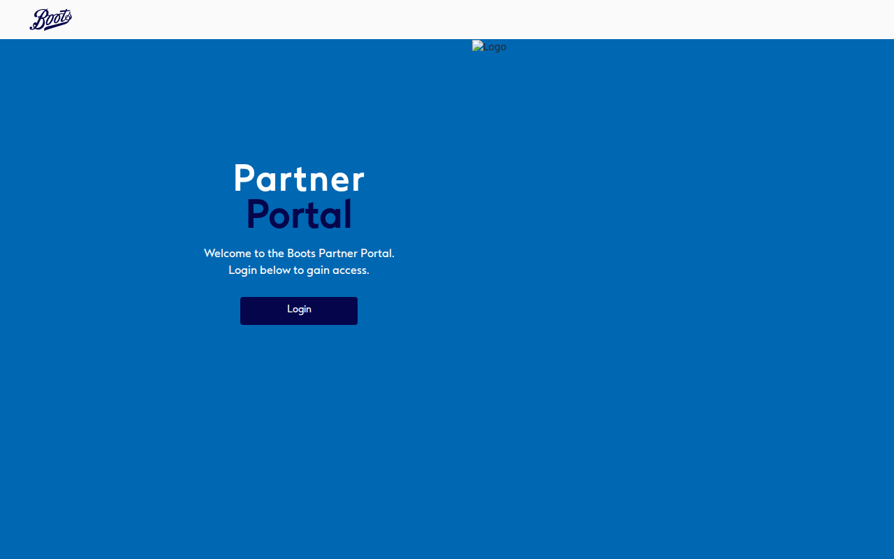
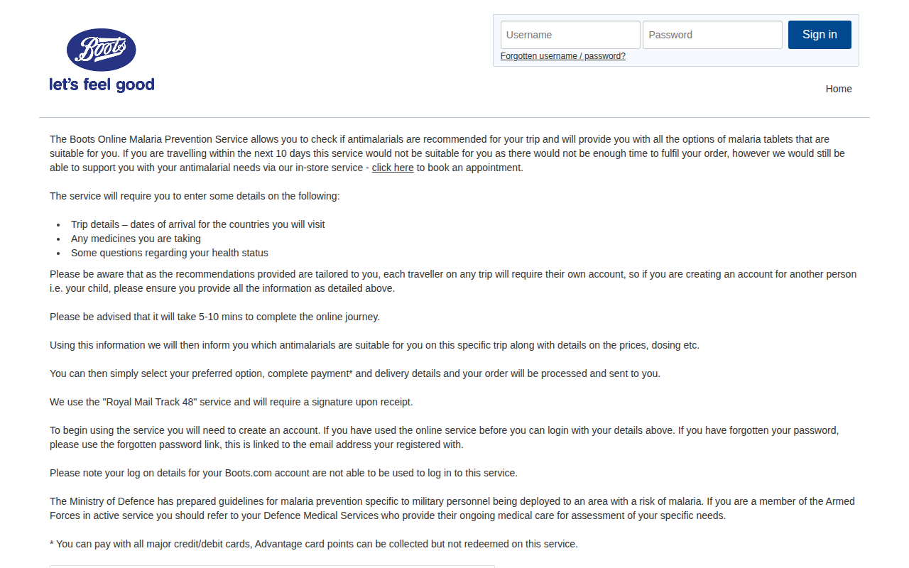
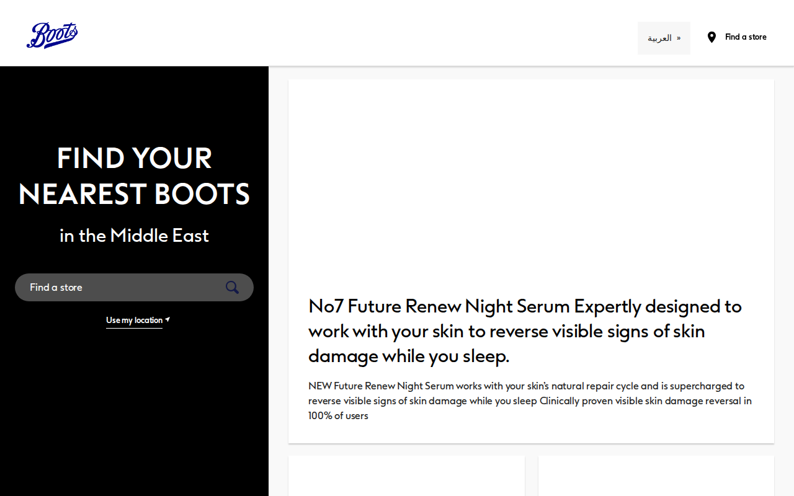
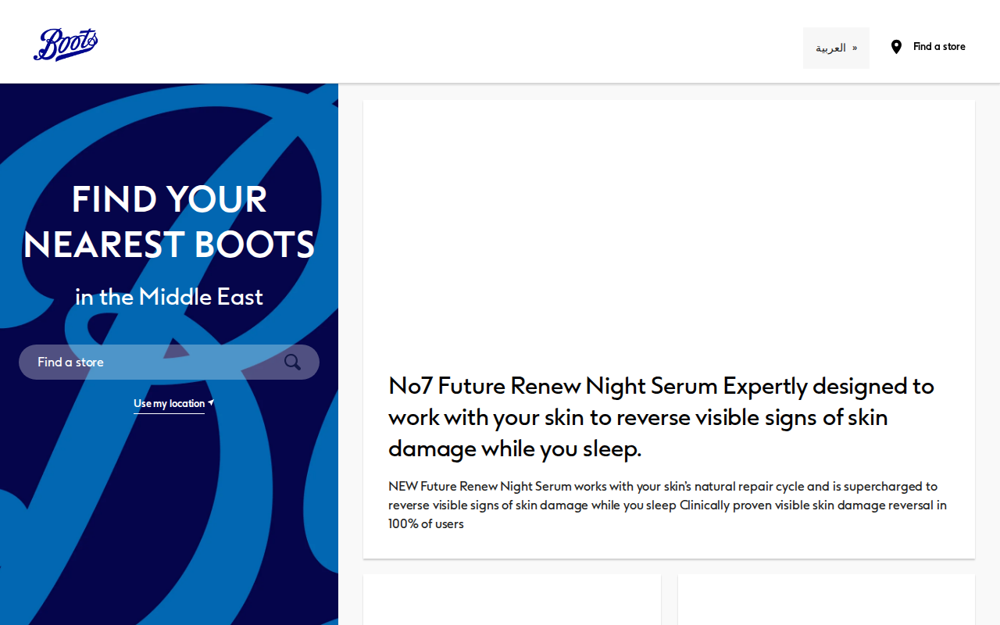
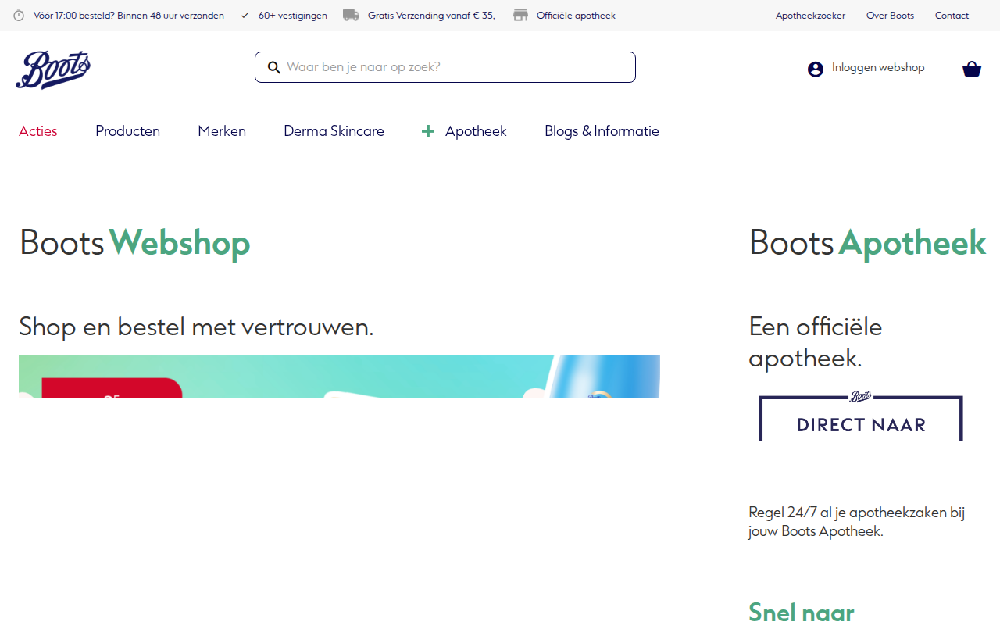

# boots.com — 2026-03-24_12-35-32

Certificates queried from [crt.sh](https://crt.sh/?q=%.boots.com).

## Summary

| Metric | Count |
|-------:|------:|
| Total domains found | 772 |
| Successes | 27 |
| ERR_CONNECTION_RESET | 1 |
| ERR_EMPTY_RESPONSE | 1 |
| ERR_NAME_NOT_RESOLVED | 673 |
| ERR_SSL_UNRECOGNIZED_NAME_ALERT | 1 |
| HTTP 403 | 19 |
| HTTP 404 | 11 |
| HTTP 410 | 2 |
| HTTP 500 | 2 |
| HTTP 503 | 3 |
| timeout | 32 |

## Details

| Domain | Result |
|--------|--------|
| `accelerator.rtl2.int.boots.com` | `ERR_NAME_NOT_RESOLVED` |
| `accelerator.rtl2stag.int.boots.com` | `ERR_NAME_NOT_RESOLVED` |
| `account.boots.com` | `HTTP 404` |
| `admin.rtl2.int.boots.com` | `ERR_NAME_NOT_RESOLVED` |
| `admin.rtl2stag.int.boots.com` | `ERR_NAME_NOT_RESOLVED` |
| `ae.boots.com` |  |
| `aem-author.dev.boots.com` | `ERR_NAME_NOT_RESOLVED` |
| `aem-author.int.boots.com` | `timeout` |
| `aem-author.pt.boots.com` | `timeout` |
| `aem-author.rtl.boots.com` | `timeout` |
| `aem-author.test1.boots.com` | `timeout` |
| `aem-author.test2.boots.com` | `ERR_NAME_NOT_RESOLVED` |
| `aem-author.trn01.boots.com` | `ERR_NAME_NOT_RESOLVED` |
| `aemdev01.gcp.boots.com` | `ERR_NAME_NOT_RESOLVED` |
| `aemqa01.gcp.boots.com` | `ERR_NAME_NOT_RESOLVED` |
| `aemtrn01.gcp.boots.com` | `ERR_NAME_NOT_RESOLVED` |
| `aeugcmcmp1wa002.boots.com` | `ERR_NAME_NOT_RESOLVED` |
| `aeuphpmtp1la001.ac.boots.com` | `HTTP 403` |
| `aeuphpmts1la001.ac.boots.com` | `HTTP 403` |
| `allocation.matflocms.boots.com` | `ERR_NAME_NOT_RESOLVED` |
| `allocation.preprod.matflocms.boots.com` | `ERR_NAME_NOT_RESOLVED` |
| `allocation.si.matflocms.boots.com` | `ERR_NAME_NOT_RESOLVED` |
| `api.int.boots.com` | `ERR_NAME_NOT_RESOLVED` |
| `api.prodstag.int.boots.com` | `ERR_NAME_NOT_RESOLVED` |
| `api.rtl2.int.boots.com` | `ERR_NAME_NOT_RESOLVED` |
| `api.rtl2stag.int.boots.com` | `ERR_NAME_NOT_RESOLVED` |
| `api.vitamins.boots.com` | `ERR_NAME_NOT_RESOLVED` |
| `app.boots.com` | `HTTP 403` |
| `appointments.boots.com` | `HTTP 403` |
| `assets.boots.com` | `HTTP 403` |
| `assets.rtl.boots.com` | `HTTP 403` |
| `auth.matflocms.boots.com` | `ERR_NAME_NOT_RESOLVED` |
| `auth.preprod.matflocms.boots.com` | `ERR_NAME_NOT_RESOLVED` |
| `auth.si.matflocms.boots.com` | `ERR_NAME_NOT_RESOLVED` |
| `autodiscover.nl.boots.com` | `timeout` |
| `autodiscover.se.boots.com` | `ERR_NAME_NOT_RESOLVED` |
| `aznelwbanpvol01.nonprod.gcp.boots.com` | `ERR_NAME_NOT_RESOLVED` |
| `bcmmyview.centre1.uk.boots.com` | `ERR_NAME_NOT_RESOLVED` |
| `beta.boots.com` | `ERR_NAME_NOT_RESOLVED` |
| `bh.boots.com` | `ERR_NAME_NOT_RESOLVED` |
| `bitbucket.tools.boots.com` | `ERR_NAME_NOT_RESOLVED` |
| `bn.boots.com` |  |
| `boots.com` | `HTTP 403` |
| `btssig-swi-ssl-asa-02.centre1.uk.boots.com` | `ERR_NAME_NOT_RESOLVED` |
| `c-logging-kibana.wcstools.boots.com` | `ERR_NAME_NOT_RESOLVED` |
| `c-monitoring-alertmanager.wcstools.boots.com` | `ERR_NAME_NOT_RESOLVED` |
| `c-monitoring-grafana.wcstools.boots.com` | `ERR_NAME_NOT_RESOLVED` |
| `c-monitoring-prometheus.wcstools.boots.com` | `ERR_NAME_NOT_RESOLVED` |
| `centre1.uk.boots.com` | `ERR_NAME_NOT_RESOLVED` |
| `cepapiservices-green.gcp.boots.com` | `ERR_NAME_NOT_RESOLVED` |
| `cepapiservices-red.gcp.boots.com` | `ERR_NAME_NOT_RESOLVED` |
| `cepepharmacy.gcp.boots.com` | `ERR_NAME_NOT_RESOLVED` |
| `cepproxy.gcp.boots.com` | `ERR_NAME_NOT_RESOLVED` |
| `clinics.prodstag.int.boots.com` | `ERR_NAME_NOT_RESOLVED` |
| `clinics.sit4.int.boots.com` | `HTTP 500` |
| `clinics.uat2.int.boots.com` | `HTTP 500` |
| `cm-cms.int.boots.com` | `ERR_NAME_NOT_RESOLVED` |
| `cm-delivery-bootsintl.int.boots.com` | `ERR_NAME_NOT_RESOLVED` |
| `cm-delivery-bootsuk.int.boots.com` | `ERR_NAME_NOT_RESOLVED` |
| `cm-editor.int.boots.com` | `ERR_NAME_NOT_RESOLVED` |
| `cm-management-bootsintl.int.boots.com` | `ERR_NAME_NOT_RESOLVED` |
| `cm-management-bootsuk.int.boots.com` | `ERR_NAME_NOT_RESOLVED` |
| `cm-studio.int.boots.com` | `ERR_NAME_NOT_RESOLVED` |
| `confluence.tools.boots.com` | `ERR_NAME_NOT_RESOLVED` |
| `corpp02.centre1.uk.boots.com` | `ERR_NAME_NOT_RESOLVED` |
| `corprd02.centre1.uk.boots.com` | `ERR_NAME_NOT_RESOLVED` |
| `css.preview.perf.webmd.boots.com` | `ERR_NAME_NOT_RESOLVED` |
| `css.preview.qa00.webmd.boots.com` | `ERR_NAME_NOT_RESOLVED` |
| `css.preview.qa01.webmd.boots.com` | `ERR_NAME_NOT_RESOLVED` |
| `css.preview.webmd.boots.com` | `ERR_NAME_NOT_RESOLVED` |
| `css.qa00.webmd.boots.com` | `ERR_NAME_NOT_RESOLVED` |
| `css.staging.perf.webmd.boots.com` | `ERR_NAME_NOT_RESOLVED` |
| `css.staging.qa00.webmd.boots.com` | `ERR_NAME_NOT_RESOLVED` |
| `css.staging.qa01.webmd.boots.com` | `ERR_NAME_NOT_RESOLVED` |
| `css.staging.webmd.boots.com` | `ERR_NAME_NOT_RESOLVED` |
| `css.webmd.boots.com` | `ERR_NAME_NOT_RESOLVED` |
| `db1.gpl.boots.com` | `ERR_NAME_NOT_RESOLVED` |
| `db1.gplnpd.boots.com` | `ERR_NAME_NOT_RESOLVED` |
| `db2.gpl.boots.com` | `ERR_NAME_NOT_RESOLVED` |
| `db2.gplnpd.boots.com` | `ERR_NAME_NOT_RESOLVED` |
| `db3.gpl.boots.com` | `ERR_NAME_NOT_RESOLVED` |
| `db4.gpl.boots.com` | `ERR_NAME_NOT_RESOLVED` |
| `dev-boots-storage.boots.com` | `timeout` |
| `dev-int.cep.boots.com` | `ERR_NAME_NOT_RESOLVED` |
| `dev01-apigreen.cep.boots.com` | `ERR_NAME_NOT_RESOLVED` |
| `dev01-apired.cep.boots.com` | `ERR_NAME_NOT_RESOLVED` |
| `dev01-grafana.cep.boots.com` | `ERR_NAME_NOT_RESOLVED` |
| `dev01-ingress.cep.boots.com` | `ERR_NAME_NOT_RESOLVED` |
| `dev01-kiali.cep.boots.com` | `ERR_NAME_NOT_RESOLVED` |
| `dev01-oms-apigreen.cep.boots.com` | `ERR_NAME_NOT_RESOLVED` |
| `dev01-oms-apired.cep.boots.com` | `ERR_NAME_NOT_RESOLVED` |
| `dev01-prometheus.cep.boots.com` | `ERR_NAME_NOT_RESOLVED` |
| `dev01-proxy.cep.boots.com` | `ERR_NAME_NOT_RESOLVED` |
| `dev01-tracing.cep.boots.com` | `ERR_NAME_NOT_RESOLVED` |
| `dev01.cep.boots.com` | `ERR_NAME_NOT_RESOLVED` |
| `devne-apigreen.cep.boots.com` | `ERR_NAME_NOT_RESOLVED` |
| `devne-grafana.cep.boots.com` | `ERR_NAME_NOT_RESOLVED` |
| `devne-kiali.cep.boots.com` | `ERR_NAME_NOT_RESOLVED` |
| `devne-oms-apigreen.cep.boots.com` | `ERR_NAME_NOT_RESOLVED` |
| `devne-oms-apired.cep.boots.com` | `ERR_NAME_NOT_RESOLVED` |
| `devne-prometheus.cep.boots.com` | `ERR_NAME_NOT_RESOLVED` |
| `devne-proxy.cep.boots.com` | `ERR_NAME_NOT_RESOLVED` |
| `devne-tracing.cep.boots.com` | `ERR_NAME_NOT_RESOLVED` |
| `devne.cep.boots.com` | `ERR_NAME_NOT_RESOLVED` |
| `dhpdev01.gcp.boots.com` | `ERR_NAME_NOT_RESOLVED` |
| `dhpdev01apiservices-green.gcp.boots.com` | `ERR_NAME_NOT_RESOLVED` |
| `dhpdev01apiservices-red.gcp.boots.com` | `ERR_NAME_NOT_RESOLVED` |
| `dhpdev01proxy.gcp.boots.com` | `ERR_NAME_NOT_RESOLVED` |
| `dhpe2e04apiservices-green.gcp.boots.com` | `ERR_NAME_NOT_RESOLVED` |
| `dhpe2e04apiservices-red.gcp.boots.com` | `ERR_NAME_NOT_RESOLVED` |
| `dhpe2e04proxy.gcp.boots.com` | `ERR_NAME_NOT_RESOLVED` |
| `dhphf01.gcp.boots.com` | `ERR_NAME_NOT_RESOLVED` |
| `dhphf01apiservices-green.gcp.boots.com` | `ERR_NAME_NOT_RESOLVED` |
| `dhphf01apiservices-red.gcp.boots.com` | `ERR_NAME_NOT_RESOLVED` |
| `dhphf01proxy.gcp.boots.com` | `ERR_NAME_NOT_RESOLVED` |
| `dhppreprod.gcp.boots.com` | `ERR_NAME_NOT_RESOLVED` |
| `dhppreprodapiservices-green.gcp.boots.com` | `ERR_NAME_NOT_RESOLVED` |
| `dhppreprodapiservices-red.gcp.boots.com` | `ERR_NAME_NOT_RESOLVED` |
| `dhppreprodproxy.gcp.boots.com` | `ERR_NAME_NOT_RESOLVED` |
| `dhppt.gcp.boots.com` | `ERR_NAME_NOT_RESOLVED` |
| `dhpptapiservices-green.gcp.boots.com` | `ERR_NAME_NOT_RESOLVED` |
| `dhpptapiservices-red.gcp.boots.com` | `ERR_NAME_NOT_RESOLVED` |
| `dhpptproxy.gcp.boots.com` | `ERR_NAME_NOT_RESOLVED` |
| `dhpqa01.gcp.boots.com` | `ERR_NAME_NOT_RESOLVED` |
| `dhpqa01apiservices-green.gcp.boots.com` | `ERR_NAME_NOT_RESOLVED` |
| `dhpqa01apiservices-red.gcp.boots.com` | `ERR_NAME_NOT_RESOLVED` |
| `dhpqa01proxy.gcp.boots.com` | `ERR_NAME_NOT_RESOLVED` |
| `dhpqa02.gcp.boots.com` | `ERR_NAME_NOT_RESOLVED` |
| `discoverreceiver.nl.boots.com` | `timeout` |
| `dl.email.boots.com` | `ERR_NAME_NOT_RESOLVED` |
| `dr.boots.com` | `ERR_NAME_NOT_RESOLVED` |
| `drugs.qa00.webmd.boots.com` | `ERR_NAME_NOT_RESOLVED` |
| `drugs.webmd.boots.com` | `ERR_NAME_NOT_RESOLVED` |
| `e2e-int.cep.boots.com` | `ERR_NAME_NOT_RESOLVED` |
| `e2e01-apigreen.cep.boots.com` | `ERR_NAME_NOT_RESOLVED` |
| `e2e01-apired.cep.boots.com` | `ERR_NAME_NOT_RESOLVED` |
| `e2e01-grafana.cep.boots.com` | `ERR_NAME_NOT_RESOLVED` |
| `e2e01-ingress.cep.boots.com` | `ERR_NAME_NOT_RESOLVED` |
| `e2e01-kiali.cep.boots.com` | `ERR_NAME_NOT_RESOLVED` |
| `e2e01-oms-apigreen.cep.boots.com` | `ERR_NAME_NOT_RESOLVED` |
| `e2e01-oms-apired.cep.boots.com` | `ERR_NAME_NOT_RESOLVED` |
| `e2e01-prometheus.cep.boots.com` | `ERR_NAME_NOT_RESOLVED` |
| `e2e01-proxy.cep.boots.com` | `ERR_NAME_NOT_RESOLVED` |
| `e2e01-tracing.cep.boots.com` | `ERR_NAME_NOT_RESOLVED` |
| `e2e01.cep.boots.com` | `ERR_NAME_NOT_RESOLVED` |
| `e2ene-apigreen.cep.boots.com` | `ERR_NAME_NOT_RESOLVED` |
| `e2ene-grafana.cep.boots.com` | `ERR_NAME_NOT_RESOLVED` |
| `e2ene-kiali.cep.boots.com` | `ERR_NAME_NOT_RESOLVED` |
| `e2ene-oms-apigreen.cep.boots.com` | `ERR_NAME_NOT_RESOLVED` |
| `e2ene-oms-apired.cep.boots.com` | `ERR_NAME_NOT_RESOLVED` |
| `e2ene-prometheus.cep.boots.com` | `ERR_NAME_NOT_RESOLVED` |
| `e2ene-proxy.cep.boots.com` | `ERR_NAME_NOT_RESOLVED` |
| `e2ene-tracing.cep.boots.com` | `ERR_NAME_NOT_RESOLVED` |
| `e2ene.cep.boots.com` | `ERR_NAME_NOT_RESOLVED` |
| `elastic.gpl.boots.com` | `ERR_NAME_NOT_RESOLVED` |
| `elastic.gplnpd.boots.com` | `ERR_NAME_NOT_RESOLVED` |
| `email.boots.com` | `ERR_NAME_NOT_RESOLVED` |
| `game.boots.com` |  |
| `gpl1.gpl.boots.com` | `ERR_NAME_NOT_RESOLVED` |
| `gpl2.gpl.boots.com` | `ERR_NAME_NOT_RESOLVED` |
| `gplink.gpl.boots.com` | `ERR_NAME_NOT_RESOLVED` |
| `gplink.gplnpd.boots.com` | `ERR_NAME_NOT_RESOLVED` |
| `gplnpd1.gplnpd.boots.com` | `ERR_NAME_NOT_RESOLVED` |
| `gplnpd2.gplnpd.boots.com` | `ERR_NAME_NOT_RESOLVED` |
| `guestwireless.boots.com` | `timeout` |
| `hf-int.cep.boots.com` | `ERR_NAME_NOT_RESOLVED` |
| `hf01-apigreen.cep.boots.com` | `ERR_NAME_NOT_RESOLVED` |
| `hf01-apired.cep.boots.com` | `ERR_NAME_NOT_RESOLVED` |
| `hf01-grafana.cep.boots.com` | `ERR_NAME_NOT_RESOLVED` |
| `hf01-ingress.cep.boots.com` | `ERR_NAME_NOT_RESOLVED` |
| `hf01-kiali.cep.boots.com` | `ERR_NAME_NOT_RESOLVED` |
| `hf01-oms-apigreen.cep.boots.com` | `ERR_NAME_NOT_RESOLVED` |
| `hf01-oms-apired.cep.boots.com` | `ERR_NAME_NOT_RESOLVED` |
| `hf01-prometheus.cep.boots.com` | `ERR_NAME_NOT_RESOLVED` |
| `hf01-proxy.cep.boots.com` | `ERR_NAME_NOT_RESOLVED` |
| `hf01-tracing.cep.boots.com` | `ERR_NAME_NOT_RESOLVED` |
| `hf01.cep.boots.com` | `ERR_NAME_NOT_RESOLVED` |
| `hfne-apigreen.cep.boots.com` | `ERR_NAME_NOT_RESOLVED` |
| `hfne-grafana.cep.boots.com` | `ERR_NAME_NOT_RESOLVED` |
| `hfne-kiali.cep.boots.com` | `ERR_NAME_NOT_RESOLVED` |
| `hfne-oms-apigreen.cep.boots.com` | `ERR_NAME_NOT_RESOLVED` |
| `hfne-oms-apired.cep.boots.com` | `ERR_NAME_NOT_RESOLVED` |
| `hfne-prometheus.cep.boots.com` | `ERR_NAME_NOT_RESOLVED` |
| `hfne-proxy.cep.boots.com` | `ERR_NAME_NOT_RESOLVED` |
| `hfne-tracing.cep.boots.com` | `ERR_NAME_NOT_RESOLVED` |
| `hfne.cep.boots.com` | `ERR_NAME_NOT_RESOLVED` |
| `holding.boots.com` | `ERR_NAME_NOT_RESOLVED` |
| `img.boots.com` | `ERR_NAME_NOT_RESOLVED` |
| `img.preview.perf.webmd.boots.com` | `ERR_NAME_NOT_RESOLVED` |
| `img.preview.qa00.webmd.boots.com` | `ERR_NAME_NOT_RESOLVED` |
| `img.preview.qa01.webmd.boots.com` | `ERR_NAME_NOT_RESOLVED` |
| `img.preview.webmd.boots.com` | `ERR_NAME_NOT_RESOLVED` |
| `img.qa00.webmd.boots.com` | `ERR_NAME_NOT_RESOLVED` |
| `img.staging.perf.webmd.boots.com` | `ERR_NAME_NOT_RESOLVED` |
| `img.staging.qa00.webmd.boots.com` | `ERR_NAME_NOT_RESOLVED` |
| `img.staging.qa01.webmd.boots.com` | `ERR_NAME_NOT_RESOLVED` |
| `img.staging.webmd.boots.com` | `ERR_NAME_NOT_RESOLVED` |
| `img.webmd.boots.com` | `ERR_NAME_NOT_RESOLVED` |
| `img1.boots.com` | `ERR_NAME_NOT_RESOLVED` |
| `int.boots.com` | `ERR_NAME_NOT_RESOLVED` |
| `intl.boots.com` | `timeout` |
| `jira.tools.boots.com` | `ERR_NAME_NOT_RESOLVED` |
| `js.preview.perf.webmd.boots.com` | `ERR_NAME_NOT_RESOLVED` |
| `js.preview.qa00.webmd.boots.com` | `ERR_NAME_NOT_RESOLVED` |
| `js.preview.qa01.webmd.boots.com` | `ERR_NAME_NOT_RESOLVED` |
| `js.preview.webmd.boots.com` | `ERR_NAME_NOT_RESOLVED` |
| `js.qa00.webmd.boots.com` | `ERR_NAME_NOT_RESOLVED` |
| `js.staging.perf.webmd.boots.com` | `ERR_NAME_NOT_RESOLVED` |
| `js.staging.qa00.webmd.boots.com` | `ERR_NAME_NOT_RESOLVED` |
| `js.staging.qa01.webmd.boots.com` | `ERR_NAME_NOT_RESOLVED` |
| `js.staging.webmd.boots.com` | `ERR_NAME_NOT_RESOLVED` |
| `js.webmd.boots.com` | `ERR_NAME_NOT_RESOLVED` |
| `kw.boots.com` |  |
| `link.onlinedoctor.boots.com` | `HTTP 404` |
| `live.cep.boots.com` | `ERR_NAME_NOT_RESOLVED` |
| `live.gcp.boots.com` | `ERR_NAME_NOT_RESOLVED` |
| `m.boots.com` | `ERR_SSL_UNRECOGNIZED_NAME_ALERT` |
| `m.info.boots.com` | `HTTP 404` |
| `m.international.boots.com` | `HTTP 410` |
| `m.mail.boots.com` | `HTTP 404` |
| `m.rtl2.int.boots.com` | `ERR_NAME_NOT_RESOLVED` |
| `majorincident.boots.com` | `timeout` |
| `managementcenter.rtl2.int.boots.com` | `ERR_NAME_NOT_RESOLVED` |
| `managementcenter.rtl2stag.int.boots.com` | `ERR_NAME_NOT_RESOLVED` |
| `matflocms.boots.com` | `timeout` |
| `mcloud1.gpl.boots.com` | `ERR_NAME_NOT_RESOLVED` |
| `mcloud1.gplnpd.boots.com` | `ERR_NAME_NOT_RESOLVED` |
| `mcloud2.gpl.boots.com` | `ERR_NAME_NOT_RESOLVED` |
| `mcloud2.gplnpd.boots.com` | `ERR_NAME_NOT_RESOLVED` |
| `mdealer1.gpl.boots.com` | `ERR_NAME_NOT_RESOLVED` |
| `mdealer1.gplnpd.boots.com` | `ERR_NAME_NOT_RESOLVED` |
| `mdealer2.gpl.boots.com` | `ERR_NAME_NOT_RESOLVED` |
| `mdealer2.gplnpd.boots.com` | `ERR_NAME_NOT_RESOLVED` |
| `me.boots.com` |  |
| `media.vitamins.boots.com` | `ERR_NAME_NOT_RESOLVED` |
| `mi.images.boots.com` |  |
| `monitor.gpl.boots.com` | `ERR_NAME_NOT_RESOLVED` |
| `monitor.gplnpd.boots.com` | `ERR_NAME_NOT_RESOLVED` |
| `msf.boots.com` | `ERR_NAME_NOT_RESOLVED` |
| `msfcms.boots.com` | `ERR_NAME_NOT_RESOLVED` |
| `myemails.boots.com` | `timeout` |
| `neoloadtsext.tools.boots.com` | `ERR_NAME_NOT_RESOLVED` |
| `neoloadwebext.tools.boots.com` | `ERR_NAME_NOT_RESOLVED` |
| `nismyview.centre1.uk.boots.com` | `ERR_NAME_NOT_RESOLVED` |
| `nl.boots.com` | `ERR_NAME_NOT_RESOLVED` |
| `nonprod.account.boots.com` | `ERR_NAME_NOT_RESOLVED` |
| `nonprod.cep.boots.com` | `ERR_NAME_NOT_RESOLVED` |
| `nonprod.gcp.boots.com` | `ERR_NAME_NOT_RESOLVED` |
| `nonprodaccount.boots.com` | `HTTP 404` |
| `nprod.cep.boots.com` | `ERR_NAME_NOT_RESOLVED` |
| `nprodne-grafana.cep.boots.com` | `ERR_NAME_NOT_RESOLVED` |
| `nprodne-insights.cep.boots.com` | `ERR_NAME_NOT_RESOLVED` |
| `nprodne-jenkins.cep.boots.com` | `ERR_NAME_NOT_RESOLVED` |
| `nprodne-kibana.cep.boots.com` | `ERR_NAME_NOT_RESOLVED` |
| `nprodne-prismacloud-defender.cep.boots.com` | `ERR_NAME_NOT_RESOLVED` |
| `nprodne-prismacloud.cep.boots.com` | `ERR_NAME_NOT_RESOLVED` |
| `nprodwe-grafana.cep.boots.com` | `ERR_NAME_NOT_RESOLVED` |
| `nprodwe-insights.cep.boots.com` | `ERR_NAME_NOT_RESOLVED` |
| `nprodwe-jenkins.cep.boots.com` | `ERR_NAME_NOT_RESOLVED` |
| `nprodwe-kibana.cep.boots.com` | `ERR_NAME_NOT_RESOLVED` |
| `nprodwe-prismacloud-defender.cep.boots.com` | `ERR_NAME_NOT_RESOLVED` |
| `nprodwe-prismacloud.cep.boots.com` | `ERR_NAME_NOT_RESOLVED` |
| `omsapiservices-green.gcp.boots.com` | `ERR_NAME_NOT_RESOLVED` |
| `omsapiservices-red.gcp.boots.com` | `ERR_NAME_NOT_RESOLVED` |
| `omsdev01apiservices-green.gcp.boots.com` | `ERR_NAME_NOT_RESOLVED` |
| `omsdev01apiservices-red.gcp.boots.com` | `ERR_NAME_NOT_RESOLVED` |
| `omse2e04apiservices-green.gcp.boots.com` | `ERR_NAME_NOT_RESOLVED` |
| `omse2e04apiservices-red.gcp.boots.com` | `ERR_NAME_NOT_RESOLVED` |
| `omshfapiservices-green.gcp.boots.com` | `ERR_NAME_NOT_RESOLVED` |
| `omshfapiservices-red.gcp.boots.com` | `ERR_NAME_NOT_RESOLVED` |
| `omspreprodapiservices-green.gcp.boots.com` | `ERR_NAME_NOT_RESOLVED` |
| `omspreprodapiservices-red.gcp.boots.com` | `ERR_NAME_NOT_RESOLVED` |
| `omsptapiservices-green.gcp.boots.com` | `ERR_NAME_NOT_RESOLVED` |
| `omsptapiservices-red.gcp.boots.com` | `ERR_NAME_NOT_RESOLVED` |
| `omsqa01apiservices-green.gcp.boots.com` | `ERR_NAME_NOT_RESOLVED` |
| `omsqa01apiservices-red.gcp.boots.com` | `ERR_NAME_NOT_RESOLVED` |
| `onlinedoctor-clinic.boots.com` |  |
| `onlinedoctor-colleague.boots.com` | `timeout` |
| `onlinedoctor.boots.com` |  |
| `orgadmin.rtl2.int.boots.com` | `ERR_NAME_NOT_RESOLVED` |
| `orgadmin.rtl2stag.int.boots.com` | `ERR_NAME_NOT_RESOLVED` |
| `origin-drugs.webmd.boots.com` | `ERR_NAME_NOT_RESOLVED` |
| `origin-img.webmd.boots.com` | `ERR_NAME_NOT_RESOLVED` |
| `origin-www.webmd.boots.com` | `ERR_NAME_NOT_RESOLVED` |
| `origin.holding.boots.com` | `HTTP 403` |
| `partnerportal.boots.com` |  |
| `peopleadmin.boots.com` | `ERR_NAME_NOT_RESOLVED` |
| `perf.boots.com` | `ERR_NAME_NOT_RESOLVED` |
| `perf.webmd.boots.com` | `ERR_NAME_NOT_RESOLVED` |
| `pharmacistplanner.int.boots.com` | `ERR_NAME_NOT_RESOLVED` |
| `pharmacistplannerdev.int.boots.com` | `ERR_NAME_NOT_RESOLVED` |
| `photo-dev.boots.com` | `timeout` |
| `photo-qa.boots.com` | `timeout` |
| `photo.boots.com` | `ERR_CONNECTION_RESET` |
| `piers.centre1.uk.boots.com` | `ERR_NAME_NOT_RESOLVED` |
| `ppr1cwd1.centre1.uk.boots.com` | `ERR_NAME_NOT_RESOLVED` |
| `prdp1cwd1.centre1.uk.boots.com` | `ERR_NAME_NOT_RESOLVED` |
| `preferences.boots.com` | `HTTP 403` |
| `premiumscan.boots.com` |  |
| `prep-grafana.cep.boots.com` | `ERR_NAME_NOT_RESOLVED` |
| `prep-ingress.cep.boots.com` | `ERR_NAME_NOT_RESOLVED` |
| `prep-int.cep.boots.com` | `ERR_NAME_NOT_RESOLVED` |
| `prep-kibana.cep.boots.com` | `ERR_NAME_NOT_RESOLVED` |
| `prep.cep.boots.com` | `ERR_NAME_NOT_RESOLVED` |
| `prep01-apigreen.cep.boots.com` | `ERR_NAME_NOT_RESOLVED` |
| `prep01-apired.cep.boots.com` | `ERR_NAME_NOT_RESOLVED` |
| `prep01-grafana.cep.boots.com` | `ERR_NAME_NOT_RESOLVED` |
| `prep01-ingress.cep.boots.com` | `ERR_NAME_NOT_RESOLVED` |
| `prep01-kiali.cep.boots.com` | `ERR_NAME_NOT_RESOLVED` |
| `prep01-oms-apigreen.cep.boots.com` | `ERR_NAME_NOT_RESOLVED` |
| `prep01-oms-apired.cep.boots.com` | `ERR_NAME_NOT_RESOLVED` |
| `prep01-prometheus.cep.boots.com` | `ERR_NAME_NOT_RESOLVED` |
| `prep01-proxy.cep.boots.com` | `ERR_NAME_NOT_RESOLVED` |
| `prep01-tracing.cep.boots.com` | `ERR_NAME_NOT_RESOLVED` |
| `prep01.cep.boots.com` | `ERR_NAME_NOT_RESOLVED` |
| `prep02-apigreen.cep.boots.com` | `ERR_NAME_NOT_RESOLVED` |
| `prep02-apired.cep.boots.com` | `ERR_NAME_NOT_RESOLVED` |
| `prep02-grafana.cep.boots.com` | `ERR_NAME_NOT_RESOLVED` |
| `prep02-ingress.cep.boots.com` | `ERR_NAME_NOT_RESOLVED` |
| `prep02-kiali.cep.boots.com` | `ERR_NAME_NOT_RESOLVED` |
| `prep02-oms-apigreen.cep.boots.com` | `ERR_NAME_NOT_RESOLVED` |
| `prep02-oms-apired.cep.boots.com` | `ERR_NAME_NOT_RESOLVED` |
| `prep02-prometheus.cep.boots.com` | `ERR_NAME_NOT_RESOLVED` |
| `prep02-proxy.cep.boots.com` | `ERR_NAME_NOT_RESOLVED` |
| `prep02-tracing.cep.boots.com` | `ERR_NAME_NOT_RESOLVED` |
| `prep02.cep.boots.com` | `ERR_NAME_NOT_RESOLVED` |
| `prepne-apigreen.cep.boots.com` | `ERR_NAME_NOT_RESOLVED` |
| `prepne-grafana.cep.boots.com` | `ERR_NAME_NOT_RESOLVED` |
| `prepne-int.cep.boots.com` | `ERR_NAME_NOT_RESOLVED` |
| `prepne-kiali.cep.boots.com` | `ERR_NAME_NOT_RESOLVED` |
| `prepne-oms-apigreen.cep.boots.com` | `ERR_NAME_NOT_RESOLVED` |
| `prepne-oms-apired.cep.boots.com` | `ERR_NAME_NOT_RESOLVED` |
| `prepne-prometheus.cep.boots.com` | `ERR_NAME_NOT_RESOLVED` |
| `prepne-proxy.cep.boots.com` | `ERR_NAME_NOT_RESOLVED` |
| `prepne-tracing.cep.boots.com` | `ERR_NAME_NOT_RESOLVED` |
| `prepne.cep.boots.com` | `ERR_NAME_NOT_RESOLVED` |
| `preprod-appointments.boots.com` | `HTTP 403` |
| `preprod-boots-storage.boots.com` | `timeout` |
| `preprod.cep.boots.com` | `ERR_NAME_NOT_RESOLVED` |
| `preprod.gcp.boots.com` | `ERR_NAME_NOT_RESOLVED` |
| `preprod.matflocms.boots.com` | `timeout` |
| `preprodpartnerportal.boots.com` |  |
| `preprodvoltage.gcp.boots.com` | `ERR_NAME_NOT_RESOLVED` |
| `prepwe-apigreen.cep.boots.com` | `ERR_NAME_NOT_RESOLVED` |
| `prepwe-grafana.cep.boots.com` | `ERR_NAME_NOT_RESOLVED` |
| `prepwe-int.cep.boots.com` | `ERR_NAME_NOT_RESOLVED` |
| `prepwe-kiali.cep.boots.com` | `ERR_NAME_NOT_RESOLVED` |
| `prepwe-oms-apigreen.cep.boots.com` | `ERR_NAME_NOT_RESOLVED` |
| `prepwe-oms-apired.cep.boots.com` | `ERR_NAME_NOT_RESOLVED` |
| `prepwe-prometheus.cep.boots.com` | `ERR_NAME_NOT_RESOLVED` |
| `prepwe-proxy.cep.boots.com` | `ERR_NAME_NOT_RESOLVED` |
| `prepwe-tracing.cep.boots.com` | `ERR_NAME_NOT_RESOLVED` |
| `prepwe.cep.boots.com` | `ERR_NAME_NOT_RESOLVED` |
| `prod-boots-storage.boots.com` | `timeout` |
| `prod-grafana.cep.boots.com` | `ERR_NAME_NOT_RESOLVED` |
| `prod-ingress.cep.boots.com` | `ERR_NAME_NOT_RESOLVED` |
| `prod-int.cep.boots.com` | `ERR_NAME_NOT_RESOLVED` |
| `prod-jenkins.cep.boots.com` | `ERR_NAME_NOT_RESOLVED` |
| `prod-kibana.cep.boots.com` | `ERR_NAME_NOT_RESOLVED` |
| `prod-leap.cep.boots.com` | `ERR_NAME_NOT_RESOLVED` |
| `prod-prismacloud-defender.cep.boots.com` | `ERR_NAME_NOT_RESOLVED` |
| `prod-prismacloud.cep.boots.com` | `ERR_NAME_NOT_RESOLVED` |
| `prod.cep.boots.com` | `ERR_NAME_NOT_RESOLVED` |
| `prod01-apigreen.cep.boots.com` | `ERR_NAME_NOT_RESOLVED` |
| `prod01-apired.cep.boots.com` | `ERR_NAME_NOT_RESOLVED` |
| `prod01-grafana.cep.boots.com` | `ERR_NAME_NOT_RESOLVED` |
| `prod01-ingress.cep.boots.com` | `ERR_NAME_NOT_RESOLVED` |
| `prod01-kiali.cep.boots.com` | `ERR_NAME_NOT_RESOLVED` |
| `prod01-oms-apigreen.cep.boots.com` | `ERR_NAME_NOT_RESOLVED` |
| `prod01-oms-apired.cep.boots.com` | `ERR_NAME_NOT_RESOLVED` |
| `prod01-prometheus.cep.boots.com` | `ERR_NAME_NOT_RESOLVED` |
| `prod01-proxy.cep.boots.com` | `ERR_NAME_NOT_RESOLVED` |
| `prod01-tracing.cep.boots.com` | `ERR_NAME_NOT_RESOLVED` |
| `prod01.cep.boots.com` | `ERR_NAME_NOT_RESOLVED` |
| `prod02-apigreen.cep.boots.com` | `ERR_NAME_NOT_RESOLVED` |
| `prod02-apired.cep.boots.com` | `ERR_NAME_NOT_RESOLVED` |
| `prod02-grafana.cep.boots.com` | `ERR_NAME_NOT_RESOLVED` |
| `prod02-ingress.cep.boots.com` | `ERR_NAME_NOT_RESOLVED` |
| `prod02-kiali.cep.boots.com` | `ERR_NAME_NOT_RESOLVED` |
| `prod02-oms-apigreen.cep.boots.com` | `ERR_NAME_NOT_RESOLVED` |
| `prod02-oms-apired.cep.boots.com` | `ERR_NAME_NOT_RESOLVED` |
| `prod02-prometheus.cep.boots.com` | `ERR_NAME_NOT_RESOLVED` |
| `prod02-proxy.cep.boots.com` | `ERR_NAME_NOT_RESOLVED` |
| `prod02-tracing.cep.boots.com` | `ERR_NAME_NOT_RESOLVED` |
| `prod02.cep.boots.com` | `ERR_NAME_NOT_RESOLVED` |
| `prodne-apigreen.cep.boots.com` | `ERR_NAME_NOT_RESOLVED` |
| `prodne-grafana.cep.boots.com` | `ERR_NAME_NOT_RESOLVED` |
| `prodne-int.cep.boots.com` | `ERR_NAME_NOT_RESOLVED` |
| `prodne-jenkins.cep.boots.com` | `ERR_NAME_NOT_RESOLVED` |
| `prodne-kiali.cep.boots.com` | `ERR_NAME_NOT_RESOLVED` |
| `prodne-kibana.cep.boots.com` | `ERR_NAME_NOT_RESOLVED` |
| `prodne-oms-apigreen.cep.boots.com` | `ERR_NAME_NOT_RESOLVED` |
| `prodne-oms-apired.cep.boots.com` | `ERR_NAME_NOT_RESOLVED` |
| `prodne-oms-apiredcep.boots.com` | `ERR_NAME_NOT_RESOLVED` |
| `prodne-prismacloud-defender.cep.boots.com` | `ERR_NAME_NOT_RESOLVED` |
| `prodne-prismacloud.cep.boots.com` | `ERR_NAME_NOT_RESOLVED` |
| `prodne-prometheus.cep.boots.com` | `ERR_NAME_NOT_RESOLVED` |
| `prodne-proxy.cep.boots.com` | `ERR_NAME_NOT_RESOLVED` |
| `prodne-tracing.cep.boots.com` | `ERR_NAME_NOT_RESOLVED` |
| `prodne.cep.boots.com` | `ERR_NAME_NOT_RESOLVED` |
| `productgpt.boots.com` | `HTTP 403` |
| `production.boots.com` | `ERR_NAME_NOT_RESOLVED` |
| `prodwe-apigreen.cep.boots.com` | `ERR_NAME_NOT_RESOLVED` |
| `prodwe-grafana.cep.boots.com` | `ERR_NAME_NOT_RESOLVED` |
| `prodwe-int.cep.boots.com` | `ERR_NAME_NOT_RESOLVED` |
| `prodwe-kiali.cep.boots.com` | `ERR_NAME_NOT_RESOLVED` |
| `prodwe-oms-apigreen.cep.boots.com` | `ERR_NAME_NOT_RESOLVED` |
| `prodwe-oms-apired.cep.boots.com` | `ERR_NAME_NOT_RESOLVED` |
| `prodwe-oms-apiredcep.boots.com` | `ERR_NAME_NOT_RESOLVED` |
| `prodwe-prometheus.cep.boots.com` | `ERR_NAME_NOT_RESOLVED` |
| `prodwe-proxy.cep.boots.com` | `ERR_NAME_NOT_RESOLVED` |
| `prodwe-tracing.cep.boots.com` | `ERR_NAME_NOT_RESOLVED` |
| `prodwe.cep.boots.com` | `ERR_NAME_NOT_RESOLVED` |
| `pt-appointments.boots.com` | `ERR_NAME_NOT_RESOLVED` |
| `pt-int.cep.boots.com` | `ERR_NAME_NOT_RESOLVED` |
| `pt.boots.com` | `ERR_NAME_NOT_RESOLVED` |
| `pt01-apigreen.cep.boots.com` | `ERR_NAME_NOT_RESOLVED` |
| `pt01-apired.cep.boots.com` | `ERR_NAME_NOT_RESOLVED` |
| `pt01-grafana.cep.boots.com` | `ERR_NAME_NOT_RESOLVED` |
| `pt01-ingress.cep.boots.com` | `ERR_NAME_NOT_RESOLVED` |
| `pt01-kiali.cep.boots.com` | `ERR_NAME_NOT_RESOLVED` |
| `pt01-oms-apigreen.cep.boots.com` | `ERR_NAME_NOT_RESOLVED` |
| `pt01-oms-apired.cep.boots.com` | `ERR_NAME_NOT_RESOLVED` |
| `pt01-prometheus.cep.boots.com` | `ERR_NAME_NOT_RESOLVED` |
| `pt01-proxy.cep.boots.com` | `ERR_NAME_NOT_RESOLVED` |
| `pt01-tracing.cep.boots.com` | `ERR_NAME_NOT_RESOLVED` |
| `pt01.cep.boots.com` | `ERR_NAME_NOT_RESOLVED` |
| `pt02-apigreen.cep.boots.com` | `ERR_NAME_NOT_RESOLVED` |
| `pt02-apired.cep.boots.com` | `ERR_NAME_NOT_RESOLVED` |
| `pt02-grafana.cep.boots.com` | `ERR_NAME_NOT_RESOLVED` |
| `pt02-kiali.cep.boots.com` | `ERR_NAME_NOT_RESOLVED` |
| `pt02-oms-apigreen.cep.boots.com` | `ERR_NAME_NOT_RESOLVED` |
| `pt02-oms-apired.cep.boots.com` | `ERR_NAME_NOT_RESOLVED` |
| `pt02-prometheus.cep.boots.com` | `ERR_NAME_NOT_RESOLVED` |
| `pt02-proxy.cep.boots.com` | `ERR_NAME_NOT_RESOLVED` |
| `pt02-tracing.cep.boots.com` | `ERR_NAME_NOT_RESOLVED` |
| `pt02.cep.boots.com` | `ERR_NAME_NOT_RESOLVED` |
| `ptne-apigreen.cep.boots.com` | `ERR_NAME_NOT_RESOLVED` |
| `ptne-grafana.cep.boots.com` | `ERR_NAME_NOT_RESOLVED` |
| `ptne-kiali.cep.boots.com` | `ERR_NAME_NOT_RESOLVED` |
| `ptne-oms-apigreen.cep.boots.com` | `ERR_NAME_NOT_RESOLVED` |
| `ptne-oms-apired.cep.boots.com` | `ERR_NAME_NOT_RESOLVED` |
| `ptne-prometheus.cep.boots.com` | `ERR_NAME_NOT_RESOLVED` |
| `ptne-proxy.cep.boots.com` | `ERR_NAME_NOT_RESOLVED` |
| `ptne-tracing.cep.boots.com` | `ERR_NAME_NOT_RESOLVED` |
| `ptne.cep.boots.com` | `ERR_NAME_NOT_RESOLVED` |
| `ptwe-apigreen.cep.boots.com` | `ERR_NAME_NOT_RESOLVED` |
| `ptwe-grafana.cep.boots.com` | `ERR_NAME_NOT_RESOLVED` |
| `ptwe-kiali.cep.boots.com` | `ERR_NAME_NOT_RESOLVED` |
| `ptwe-oms-apigreen.cep.boots.com` | `ERR_NAME_NOT_RESOLVED` |
| `ptwe-oms-apired.cep.boots.com` | `ERR_NAME_NOT_RESOLVED` |
| `ptwe-prometheus.cep.boots.com` | `ERR_NAME_NOT_RESOLVED` |
| `ptwe-proxy.cep.boots.com` | `ERR_NAME_NOT_RESOLVED` |
| `ptwe-tracing.cep.boots.com` | `ERR_NAME_NOT_RESOLVED` |
| `ptwe.cep.boots.com` | `ERR_NAME_NOT_RESOLVED` |
| `qa-boots-storage.boots.com` | `timeout` |
| `qa-int.cep.boots.com` | `ERR_NAME_NOT_RESOLVED` |
| `qa01-apigreen.cep.boots.com` | `ERR_NAME_NOT_RESOLVED` |
| `qa01-apired.cep.boots.com` | `ERR_NAME_NOT_RESOLVED` |
| `qa01-grafana.cep.boots.com` | `ERR_NAME_NOT_RESOLVED` |
| `qa01-ingress.cep.boots.com` | `ERR_NAME_NOT_RESOLVED` |
| `qa01-kiali.cep.boots.com` | `ERR_NAME_NOT_RESOLVED` |
| `qa01-oms-apigreen.cep.boots.com` | `ERR_NAME_NOT_RESOLVED` |
| `qa01-oms-apired.cep.boots.com` | `ERR_NAME_NOT_RESOLVED` |
| `qa01-prometheus.cep.boots.com` | `ERR_NAME_NOT_RESOLVED` |
| `qa01-proxy.cep.boots.com` | `ERR_NAME_NOT_RESOLVED` |
| `qa01-tracing.cep.boots.com` | `ERR_NAME_NOT_RESOLVED` |
| `qa01.cep.boots.com` | `ERR_NAME_NOT_RESOLVED` |
| `qane-apigreen.cep.boots.com` | `ERR_NAME_NOT_RESOLVED` |
| `qane-grafana.cep.boots.com` | `ERR_NAME_NOT_RESOLVED` |
| `qane-kiali.cep.boots.com` | `ERR_NAME_NOT_RESOLVED` |
| `qane-oms-apigreen.cep.boots.com` | `ERR_NAME_NOT_RESOLVED` |
| `qane-oms-apired.cep.boots.com` | `ERR_NAME_NOT_RESOLVED` |
| `qane-prometheus.cep.boots.com` | `ERR_NAME_NOT_RESOLVED` |
| `qane-proxy.cep.boots.com` | `ERR_NAME_NOT_RESOLVED` |
| `qane-tracing.cep.boots.com` | `ERR_NAME_NOT_RESOLVED` |
| `qane.cep.boots.com` | `ERR_NAME_NOT_RESOLVED` |
| `qcjira.tools.boots.com` | `ERR_NAME_NOT_RESOLVED` |
| `qt.boots.com` |  |
| `queue.boots.com` | `HTTP 404` |
| `res.info.boots.com` | `HTTP 404` |
| `res.mail.boots.com` | `HTTP 404` |
| `rss.qa00.webmd.boots.com` | `ERR_NAME_NOT_RESOLVED` |
| `rss.webmd.boots.com` | `ERR_NAME_NOT_RESOLVED` |
| `rssfeeds.qa00.webmd.boots.com` | `ERR_NAME_NOT_RESOLVED` |
| `rssfeeds.webmd.boots.com` | `ERR_NAME_NOT_RESOLVED` |
| `rtl.boots.com` | `ERR_NAME_NOT_RESOLVED` |
| `rtl2.int.boots.com` | `ERR_NAME_NOT_RESOLVED` |
| `rtl2msf.boots.com` | `ERR_NAME_NOT_RESOLVED` |
| `rundeck.wcstools.boots.com` | `ERR_NAME_NOT_RESOLVED` |
| `sa.boots.com` |  |
| `sandpit-int.cep.boots.com` | `ERR_NAME_NOT_RESOLVED` |
| `sandpit01-apigreen.cep.boots.com` | `ERR_NAME_NOT_RESOLVED` |
| `sandpit01-apired.cep.boots.com` | `ERR_NAME_NOT_RESOLVED` |
| `sandpit01-grafana.cep.boots.com` | `ERR_NAME_NOT_RESOLVED` |
| `sandpit01-ingress.cep.boots.com` | `ERR_NAME_NOT_RESOLVED` |
| `sandpit01-kiali.cep.boots.com` | `ERR_NAME_NOT_RESOLVED` |
| `sandpit01-oms-apigreen.cep.boots.com` | `ERR_NAME_NOT_RESOLVED` |
| `sandpit01-oms-apired.cep.boots.com` | `ERR_NAME_NOT_RESOLVED` |
| `sandpit01-prometheus.cep.boots.com` | `ERR_NAME_NOT_RESOLVED` |
| `sandpit01-proxy.cep.boots.com` | `ERR_NAME_NOT_RESOLVED` |
| `sandpit01-tracing.cep.boots.com` | `ERR_NAME_NOT_RESOLVED` |
| `sandpit01.cep.boots.com` | `ERR_NAME_NOT_RESOLVED` |
| `sandpit02-apigreen.cep.boots.com` | `ERR_NAME_NOT_RESOLVED` |
| `sandpit02-apired.cep.boots.com` | `ERR_NAME_NOT_RESOLVED` |
| `sandpit02-grafana.cep.boots.com` | `ERR_NAME_NOT_RESOLVED` |
| `sandpit02-kiali.cep.boots.com` | `ERR_NAME_NOT_RESOLVED` |
| `sandpit02-oms-apigreen.cep.boots.com` | `ERR_NAME_NOT_RESOLVED` |
| `sandpit02-oms-apired.cep.boots.com` | `ERR_NAME_NOT_RESOLVED` |
| `sandpit02-prometheus.cep.boots.com` | `ERR_NAME_NOT_RESOLVED` |
| `sandpit02-proxy.cep.boots.com` | `ERR_NAME_NOT_RESOLVED` |
| `sandpit02-tracing.cep.boots.com` | `ERR_NAME_NOT_RESOLVED` |
| `sandpit02.cep.boots.com` | `ERR_NAME_NOT_RESOLVED` |
| `sandpitne-apigreen.cep.boots.com` | `ERR_NAME_NOT_RESOLVED` |
| `sandpitne-grafana.cep.boots.com` | `ERR_NAME_NOT_RESOLVED` |
| `sandpitne-insights.cep.boots.com` | `ERR_NAME_NOT_RESOLVED` |
| `sandpitne-jenkins.cep.boots.com` | `ERR_NAME_NOT_RESOLVED` |
| `sandpitne-kiali.cep.boots.com` | `ERR_NAME_NOT_RESOLVED` |
| `sandpitne-kibana.cep.boots.com` | `ERR_NAME_NOT_RESOLVED` |
| `sandpitne-oms-apigreen.cep.boots.com` | `ERR_NAME_NOT_RESOLVED` |
| `sandpitne-oms-apired.cep.boots.com` | `ERR_NAME_NOT_RESOLVED` |
| `sandpitne-prismacloud-defender.cep.boots.com` | `ERR_NAME_NOT_RESOLVED` |
| `sandpitne-prismacloud.cep.boots.com` | `ERR_NAME_NOT_RESOLVED` |
| `sandpitne-prometheus.cep.boots.com` | `ERR_NAME_NOT_RESOLVED` |
| `sandpitne-proxy.cep.boots.com` | `ERR_NAME_NOT_RESOLVED` |
| `sandpitne-tracing.cep.boots.com` | `ERR_NAME_NOT_RESOLVED` |
| `sandpitne.cep.boots.com` | `ERR_NAME_NOT_RESOLVED` |
| `sandpitwe-apigreen.cep.boots.com` | `ERR_NAME_NOT_RESOLVED` |
| `sandpitwe-grafana.cep.boots.com` | `ERR_NAME_NOT_RESOLVED` |
| `sandpitwe-insights.cep.boots.com` | `ERR_NAME_NOT_RESOLVED` |
| `sandpitwe-jenkins.cep.boots.com` | `ERR_NAME_NOT_RESOLVED` |
| `sandpitwe-kiali.cep.boots.com` | `ERR_NAME_NOT_RESOLVED` |
| `sandpitwe-kibana.cep.boots.com` | `ERR_NAME_NOT_RESOLVED` |
| `sandpitwe-oms-apigreen.cep.boots.com` | `ERR_NAME_NOT_RESOLVED` |
| `sandpitwe-oms-apired.cep.boots.com` | `ERR_NAME_NOT_RESOLVED` |
| `sandpitwe-prismacloud-defender.cep.boots.com` | `ERR_NAME_NOT_RESOLVED` |
| `sandpitwe-prismacloud.cep.boots.com` | `ERR_NAME_NOT_RESOLVED` |
| `sandpitwe-prometheus.cep.boots.com` | `ERR_NAME_NOT_RESOLVED` |
| `sandpitwe-proxy.cep.boots.com` | `ERR_NAME_NOT_RESOLVED` |
| `sandpitwe-tracing.cep.boots.com` | `ERR_NAME_NOT_RESOLVED` |
| `sandpitwe.cep.boots.com` | `ERR_NAME_NOT_RESOLVED` |
| `sapsrmuip01.centre1.uk.boots.com` | `ERR_NAME_NOT_RESOLVED` |
| `sapsrmuip02.centre1.uk.boots.com` | `ERR_NAME_NOT_RESOLVED` |
| `sapsrmuir01.centre1.uk.boots.com` | `ERR_NAME_NOT_RESOLVED` |
| `sapsrmuir02.centre1.uk.boots.com` | `ERR_NAME_NOT_RESOLVED` |
| `sapuiq01.centre1.uk.boots.com` | `ERR_NAME_NOT_RESOLVED` |
| `scan.boots.com` |  |
| `search.qa00.webmd.boots.com` | `ERR_NAME_NOT_RESOLVED` |
| `search.webmd.boots.com` | `ERR_NAME_NOT_RESOLVED` |
| `services.boots.com` | `HTTP 403` |
| `si.matflocms.boots.com` | `timeout` |
| `st-appointments.boots.com` | `ERR_NAME_NOT_RESOLVED` |
| `st2.boots.com` | `ERR_NAME_NOT_RESOLVED` |
| `st2.int.boots.com` | `ERR_NAME_NOT_RESOLVED` |
| `symptoms.preview.webmd.boots.com` | `ERR_NAME_NOT_RESOLVED` |
| `symptoms.staging.webmd.boots.com` | `ERR_NAME_NOT_RESOLVED` |
| `symptoms.webmd.boots.com` | `ERR_NAME_NOT_RESOLVED` |
| `t.info.boots.com` | `HTTP 404` |
| `t.mail.boots.com` | `HTTP 404` |
| `tbl.boots.com` | `ERR_NAME_NOT_RESOLVED` |
| `team.onlinedoctor.boots.com` | `ERR_NAME_NOT_RESOLVED` |
| `test.boots.com` | `timeout` |
| `test1.afdpublic.boots.com` | `ERR_NAME_NOT_RESOLVED` |
| `test1.boots.com` | `ERR_NAME_NOT_RESOLVED` |
| `test2.afdpublic.boots.com` | `ERR_NAME_NOT_RESOLVED` |
| `test2.boots.com` | `ERR_NAME_NOT_RESOLVED` |
| `test3.afdpublic.boots.com` | `ERR_NAME_NOT_RESOLVED` |
| `test3.boots.com` | `ERR_NAME_NOT_RESOLVED` |
| `test4.afdpublic.boots.com` | `ERR_NAME_NOT_RESOLVED` |
| `test4.boots.com` | `ERR_NAME_NOT_RESOLVED` |
| `test5.afdpublic.boots.com` | `ERR_NAME_NOT_RESOLVED` |
| `test5.boots.com` | `ERR_NAME_NOT_RESOLVED` |
| `test6.afdpublic.boots.com` | `HTTP 404` |
| `test6.boots.com` | `ERR_NAME_NOT_RESOLVED` |
| `tm.boots.com` | `ERR_EMPTY_RESPONSE` |
| `tonic.boots.com` | `timeout` |
| `tools.boots.com` | `ERR_NAME_NOT_RESOLVED` |
| `trainingpartnerportal.boots.com` | `ERR_NAME_NOT_RESOLVED` |
| `travelhealth.boots.com` |  |
| `travelhealthtest.boots.com` | `timeout` |
| `uae.boots.com` |  |
| `uat-appointments.boots.com` | `HTTP 403` |
| `ui.matflocms.boots.com` | `ERR_NAME_NOT_RESOLVED` |
| `ui.preprod.matflocms.boots.com` | `ERR_NAME_NOT_RESOLVED` |
| `ui.si.matflocms.boots.com` | `ERR_NAME_NOT_RESOLVED` |
| `ukc1centks.centre1.uk.boots.com` | `ERR_NAME_NOT_RESOLVED` |
| `ukc1centkt.centre1.uk.boots.com` | `ERR_NAME_NOT_RESOLVED` |
| `ukc1cento7.centre1.uk.boots.com` | `ERR_NAME_NOT_RESOLVED` |
| `ukc1cento8.centre1.uk.boots.com` | `ERR_NAME_NOT_RESOLVED` |
| `ukc1cento9.centre1.uk.boots.com` | `ERR_NAME_NOT_RESOLVED` |
| `ukc1centoa.centre1.uk.boots.com` | `ERR_NAME_NOT_RESOLVED` |
| `ukc1centoc.centre1.uk.boots.com` | `ERR_NAME_NOT_RESOLVED` |
| `ukc1centoe.centre1.uk.boots.com` | `ERR_NAME_NOT_RESOLVED` |
| `ukc1centq2.centre1.uk.boots.com` | `ERR_NAME_NOT_RESOLVED` |
| `us.boots.com` | `HTTP 403` |
| `vault-active.vault-consul-prod.production.boots.com` | `ERR_NAME_NOT_RESOLVED` |
| `vault-active.vault-consul-pt-dr.perf.boots.com` | `ERR_NAME_NOT_RESOLVED` |
| `vault-active.vault-consul-test.test.boots.com` | `ERR_NAME_NOT_RESOLVED` |
| `vault.wcstools.boots.com` | `ERR_NAME_NOT_RESOLVED` |
| `vitamins.boots.com` |  |
| `voltage-pp-0000.dev.gcp.boots.com` | `ERR_NAME_NOT_RESOLVED` |
| `voltage-pp-0000.nonprod.gcp.boots.com` | `ERR_NAME_NOT_RESOLVED` |
| `voltage-pp-0000.preprod.gcp.boots.com` | `ERR_NAME_NOT_RESOLVED` |
| `voltage-pp-0000.prod.gcp.boots.com` | `ERR_NAME_NOT_RESOLVED` |
| `voltage-pp-0000.sandpit.gcp.boots.com` | `ERR_NAME_NOT_RESOLVED` |
| `voltage.gcp.boots.com` | `ERR_NAME_NOT_RESOLVED` |
| `was1.gpl.boots.com` | `ERR_NAME_NOT_RESOLVED` |
| `was1.gplnpd.boots.com` | `ERR_NAME_NOT_RESOLVED` |
| `was2.gpl.boots.com` | `ERR_NAME_NOT_RESOLVED` |
| `was2.gplnpd.boots.com` | `ERR_NAME_NOT_RESOLVED` |
| `wbamapping.boots.com` | `ERR_NAME_NOT_RESOLVED` |
| `wbamappingdev.boots.com` | `ERR_NAME_NOT_RESOLVED` |
| `wcstools.boots.com` | `ERR_NAME_NOT_RESOLVED` |
| `webmail.se.boots.com` | `timeout` |
| `webmd.boots.com` | `ERR_NAME_NOT_RESOLVED` |
| `wellbeing.boots.com` | `HTTP 403` |
| `wellbeing.int.boots.com` | `ERR_NAME_NOT_RESOLVED` |
| `wfa-backend.int.boots.com` | `ERR_NAME_NOT_RESOLVED` |
| `wfa-reporting.int.boots.com` | `ERR_NAME_NOT_RESOLVED` |
| `wifi.rtl2.int.boots.com` | `ERR_NAME_NOT_RESOLVED` |
| `wifi.rtl2stag.int.boots.com` | `ERR_NAME_NOT_RESOLVED` |
| `www.accelerator.int.boots.com` | `ERR_NAME_NOT_RESOLVED` |
| `www.admin.int.boots.com` | `ERR_NAME_NOT_RESOLVED` |
| `www.ae.boots.com` |  |
| `www.aem-author.dev.boots.com` | `ERR_NAME_NOT_RESOLVED` |
| `www.aem-author.int.boots.com` | `ERR_NAME_NOT_RESOLVED` |
| `www.aem-author.pt.boots.com` | `ERR_NAME_NOT_RESOLVED` |
| `www.aem-author.rtl.boots.com` | `ERR_NAME_NOT_RESOLVED` |
| `www.aem-author.test1.boots.com` | `ERR_NAME_NOT_RESOLVED` |
| `www.aem-author.test2.boots.com` | `ERR_NAME_NOT_RESOLVED` |
| `www.aem-author.trn01.boots.com` | `ERR_NAME_NOT_RESOLVED` |
| `www.aemdev01.gcp.boots.com` | `ERR_NAME_NOT_RESOLVED` |
| `www.aemqa01.gcp.boots.com` | `ERR_NAME_NOT_RESOLVED` |
| `www.aemtrn01.gcp.boots.com` | `ERR_NAME_NOT_RESOLVED` |
| `www.aeuphpmtp1la001.ac.boots.com` | `ERR_NAME_NOT_RESOLVED` |
| `www.aeuphpmts1la001.ac.boots.com` | `ERR_NAME_NOT_RESOLVED` |
| `www.appointments.boots.com` | `ERR_NAME_NOT_RESOLVED` |
| `www.asia.boots.com` | `timeout` |
| `www.aznelwbanpvol01.nonprod.gcp.boots.com` | `ERR_NAME_NOT_RESOLVED` |
| `www.beta.boots.com` | `ERR_NAME_NOT_RESOLVED` |
| `www.bh.boots.com` | `ERR_NAME_NOT_RESOLVED` |
| `www.bn.boots.com` |  |
| `www.boots.com` | `HTTP 403` |
| `www.clinics.rtl2.int.boots.com` | `ERR_NAME_NOT_RESOLVED` |
| `www.clinics.rtl2stag.int.boots.com` | `ERR_NAME_NOT_RESOLVED` |
| `www.game.boots.com` | `ERR_NAME_NOT_RESOLVED` |
| `www.guestwireless.boots.com` | `ERR_NAME_NOT_RESOLVED` |
| `www.holding.boots.com` | `HTTP 403` |
| `www.international.boots.com` | `HTTP 410` |
| `www.intl.boots.com` | `timeout` |
| `www.kw.boots.com` |  |
| `www.link.onlinedoctor.boots.com` | `ERR_NAME_NOT_RESOLVED` |
| `www.m.webmd.boots.com` | `ERR_NAME_NOT_RESOLVED` |
| `www.majorincident.boots.com` | `ERR_NAME_NOT_RESOLVED` |
| `www.managementcenter.int.boots.com` | `ERR_NAME_NOT_RESOLVED` |
| `www.me.boots.com` |  |
| `www.msf.boots.com` |  |
| `www.msfcms.boots.com` | `ERR_NAME_NOT_RESOLVED` |
| `www.nismyview.centre1.uk.boots.com` | `ERR_NAME_NOT_RESOLVED` |
| `www.nl.boots.com` |  |
| `www.nonprod.cep.boots.com` | `ERR_NAME_NOT_RESOLVED` |
| `www.onlinedoctor-clinic.boots.com` | `ERR_NAME_NOT_RESOLVED` |
| `www.onlinedoctor-colleague.boots.com` | `ERR_NAME_NOT_RESOLVED` |
| `www.onlinedoctor.boots.com` | `ERR_NAME_NOT_RESOLVED` |
| `www.orgadmin.int.boots.com` | `ERR_NAME_NOT_RESOLVED` |
| `www.origin.holding.boots.com` | `ERR_NAME_NOT_RESOLVED` |
| `www.partnerportal.boots.com` | `ERR_NAME_NOT_RESOLVED` |
| `www.peopleadmin.boots.com` | `ERR_NAME_NOT_RESOLVED` |
| `www.perf.m.webmd.boots.com` | `ERR_NAME_NOT_RESOLVED` |
| `www.pharmacistplanner.int.boots.com` | `ERR_NAME_NOT_RESOLVED` |
| `www.pharmacistplannerdev.int.boots.com` | `ERR_NAME_NOT_RESOLVED` |
| `www.photo-dev.boots.com` | `ERR_NAME_NOT_RESOLVED` |
| `www.photo-qa.boots.com` | `ERR_NAME_NOT_RESOLVED` |
| `www.photo.boots.com` | `ERR_NAME_NOT_RESOLVED` |
| `www.piers.centre1.uk.boots.com` | `ERR_NAME_NOT_RESOLVED` |
| `www.ppr1cwd1.centre1.uk.boots.com` | `ERR_NAME_NOT_RESOLVED` |
| `www.prdp1cwd1.centre1.uk.boots.com` | `ERR_NAME_NOT_RESOLVED` |
| `www.preferences.boots.com` | `ERR_NAME_NOT_RESOLVED` |
| `www.premiumscan.boots.com` |  |
| `www.preprod-appointments.boots.com` | `ERR_NAME_NOT_RESOLVED` |
| `www.preprodpartnerportal.boots.com` | `ERR_NAME_NOT_RESOLVED` |
| `www.preprodvoltage.gcp.boots.com` | `ERR_NAME_NOT_RESOLVED` |
| `www.preview.m.webmd.boots.com` | `ERR_NAME_NOT_RESOLVED` |
| `www.preview.prod.intl.int.boots.com` | `ERR_NAME_NOT_RESOLVED` |
| `www.preview.prod.uk.int.boots.com` | `ERR_NAME_NOT_RESOLVED` |
| `www.preview.qa00.m.webmd.boots.com` | `ERR_NAME_NOT_RESOLVED` |
| `www.preview.qa00.webmd.boots.com` | `ERR_NAME_NOT_RESOLVED` |
| `www.preview.webmd.boots.com` | `ERR_NAME_NOT_RESOLVED` |
| `www.prodstag.int.accelerator.int.boots.com` | `ERR_NAME_NOT_RESOLVED` |
| `www.prodstag.int.admin.int.boots.com` | `ERR_NAME_NOT_RESOLVED` |
| `www.prodstag.int.boots.com` | `HTTP 403` |
| `www.prodstag.int.international.boots.com` | `ERR_NAME_NOT_RESOLVED` |
| `www.prodstag.int.m.boots.com` | `ERR_NAME_NOT_RESOLVED` |
| `www.prodstag.int.managementcenter.int.boots.com` | `ERR_NAME_NOT_RESOLVED` |
| `www.prodstag.int.orgadmin.int.boots.com` | `ERR_NAME_NOT_RESOLVED` |
| `www.prodstag.int.returns.boots.com` | `ERR_NAME_NOT_RESOLVED` |
| `www.prodstag.int.salescenter.int.boots.com` | `ERR_NAME_NOT_RESOLVED` |
| `www.prodstag.nu.int.boots.com` | `ERR_NAME_NOT_RESOLVED` |
| `www.prodstagstock.int.boots.com` | `ERR_NAME_NOT_RESOLVED` |
| `www.pt-appointments.boots.com` | `ERR_NAME_NOT_RESOLVED` |
| `www.pt2.int.boots.com` | `ERR_NAME_NOT_RESOLVED` |
| `www.pt2.intl.int.boots.com` | `ERR_NAME_NOT_RESOLVED` |
| `www.qa00.m.webmd.boots.com` | `ERR_NAME_NOT_RESOLVED` |
| `www.qa00.webmd.boots.com` | `ERR_NAME_NOT_RESOLVED` |
| `www.qa01.m.webmd.boots.com` | `ERR_NAME_NOT_RESOLVED` |
| `www.qt.boots.com` |  |
| `www.returns.boots.com` | `ERR_NAME_NOT_RESOLVED` |
| `www.returns.int.boots.com` | `ERR_NAME_NOT_RESOLVED` |
| `www.rtl2.int.boots.com` | `HTTP 503` |
| `www.rtl2.int.international.boots.com` | `ERR_NAME_NOT_RESOLVED` |
| `www.rtl2.intl.int.boots.com` | `ERR_NAME_NOT_RESOLVED` |
| `www.rtl2.returns.int.boots.com` | `ERR_NAME_NOT_RESOLVED` |
| `www.rtl2.salescenter.int.boots.com` | `ERR_NAME_NOT_RESOLVED` |
| `www.rtl2msf.boots.com` | `timeout` |
| `www.rtl2stag.int.boots.com` | `HTTP 403` |
| `www.rtl2stag.intl.int.boots.com` | `ERR_NAME_NOT_RESOLVED` |
| `www.rtl2stag.returns.int.boots.com` | `ERR_NAME_NOT_RESOLVED` |
| `www.rtl2stag.salescenter.int.boots.com` | `ERR_NAME_NOT_RESOLVED` |
| `www.rtl2stagstock.int.boots.com` | `ERR_NAME_NOT_RESOLVED` |
| `www.rtl2stock.int.boots.com` | `ERR_NAME_NOT_RESOLVED` |
| `www.sa.boots.com` |  |
| `www.salescenter.int.boots.com` | `ERR_NAME_NOT_RESOLVED` |
| `www.scan.boots.com` |  |
| `www.sg.boots.com` | `timeout` |
| `www.sit2.int.boots.com` | `ERR_NAME_NOT_RESOLVED` |
| `www.sit2.intl.int.boots.com` | `ERR_NAME_NOT_RESOLVED` |
| `www.sit2clinics.int.boots.com` | `ERR_NAME_NOT_RESOLVED` |
| `www.sit2msf.boots.com` | `timeout` |
| `www.sit3.int.boots.com` | `ERR_NAME_NOT_RESOLVED` |
| `www.sit3.intl.int.boots.com` | `ERR_NAME_NOT_RESOLVED` |
| `www.sit3clinics.int.boots.com` | `ERR_NAME_NOT_RESOLVED` |
| `www.sit3msf.boots.com` | `timeout` |
| `www.sit4.int.boots.com` | `ERR_NAME_NOT_RESOLVED` |
| `www.sit4.intl.int.boots.com` | `ERR_NAME_NOT_RESOLVED` |
| `www.sit4clinics.int.boots.com` | `ERR_NAME_NOT_RESOLVED` |
| `www.sit4msf.boots.com` | `timeout` |
| `www.st-appointments.boots.com` | `ERR_NAME_NOT_RESOLVED` |
| `www.staging.m.webmd.boots.com` | `ERR_NAME_NOT_RESOLVED` |
| `www.staging.qa00.m.webmd.boots.com` | `ERR_NAME_NOT_RESOLVED` |
| `www.staging.qa00.webmd.boots.com` | `ERR_NAME_NOT_RESOLVED` |
| `www.staging.webmd.boots.com` | `ERR_NAME_NOT_RESOLVED` |
| `www.stock.int.boots.com` | `ERR_NAME_NOT_RESOLVED` |
| `www.stores.boots.com` | `ERR_NAME_NOT_RESOLVED` |
| `www.stores.prodstag.int.boots.com` | `ERR_NAME_NOT_RESOLVED` |
| `www.stores.prodstagstock.int.boots.com` | `ERR_NAME_NOT_RESOLVED` |
| `www.stores.rtl2.int.boots.com` | `ERR_NAME_NOT_RESOLVED` |
| `www.stores.rtl2stag.int.boots.com` | `ERR_NAME_NOT_RESOLVED` |
| `www.stores.rtl2stagstock.int.boots.com` | `ERR_NAME_NOT_RESOLVED` |
| `www.stores.rtl2stock.int.boots.com` | `ERR_NAME_NOT_RESOLVED` |
| `www.stores.stock.int.boots.com` | `ERR_NAME_NOT_RESOLVED` |
| `www.team.onlinedoctor.boots.com` | `ERR_NAME_NOT_RESOLVED` |
| `www.test1.boots.com` | `HTTP 503` |
| `www.tonic.boots.com` | `ERR_NAME_NOT_RESOLVED` |
| `www.tools.int.boots.com` | `ERR_NAME_NOT_RESOLVED` |
| `www.travelhealth.boots.com` | `HTTP 503` |
| `www.travelhealthtest.boots.com` | `ERR_NAME_NOT_RESOLVED` |
| `www.uae.boots.com` | `ERR_NAME_NOT_RESOLVED` |
| `www.uat-appointments.boots.com` | `ERR_NAME_NOT_RESOLVED` |
| `www.uat2.int.boots.com` | `ERR_NAME_NOT_RESOLVED` |
| `www.uat2.intl.int.boots.com` | `ERR_NAME_NOT_RESOLVED` |
| `www.uat2clinics.int.boots.com` | `ERR_NAME_NOT_RESOLVED` |
| `www.ukc1centq2.centre1.uk.boots.com` | `ERR_NAME_NOT_RESOLVED` |
| `www.voltage-pp-0000.dev.gcp.boots.com` | `ERR_NAME_NOT_RESOLVED` |
| `www.voltage-pp-0000.nonprod.gcp.boots.com` | `ERR_NAME_NOT_RESOLVED` |
| `www.voltage-pp-0000.preprod.gcp.boots.com` | `ERR_NAME_NOT_RESOLVED` |
| `www.voltage-pp-0000.prod.gcp.boots.com` | `ERR_NAME_NOT_RESOLVED` |
| `www.voltage-pp-0000.sandpit.gcp.boots.com` | `ERR_NAME_NOT_RESOLVED` |
| `www.voltage.gcp.boots.com` | `ERR_NAME_NOT_RESOLVED` |
| `www.wcstools.boots.com` | `ERR_NAME_NOT_RESOLVED` |
| `www.webmd.boots.com` | `ERR_NAME_NOT_RESOLVED` |
| `www.wifi.boots.com` | `timeout` |
| `www.wifi.prodstag.int.boots.com` | `ERR_NAME_NOT_RESOLVED` |
