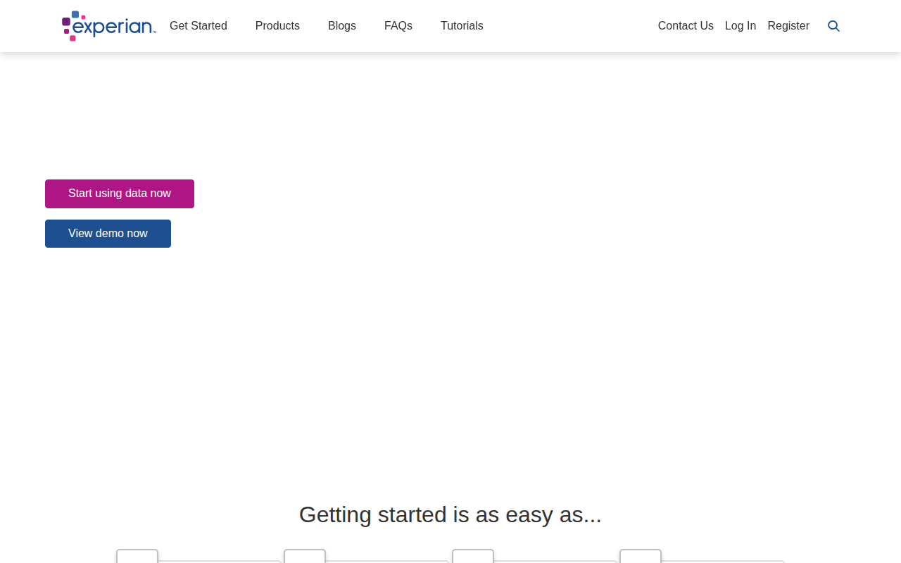
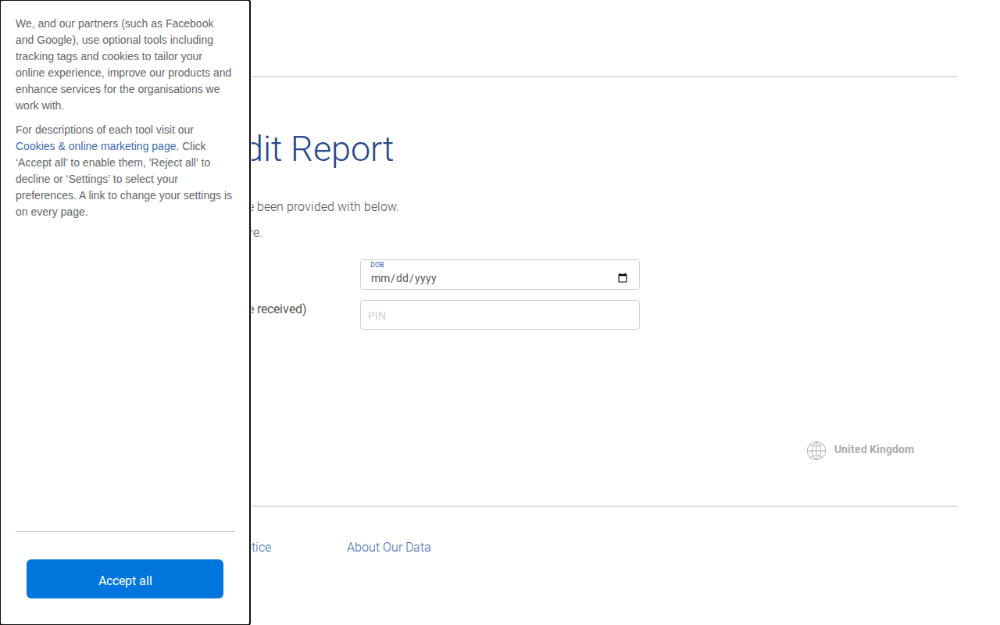
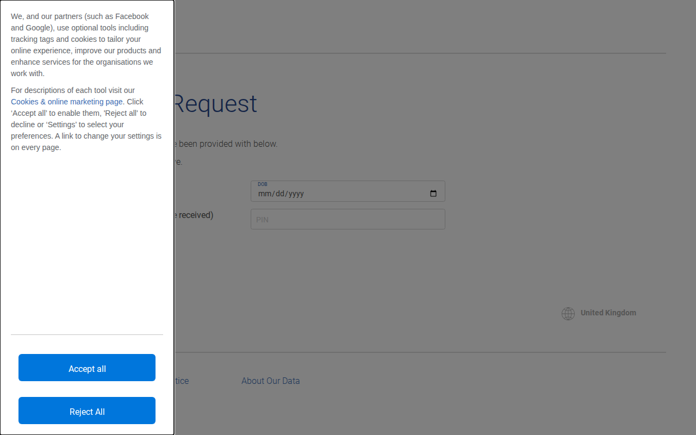
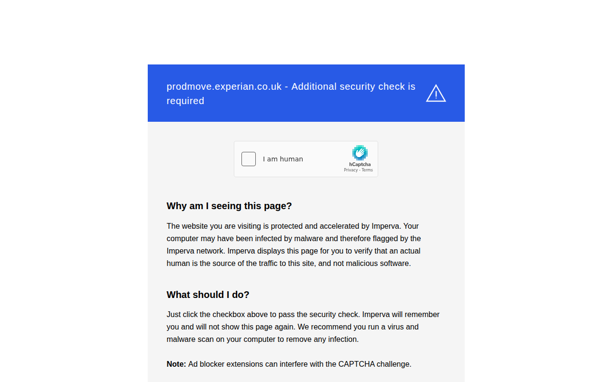
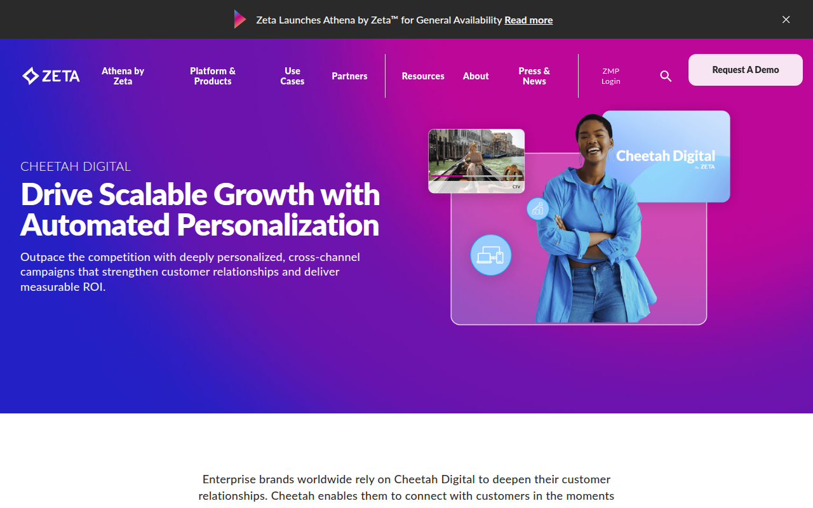
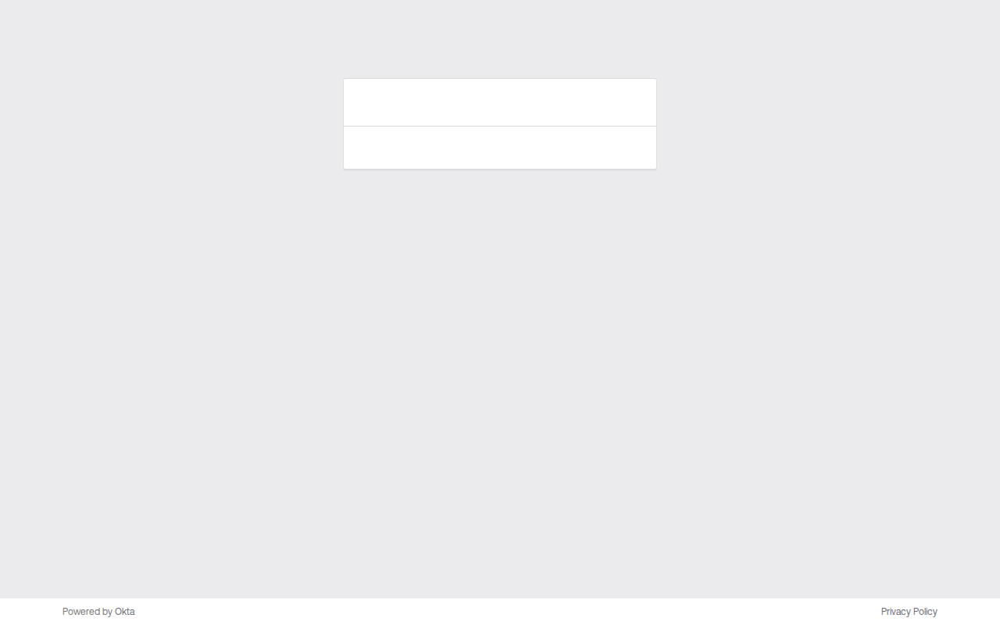
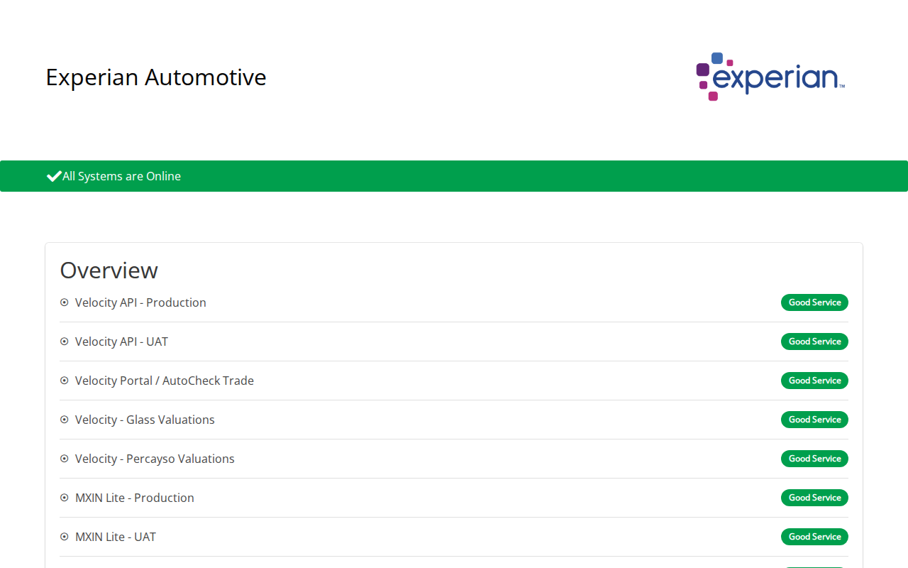
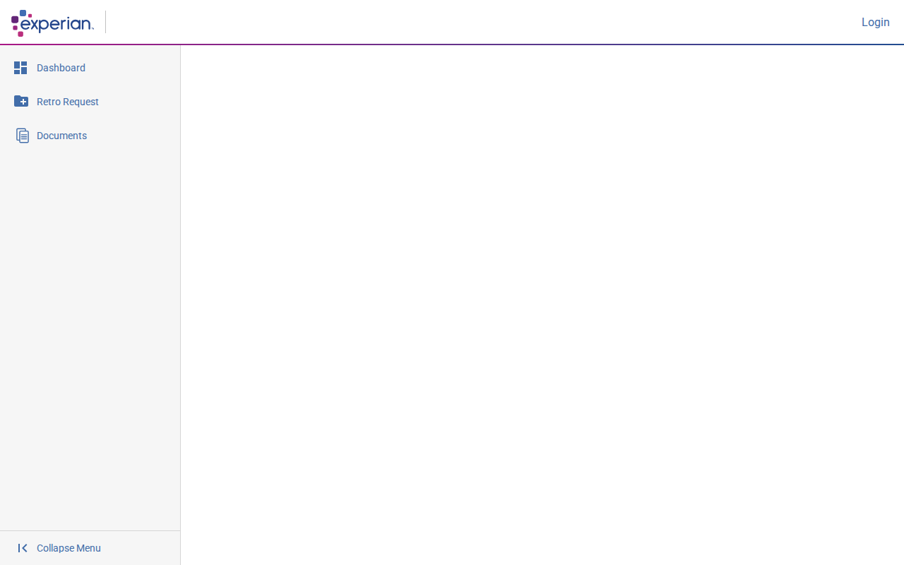
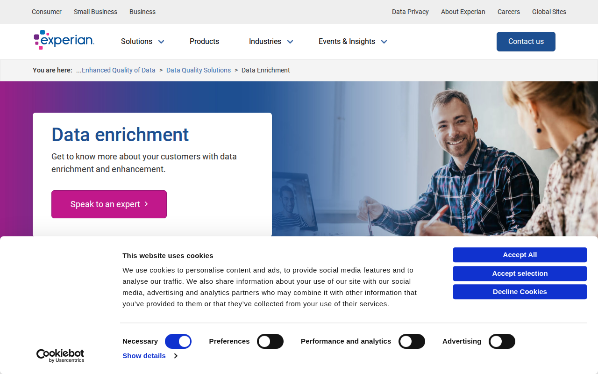
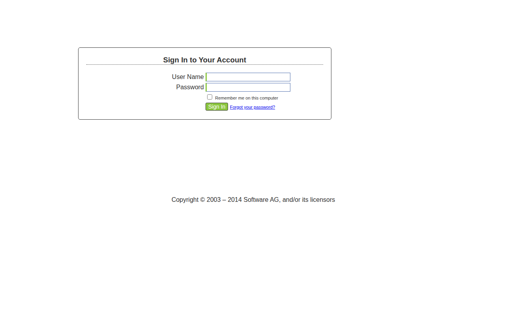

# experian.co.uk — 2026-03-24_12-35-30

Certificates queried from [crt.sh](https://crt.sh/?q=%.experian.co.uk).

## Summary

| Metric | Count |
|-------:|------:|
| Total domains found | 581 |
| Successes | 71 |
| ERR_ABORTED | 2 |
| ERR_CONNECTION_REFUSED | 9 |
| ERR_EMPTY_RESPONSE | 4 |
| ERR_NAME_NOT_RESOLVED | 202 |
| HTTP 400 | 1 |
| HTTP 401 | 1 |
| HTTP 403 | 133 |
| HTTP 404 | 15 |
| HTTP 409 | 2 |
| HTTP 502 | 2 |
| HTTP 503 | 34 |
| timeout | 105 |

## Details

| Domain | Result |
|--------|--------|
| `accdata.experian.co.uk` | `ERR_NAME_NOT_RESOLVED` |
| `account.experian.co.uk` |  |
| `admin.pcod.experian.co.uk` | `ERR_NAME_NOT_RESOLVED` |
| `admin.preprod.pcod.experian.co.uk` | `timeout` |
| `admin.prestg.pcod.experian.co.uk` | `ERR_NAME_NOT_RESOLVED` |
| `admin.stg.pcod.experian.co.uk` | `ERR_NAME_NOT_RESOLVED` |
| `adrastea-explore.experian.co.uk` |  |
| `adrastea-workbench.experian.co.uk` | `timeout` |
| `affordabilitycheck.experian.co.uk` | `ERR_NAME_NOT_RESOLVED` |
| `affordabilitypassport.experian.co.uk` |  |
| `affordabilitypassportuserauth.experian.co.uk` | `HTTP 503` |
| `affordabilityportal.experian.co.uk` |  |
| `agentux.dsardatacapture.experian.co.uk` |  |
| `agentux.qat.dsardatacapture.experian.co.uk` | `ERR_NAME_NOT_RESOLVED` |
| `agentux.uat.dsardatacapture.experian.co.uk` | `timeout` |
| `ais-optimize-uk.experian.co.uk` | `HTTP 503` |
| `ais.experian.co.uk` |  |
| `aitne-analytics.experian.co.uk` | `HTTP 403` |
| `aitne-notebook.experian.co.uk` | `HTTP 403` |
| `alert.experian.co.uk` | `timeout` |
| `alerts.experian.co.uk` |  |
| `alvaldi-analytics.experian.co.uk` | `HTTP 403` |
| `alvaldi-notebook.experian.co.uk` | `HTTP 403` |
| `amalthea-workbench.experian.co.uk` | `timeout` |
| `amatheia-analytics.experian.co.uk` | `HTTP 403` |
| `amatheia-notebook.experian.co.uk` | `HTTP 403` |
| `amphinome-analytics.experian.co.uk` | `HTTP 403` |
| `amphinome-notebook.experian.co.uk` | `HTTP 403` |
| `analytics-explorer-browser.experian.co.uk` | `timeout` |
| `analytics-explorer.experian.co.uk` | `timeout` |
| `analytics.experian.co.uk` | `ERR_NAME_NOT_RESOLVED` |
| `analytics1.experian.co.uk` | `timeout` |
| `analytics2.experian.co.uk` | `ERR_CONNECTION_REFUSED` |
| `analyticsondemand.experian.co.uk` | `timeout` |
| `api-floodre.experian.co.uk` | `ERR_NAME_NOT_RESOLVED` |
| `api-nqa.experian.co.uk` | `HTTP 404` |
| `api.experian.co.uk` | `timeout` |
| `api.pcod.experian.co.uk` | `timeout` |
| `api.preprod.pcod.experian.co.uk` | `timeout` |
| `api.prestg.pcod.experian.co.uk` | `ERR_NAME_NOT_RESOLVED` |
| `api.stg.pcod.experian.co.uk` | `ERR_NAME_NOT_RESOLVED` |
| `app.pcod.experian.co.uk` | `ERR_NAME_NOT_RESOLVED` |
| `app.stg.pcod.experian.co.uk` | `ERR_NAME_NOT_RESOLVED` |
| `apseudes-analytics.experian.co.uk` | `HTTP 403` |
| `apseudes-notebook.experian.co.uk` | `HTTP 403` |
| `archiver-voy.experian.co.uk` | `ERR_NAME_NOT_RESOLVED` |
| `ariel-analytics.experian.co.uk` | `timeout` |
| `ariel-notebook.experian.co.uk` | `timeout` |
| `ariel-workbench.experian.co.uk` | `timeout` |
| `ascend-analytics.experian.co.uk` | `HTTP 503` |
| `ascend-notebook.experian.co.uk` | `HTTP 503` |
| `aumurie-analytics.experian.co.uk` | `HTTP 403` |
| `aumurie-notebook.experian.co.uk` | `HTTP 403` |
| `autodiscover.experian.co.uk` | `timeout` |
| `automation-companies.experian.co.uk` | `ERR_NAME_NOT_RESOLVED` |
| `autonoe-analytics.experian.co.uk` | `ERR_NAME_NOT_RESOLVED` |
| `autonoe-notebook.experian.co.uk` | `ERR_NAME_NOT_RESOLVED` |
| `barclays.huntergateway.experian.co.uk` | `timeout` |
| `bardolph-analytics.experian.co.uk` | `HTTP 403` |
| `bardolph-notebook.experian.co.uk` | `HTTP 403` |
| `bebhionn-analytics.experian.co.uk` | `HTTP 503` |
| `bebhionn-notebook.experian.co.uk` | `HTTP 503` |
| `bergelmir-analytics.experian.co.uk` | `HTTP 403` |
| `bergelmir-notebook.experian.co.uk` | `HTTP 403` |
| `beta-developer.experian.co.uk` | `ERR_NAME_NOT_RESOLVED` |
| `bianca-analytics.experian.co.uk` | `HTTP 403` |
| `bianca-notebook.experian.co.uk` | `HTTP 403` |
| `bidatavis.experian.co.uk` | `timeout` |
| `bidatavis.uat.experian.co.uk` | `timeout` |
| `boost.experian.co.uk` |  |
| `boost.livestaging.experian.co.uk` | `HTTP 403` |
| `businessprospectprofile.experian.co.uk` |  |
| `c1.experian.co.uk` | `timeout` |
| `cadwal-explore.experian.co.uk` |  |
| `callisto-workbench.experian.co.uk` | `timeout` |
| `car.experian.co.uk` | `HTTP 503` |
| `cat-affordabilitypassport.experian.co.uk` |  |
| `cat-customerconsentportal.experian.co.uk` |  |
| `celebrus.experian.co.uk` | `timeout` |
| `ceres-workbench.experian.co.uk` | `timeout` |
| `chaldene-analytics.experian.co.uk` | `timeout` |
| `chaldene-notebook.experian.co.uk` | `timeout` |
| `cinna-explore.experian.co.uk` |  |
| `click.eml.experian.co.uk` | `HTTP 403` |
| `cloud.alert.experian.co.uk` | `HTTP 404` |
| `cloud.eml.experian.co.uk` | `HTTP 404` |
| `cloud.notify.experian.co.uk` | `HTTP 404` |
| `companies.experian.co.uk` | `ERR_NAME_NOT_RESOLVED` |
| `connect.experian.co.uk` |  |
| `consumer.help.experian.co.uk` |  |
| `consumer.learn.experian.co.uk` |  |
| `consumerenrich.experian.co.uk` | `timeout` |
| `consumerportal.experian.co.uk` | `HTTP 401` |
| `creditmatcher.experian.co.uk` |  |
| `creditreport.cpp.experian.co.uk` | `timeout` |
| `creditreporthelp.experian.co.uk` | `ERR_NAME_NOT_RESOLVED` |
| `csync-enterpriseapi.experian.co.uk` | `HTTP 503` |
| `customerconsentportal.experian.co.uk` |  |
| `daphnis-analytics.experian.co.uk` | `timeout` |
| `daphnis-notebook.experian.co.uk` | `timeout` |
| `dashboard.pfs.poc.experian.co.uk` | `timeout` |
| `data-analytics-insights.experian.co.uk` |  |
| `data.experian.co.uk` | `ERR_ABORTED` |
| `datadisputes.experian.co.uk` | `timeout` |
| `desdemona-analytics.experian.co.uk` | `timeout` |
| `desdemona-notebook.experian.co.uk` | `timeout` |
| `designstudio.experian.co.uk` | `ERR_CONNECTION_REFUSED` |
| `dev-analytics-explorer-browser.experian.co.uk` | `timeout` |
| `dev-api-floodre.experian.co.uk` | `ERR_NAME_NOT_RESOLVED` |
| `dev-api-nqa.experian.co.uk` | `HTTP 404` |
| `dev-api-nqaservices.experian.co.uk` | `HTTP 404` |
| `dev-ascend-analytics.experian.co.uk` | `HTTP 503` |
| `dev-ascend-notebook.experian.co.uk` | `HTTP 503` |
| `dev-customerconsentportal.experian.co.uk` |  |
| `dev-enrichment-api-enterprise.experian.co.uk` | `HTTP 503` |
| `dev-enrichmentui.experian.co.uk` |  |
| `dev-entitlements-api-enterprise.experian.co.uk` | `ERR_NAME_NOT_RESOLVED` |
| `dev-nqa-demo.experian.co.uk` |  |
| `dev-regulation.experian.co.uk` | `ERR_NAME_NOT_RESOLVED` |
| `dev.api.experian.co.uk` | `ERR_NAME_NOT_RESOLVED` |
| `dev.experian.co.uk` | `ERR_NAME_NOT_RESOLVED` |
| `dev.garlik.api.experian.co.uk` | `ERR_NAME_NOT_RESOLVED` |
| `dev.service.experian.co.uk` | `timeout` |
| `developer.experian.co.uk` |  |
| `dexamene-analytics.experian.co.uk` | `HTTP 403` |
| `dexamene-notebook.experian.co.uk` | `HTTP 403` |
| `digiwise.experian.co.uk` | `timeout` |
| `dionyza-explore.experian.co.uk` |  |
| `docscan.experian.co.uk` |  |
| `dqc-dev.experian.co.uk` | `ERR_NAME_NOT_RESOLVED` |
| `dqc.dev.experian.co.uk` | `timeout` |
| `dqc.experian.co.uk` | `ERR_NAME_NOT_RESOLVED` |
| `dqc.uat.experian.co.uk` | `ERR_NAME_NOT_RESOLVED` |
| `dsardatacapture.experian.co.uk` | `ERR_NAME_NOT_RESOLVED` |
| `earthworkbench.experian.co.uk` | `ERR_NAME_NOT_RESOLVED` |
| `economics.experian.co.uk` | `timeout` |
| `economics.uat.experian.co.uk` | `ERR_NAME_NOT_RESOLVED` |
| `edaoracle.experian.co.uk` | `timeout` |
| `email.experian.co.uk` |  |
| `emsquit.experian.co.uk` | `ERR_NAME_NOT_RESOLVED` |
| `emsuquit.experian.co.uk` | `timeout` |
| `emsuweb.experian.co.uk` | `ERR_CONNECTION_REFUSED` |
| `emsuweb2.experian.co.uk` | `timeout` |
| `emsweb.experian.co.uk` | `HTTP 404` |
| `emsweb2.experian.co.uk` | `timeout` |
| `engage.experian.co.uk` | `HTTP 409` |
| `enrichment-api-enterprise.experian.co.uk` | `HTTP 503` |
| `erinome-analytics.experian.co.uk` | `HTTP 503` |
| `erinome-notebook.experian.co.uk` | `HTTP 503` |
| `eris-workbench.experian.co.uk` | `timeout` |
| `erriapus-explore.experian.co.uk` | `HTTP 400` |
| `escanes-analytics.experian.co.uk` | `HTTP 403` |
| `escanes-notebook.experian.co.uk` | `HTTP 403` |
| `euagore-analytics.experian.co.uk` | `HTTP 403` |
| `euagore-notebook.experian.co.uk` | `HTTP 403` |
| `eukelade-analytics.experian.co.uk` | `HTTP 403` |
| `eukelade-notebook.experian.co.uk` | `HTTP 403` |
| `eukrante-analytics.experian.co.uk` | `HTTP 403` |
| `eukrante-notebook.experian.co.uk` | `HTTP 403` |
| `eulimene-analytics.experian.co.uk` | `HTTP 403` |
| `eulimene-notebook.experian.co.uk` | `HTTP 403` |
| `eumolpe-analytics.experian.co.uk` | `HTTP 503` |
| `eumolpe-notebook.experian.co.uk` | `HTTP 403` |
| `eupompe-analytics.experian.co.uk` | `HTTP 403` |
| `eupompe-notebook.experian.co.uk` | `HTTP 403` |
| `euporie-analytics.experian.co.uk` | `timeout` |
| `euporie-notebook.experian.co.uk` | `timeout` |
| `europa-workbench.experian.co.uk` | `timeout` |
| `eurydome-analytics.experian.co.uk` | `ERR_NAME_NOT_RESOLVED` |
| `eurydome-notebook.experian.co.uk` | `HTTP 503` |
| `experian-hub.experian.co.uk` | `ERR_NAME_NOT_RESOLVED` |
| `experian.co.uk` |  |
| `farbauti-analytics.experian.co.uk` | `HTTP 503` |
| `farbauti-notebook.experian.co.uk` | `HTTP 503` |
| `fedsso.experian.co.uk` | `timeout` |
| `forgerock.experian.co.uk` |  |
| `francisco-analytics.experian.co.uk` | `timeout` |
| `francisco-notebook.experian.co.uk` | `timeout` |
| `fulfillcredit.experian.co.uk` |  |
| `fulfilldataaccess.experian.co.uk` |  |
| `galateia-analytics.experian.co.uk` | `HTTP 403` |
| `galateia-notebook.experian.co.uk` | `HTTP 403` |
| `ganymede-analytics.experian.co.uk` | `timeout` |
| `ganymede-notebook.experian.co.uk` | `timeout` |
| `ganymede-workbench.experian.co.uk` | `timeout` |
| `garlik.api.experian.co.uk` | `timeout` |
| `glauke-analytics.experian.co.uk` | `HTTP 403` |
| `glauke-notebook.experian.co.uk` | `HTTP 403` |
| `glaukonome-analytics.experian.co.uk` | `HTTP 403` |
| `glaukonome-notebook.experian.co.uk` | `HTTP 403` |
| `goad.experian.co.uk` | `ERR_EMPTY_RESPONSE` |
| `gunnlod-explore.experian.co.uk` |  |
| `halia-analytics.experian.co.uk` | `HTTP 403` |
| `halia-notebook.experian.co.uk` | `HTTP 403` |
| `halimede-analytics.experian.co.uk` | `HTTP 403` |
| `halimede-notebook.experian.co.uk` | `HTTP 403` |
| `harpalyke-analytics.experian.co.uk` | `HTTP 403` |
| `harpalyke-notebook.experian.co.uk` | `HTTP 403` |
| `help.creditreport.cpp.experian.co.uk` | `ERR_NAME_NOT_RESOLVED` |
| `himalia-analytics.experian.co.uk` | `timeout` |
| `himalia-notebook.experian.co.uk` | `timeout` |
| `hipponoe-analytics.experian.co.uk` | `HTTP 403` |
| `hipponoe-notebook.experian.co.uk` | `HTTP 403` |
| `hippothoe-analytics.experian.co.uk` | `HTTP 503` |
| `hippothoe-notebook.experian.co.uk` | `HTTP 403` |
| `home.experian.co.uk` |  |
| `homepage.experian.co.uk` |  |
| `hunter.experian.co.uk` | `ERR_NAME_NOT_RESOLVED` |
| `huntergateway.experian.co.uk` | `timeout` |
| `iaira-analytics.experian.co.uk` | `HTTP 403` |
| `iaira-notebook.experian.co.uk` | `HTTP 403` |
| `ianassa-analytics.experian.co.uk` | `HTTP 403` |
| `ianassa-notebook.experian.co.uk` | `HTTP 403` |
| `ianeira-analytics.experian.co.uk` | `HTTP 403` |
| `ianeira-notebook.experian.co.uk` | `HTTP 403` |
| `identity.experian.co.uk` |  |
| `identityalarm.experian.co.uk` | `ERR_NAME_NOT_RESOLVED` |
| `identitycare.experian.co.uk` | `ERR_NAME_NOT_RESOLVED` |
| `identitycare.uat.experian.co.uk` | `ERR_NAME_NOT_RESOLVED` |
| `identityprotect.experian.co.uk` | `timeout` |
| `identitytheft.experian.co.uk` | `ERR_NAME_NOT_RESOLVED` |
| `identitytheft.uat.experian.co.uk` | `ERR_NAME_NOT_RESOLVED` |
| `ijiraq-analytics.experian.co.uk` | `HTTP 403` |
| `ijiraq-notebook.experian.co.uk` | `HTTP 403` |
| `image.eml.experian.co.uk` | `HTTP 403` |
| `images.experian.co.uk` | `timeout` |
| `incomeexpend.experian.co.uk` | `ERR_NAME_NOT_RESOLVED` |
| `ins.experian.co.uk` |  |
| `insurance.experian.co.uk` | `ERR_NAME_NOT_RESOLVED` |
| `investigatoronline.experian.co.uk` |  |
| `ione-analytics.experian.co.uk` | `HTTP 403` |
| `ione-notebook.experian.co.uk` | `HTTP 403` |
| `jeeves.poc.experian.co.uk` | `timeout` |
| `jupiterworkbench.experian.co.uk` | `ERR_NAME_NOT_RESOLVED` |
| `kalyke-explore.experian.co.uk` | `HTTP 502` |
| `keto-analytics.experian.co.uk` | `HTTP 403` |
| `keto-notebook.experian.co.uk` | `HTTP 403` |
| `klymene-analytics.experian.co.uk` | `HTTP 403` |
| `klymene-notebook.experian.co.uk` | `HTTP 403` |
| `kranto-analytics.experian.co.uk` | `HTTP 403` |
| `kranto-notebook.experian.co.uk` | `HTTP 403` |
| `kymodoke-analytics.experian.co.uk` | `HTTP 403` |
| `kymodoke-notebook.experian.co.uk` | `HTTP 403` |
| `kymothoe-analytics.experian.co.uk` | `HTTP 403` |
| `kymothoe-notebook.experian.co.uk` | `HTTP 403` |
| `laomedeia-analytics.experian.co.uk` | `HTTP 403` |
| `laomedeia-notebook.experian.co.uk` | `HTTP 403` |
| `leagore-analytics.experian.co.uk` | `HTTP 403` |
| `leagore-notebook.experian.co.uk` | `HTTP 403` |
| `links.rewards.experian.co.uk` | `HTTP 404` |
| `locaste-analytics.experian.co.uk` | `HTTP 403` |
| `locaste-notebook.experian.co.uk` | `HTTP 403` |
| `lock.experian.co.uk` |  |
| `lucentio-analytics.experian.co.uk` | `HTTP 403` |
| `lucentio-notebook.experian.co.uk` | `HTTP 403` |
| `lysithea-analytics.experian.co.uk` | `HTTP 403` |
| `lysithea-notebook.experian.co.uk` | `HTTP 403` |
| `maira-analytics.experian.co.uk` | `HTTP 403` |
| `maira-notebook.experian.co.uk` | `HTTP 403` |
| `marsworkbench.experian.co.uk` | `ERR_NAME_NOT_RESOLVED` |
| `mbnaidcs.experian.co.uk` | `timeout` |
| `megaclite-analytics.experian.co.uk` | `HTTP 403` |
| `megaclite-notebook.experian.co.uk` | `HTTP 403` |
| `menippe-analytics.experian.co.uk` | `HTTP 403` |
| `menippe-notebook.experian.co.uk` | `HTTP 403` |
| `mercuryworkbench.experian.co.uk` | `ERR_NAME_NOT_RESOLVED` |
| `messenger.dev.autocheck.experian.co.uk` | `timeout` |
| `methone-analytics.experian.co.uk` | `timeout` |
| `methone-notebook.experian.co.uk` | `timeout` |
| `mfe.experian.co.uk` | `HTTP 503` |
| `minij.dev.experian.co.uk` | `timeout` |
| `mmonline.experian.co.uk` | `timeout` |
| `mmonlinestage.experian.co.uk` | `timeout` |
| `morrisonslocn.experian.co.uk` | `timeout` |
| `morrisonslp.experian.co.uk` | `ERR_NAME_NOT_RESOLVED` |
| `mortgagesavingstool.experian.co.uk` | `ERR_NAME_NOT_RESOLVED` |
| `mtls-api.experian.co.uk` | `ERR_EMPTY_RESPONSE` |
| `mundilfari-analytics.experian.co.uk` | `HTTP 503` |
| `mundilfari-notebook.experian.co.uk` | `HTTP 503` |
| `myhome.experian.co.uk` |  |
| `namstrcdr.experian.co.uk` |  |
| `namstrvrec.experian.co.uk` | `ERR_NAME_NOT_RESOLVED` |
| `neartime.experian.co.uk` | `ERR_CONNECTION_REFUSED` |
| `neomeris-analytics.experian.co.uk` | `HTTP 403` |
| `neomeris-notebook.experian.co.uk` | `HTTP 403` |
| `neptuneworkbench.experian.co.uk` | `ERR_NAME_NOT_RESOLVED` |
| `nesaie-analytics.experian.co.uk` | `HTTP 403` |
| `nesaie-notebook.experian.co.uk` | `HTTP 403` |
| `nqa-demo.experian.co.uk` | `HTTP 502` |
| `offers.experian.co.uk` |  |
| `openai-app.experian.co.uk` | `ERR_NAME_NOT_RESOLVED` |
| `oreithyia-analytics.experian.co.uk` | `HTTP 403` |
| `oreithyia-notebook.experian.co.uk` | `HTTP 403` |
| `orthosie-analytics.experian.co.uk` | `HTTP 403` |
| `orthosie-notebook.experian.co.uk` | `HTTP 403` |
| `outsystems.experian.co.uk` | `HTTP 403` |
| `pasithea-analytics.experian.co.uk` | `HTTP 403` |
| `pasithea-notebook.experian.co.uk` | `HTTP 403` |
| `pasithee-analytics.experian.co.uk` | `HTTP 403` |
| `pasithee-notebook.experian.co.uk` | `HTTP 403` |
| `pcod.experian.co.uk` | `ERR_NAME_NOT_RESOLVED` |
| `perdita-analytics.experian.co.uk` | `HTTP 403` |
| `perdita-notebook.experian.co.uk` | `HTTP 403` |
| `pherousa-analytics.experian.co.uk` | `HTTP 403` |
| `pherousa-notebook.experian.co.uk` | `HTTP 403` |
| `plexaure-analytics.experian.co.uk` | `HTTP 403` |
| `plexaure-notebook.experian.co.uk` | `HTTP 403` |
| `ploto-analytics.experian.co.uk` | `HTTP 403` |
| `ploto-notebook.experian.co.uk` | `HTTP 403` |
| `plutoworkbench.experian.co.uk` | `ERR_NAME_NOT_RESOLVED` |
| `pmidvalidation.experian.co.uk` | `timeout` |
| `portia-analytics.experian.co.uk` | `HTTP 403` |
| `portia-notebook.experian.co.uk` | `HTTP 403` |
| `praxidike-analytics.experian.co.uk` | `timeout` |
| `praxidike-notebook.experian.co.uk` | `timeout` |
| `premium.experian.co.uk` | `ERR_NAME_NOT_RESOLVED` |
| `preprod.pcod.experian.co.uk` | `ERR_NAME_NOT_RESOLVED` |
| `prestg.pcod.experian.co.uk` | `ERR_NAME_NOT_RESOLVED` |
| `preview.experian.co.uk` | `HTTP 404` |
| `privacyguard.experian.co.uk` | `ERR_NAME_NOT_RESOLVED` |
| `privacyguard.uat.experian.co.uk` | `ERR_NAME_NOT_RESOLVED` |
| `prodmove.experian.co.uk` |  |
| `profile.experian.co.uk` |  |
| `protect.experian.co.uk` |  |
| `protectmyidentity.experian.co.uk` | `ERR_NAME_NOT_RESOLVED` |
| `protectmyidentity.uat.experian.co.uk` | `ERR_NAME_NOT_RESOLVED` |
| `provider.pfs.poc.experian.co.uk` | `timeout` |
| `puck-analytics.experian.co.uk` | `HTTP 403` |
| `puck-notebook.experian.co.uk` | `HTTP 403` |
| `qa-companies.experian.co.uk` | `ERR_NAME_NOT_RESOLVED` |
| `qa-content.experian.co.uk` | `HTTP 404` |
| `qa.garlik.api.experian.co.uk` | `ERR_NAME_NOT_RESOLVED` |
| `qa.identityprotect.experian.co.uk` | `timeout` |
| `qat.dsardatacapture.experian.co.uk` | `timeout` |
| `queries.creditreport.cpp.experian.co.uk` | `timeout` |
| `registry.pfs.poc.experian.co.uk` | `timeout` |
| `regulation.experian.co.uk` | `ERR_NAME_NOT_RESOLVED` |
| `report.experian.co.uk` |  |
| `reportsaver.experian.co.uk` | `timeout` |
| `retirementplan.experian.co.uk` |  |
| `retirementplansecure.experian.co.uk` | `ERR_NAME_NOT_RESOLVED` |
| `retro-on-demand.experian.co.uk` |  |
| `rp.experian.co.uk` | `ERR_NAME_NOT_RESOLVED` |
| `rpa.experian.co.uk` | `ERR_NAME_NOT_RESOLVED` |
| `sandbox-analytics.experian.co.uk` | `timeout` |
| `sandbox-api-employeedirectory.experian.co.uk` | `HTTP 503` |
| `sandbox-mtls-api.experian.co.uk` | `ERR_EMPTY_RESPONSE` |
| `sandbox.uat.velocity-automotive.experian.co.uk` | `HTTP 404` |
| `sandboxanalytics.experian.co.uk` | `ERR_NAME_NOT_RESOLVED` |
| `saturnworkbench.experian.co.uk` | `ERR_NAME_NOT_RESOLVED` |
| `savings.experian.co.uk` | `HTTP 403` |
| `sbslive.experian.co.uk` | `timeout` |
| `score.experian.co.uk` |  |
| `search.experian.co.uk` | `ERR_NAME_NOT_RESOLVED` |
| `service.experian.co.uk` |  |
| `servicing.experian.co.uk` |  |
| `setebos-analytics.experian.co.uk` | `HTTP 403` |
| `setebos-notebook.experian.co.uk` | `HTTP 403` |
| `sfs-e-series.experian.co.uk` | `timeout` |
| `sh-assistedjourney.experian.co.uk` |  |
| `shub.experian.co.uk` |  |
| `skathi-analytics.experian.co.uk` | `HTTP 503` |
| `skathi-notebook.experian.co.uk` | `HTTP 503` |
| `smetrics.experian.co.uk` | `ERR_NAME_NOT_RESOLVED` |
| `sparkdevlb.experian.co.uk` | `ERR_NAME_NOT_RESOLVED` |
| `speio-analytics.experian.co.uk` | `HTTP 403` |
| `speio-notebook.experian.co.uk` | `HTTP 403` |
| `sso-uat-proxy.experian.co.uk` | `ERR_NAME_NOT_RESOLVED` |
| `sso-uat-proxy.uk.experian.co.uk` | `ERR_NAME_NOT_RESOLVED` |
| `stage.garlik.api.experian.co.uk` | `ERR_NAME_NOT_RESOLVED` |
| `stage.identityprotect.experian.co.uk` | `timeout` |
| `stat.experian.co.uk` | `ERR_NAME_NOT_RESOLVED` |
| `stat.uat.experian.co.uk` | `ERR_NAME_NOT_RESOLVED` |
| `status.velocity-automotive.experian.co.uk` |  |
| `stephano-analytics.experian.co.uk` | `HTTP 403` |
| `stephano-notebook.experian.co.uk` | `HTTP 403` |
| `stg-fedsso.experian.co.uk` | `timeout` |
| `stg-retro-on-demand.experian.co.uk` |  |
| `stg.experian.co.uk` | `ERR_NAME_NOT_RESOLVED` |
| `stg.neartime.experian.co.uk` | `ERR_CONNECTION_REFUSED` |
| `stg.pcod.experian.co.uk` | `ERR_NAME_NOT_RESOLVED` |
| `stg.pmidvalidation.experian.co.uk` | `timeout` |
| `stg1-preview.experian.co.uk` | `HTTP 404` |
| `stg1.experian.co.uk` |  |
| `support.experian.co.uk` |  |
| `supporthub.experian.co.uk` |  |
| `supportportal.experian.co.uk` | `ERR_NAME_NOT_RESOLVED` |
| `suttungr-analytics.experian.co.uk` | `HTTP 403` |
| `suttungr-notebook.experian.co.uk` | `HTTP 403` |
| `sycorax-analytics.experian.co.uk` | `HTTP 403` |
| `sycorax-notebook.experian.co.uk` | `HTTP 403` |
| `t.experian.co.uk` |  |
| `tags.experian.co.uk` | `ERR_ABORTED` |
| `targetiq.experian.co.uk` |  |
| `targetiq.uat.experian.co.uk` | `ERR_NAME_NOT_RESOLVED` |
| `tarqeq-analytics.experian.co.uk` | `HTTP 503` |
| `tarqeq-notebook.experian.co.uk` | `HTTP 503` |
| `test-affordabilitypassport.experian.co.uk` |  |
| `test-archiver-voy.experian.co.uk` | `ERR_NAME_NOT_RESOLVED` |
| `test-customerconsentportal.experian.co.uk` |  |
| `test-enrichment-api-enterprise.experian.co.uk` | `HTTP 503` |
| `test-enrichmentui.experian.co.uk` | `HTTP 503` |
| `test-entitlements-api-enterprise.experian.co.uk` | `ERR_NAME_NOT_RESOLVED` |
| `thelxinoe-analytics.experian.co.uk` | `HTTP 403` |
| `thelxinoe-notebook.experian.co.uk` | `HTTP 403` |
| `themisto-analytics.experian.co.uk` | `HTTP 403` |
| `themisto-notebook.experian.co.uk` | `HTTP 403` |
| `thoe-analytics.experian.co.uk` | `HTTP 403` |
| `thoe-notebook.experian.co.uk` | `HTTP 403` |
| `thyone-analytics.experian.co.uk` | `HTTP 403` |
| `thyone-notebook.experian.co.uk` | `HTTP 403` |
| `tmp.creditmatcher.experian.co.uk` | `ERR_NAME_NOT_RESOLVED` |
| `tmp.ins.experian.co.uk` | `ERR_NAME_NOT_RESOLVED` |
| `trinculo-analytics.experian.co.uk` | `HTTP 403` |
| `trinculo-notebook.experian.co.uk` | `HTTP 403` |
| `trusso.experian.co.uk` | `timeout` |
| `tst-api-nqa.experian.co.uk` | `HTTP 404` |
| `tst-outsystems.experian.co.uk` | `ERR_NAME_NOT_RESOLVED` |
| `tst-regulation.experian.co.uk` | `ERR_NAME_NOT_RESOLVED` |
| `uat-api-floodre.experian.co.uk` | `ERR_NAME_NOT_RESOLVED` |
| `uat-api-nqa.experian.co.uk` | `HTTP 404` |
| `uat-api-nqaservices.experian.co.uk` | `HTTP 404` |
| `uat-beta-developer.experian.co.uk` | `ERR_NAME_NOT_RESOLVED` |
| `uat-companies.experian.co.uk` | `ERR_NAME_NOT_RESOLVED` |
| `uat-consumerenrich.experian.co.uk` | `timeout` |
| `uat-csync-enterpriseapi.experian.co.uk` | `HTTP 503` |
| `uat-designstudio.experian.co.uk` | `ERR_CONNECTION_REFUSED` |
| `uat-enrichment-api-enterprise.experian.co.uk` | `ERR_NAME_NOT_RESOLVED` |
| `uat-enrichmentui.experian.co.uk` | `ERR_NAME_NOT_RESOLVED` |
| `uat-experian-hub.experian.co.uk` | `ERR_NAME_NOT_RESOLVED` |
| `uat-investigatoronline.experian.co.uk` |  |
| `uat-mtls-api.experian.co.uk` | `ERR_EMPTY_RESPONSE` |
| `uat-nqa-demo.experian.co.uk` |  |
| `uat-sfs-e-series.experian.co.uk` | `timeout` |
| `uat-sh-assistedjourney.experian.co.uk` |  |
| `uat-supporthub.experian.co.uk` |  |
| `uat.dsardatacapture.experian.co.uk` | `ERR_NAME_NOT_RESOLVED` |
| `uat.identityalarm.experian.co.uk` | `ERR_NAME_NOT_RESOLVED` |
| `uat.mbnaidcs.experian.co.uk` | `timeout` |
| `uat.service.experian.co.uk` |  |
| `uat.velocity-automotive.experian.co.uk` |  |
| `uatworkbench.experian.co.uk` | `ERR_NAME_NOT_RESOLVED` |
| `uhuntergateway.experian.co.uk` | `timeout` |
| `ukrsotsbank.experian.co.uk` | `timeout` |
| `userauth.experian.co.uk` | `HTTP 503` |
| `userdetails.creditreport.cpp.experian.co.uk` | `timeout` |
| `vehiclecheck.dev.autocheck.experian.co.uk` | `timeout` |
| `velocity-automotive.experian.co.uk` |  |
| `venusworkbench.experian.co.uk` | `ERR_NAME_NOT_RESOLVED` |
| `view.eml.experian.co.uk` |  |
| `workbench.experian.co.uk` | `ERR_NAME_NOT_RESOLVED` |
| `www.accdata.experian.co.uk` | `ERR_NAME_NOT_RESOLVED` |
| `www.account.experian.co.uk` | `ERR_NAME_NOT_RESOLVED` |
| `www.affordabilitycheck.experian.co.uk` | `ERR_NAME_NOT_RESOLVED` |
| `www.affordabilitypassport.experian.co.uk` | `ERR_NAME_NOT_RESOLVED` |
| `www.affordabilitypassportuserauth.experian.co.uk` | `ERR_NAME_NOT_RESOLVED` |
| `www.affordabilityportal.experian.co.uk` | `ERR_NAME_NOT_RESOLVED` |
| `www.agentux.dsardatacapture.experian.co.uk` | `ERR_NAME_NOT_RESOLVED` |
| `www.agentux.uat.dsardatacapture.experian.co.uk` | `ERR_NAME_NOT_RESOLVED` |
| `www.ais.experian.co.uk` | `ERR_NAME_NOT_RESOLVED` |
| `www.alerts.experian.co.uk` | `ERR_NAME_NOT_RESOLVED` |
| `www.analytics.experian.co.uk` | `ERR_NAME_NOT_RESOLVED` |
| `www.analytics2.experian.co.uk` | `ERR_NAME_NOT_RESOLVED` |
| `www.analyticsondemand.experian.co.uk` | `ERR_NAME_NOT_RESOLVED` |
| `www.api-eec-workreport.experian.co.uk` | `timeout` |
| `www.ariel-notebook.experian.co.uk` | `ERR_NAME_NOT_RESOLVED` |
| `www.beta-developer.experian.co.uk` | `ERR_NAME_NOT_RESOLVED` |
| `www.boost.experian.co.uk` | `ERR_NAME_NOT_RESOLVED` |
| `www.c1.experian.co.uk` | `ERR_NAME_NOT_RESOLVED` |
| `www.car.experian.co.uk` | `ERR_NAME_NOT_RESOLVED` |
| `www.creditmatcher.experian.co.uk` | `ERR_NAME_NOT_RESOLVED` |
| `www.creditreporthelp.experian.co.uk` | `timeout` |
| `www.dashboard.pfs.poc.experian.co.uk` | `ERR_NAME_NOT_RESOLVED` |
| `www.datadisputes.experian.co.uk` | `ERR_NAME_NOT_RESOLVED` |
| `www.designstudio.experian.co.uk` | `ERR_NAME_NOT_RESOLVED` |
| `www.dev-regulation.experian.co.uk` | `ERR_NAME_NOT_RESOLVED` |
| `www.dev.aacheck.experian.co.uk` | `timeout` |
| `www.dev.autocheck.experian.co.uk` | `timeout` |
| `www.dev.checkabike.experian.co.uk` | `timeout` |
| `www.dev.service.experian.co.uk` | `ERR_NAME_NOT_RESOLVED` |
| `www.dsardatacapture.experian.co.uk` |  |
| `www.economics.experian.co.uk` | `ERR_NAME_NOT_RESOLVED` |
| `www.economics.uat.experian.co.uk` | `ERR_NAME_NOT_RESOLVED` |
| `www.email.experian.co.uk` | `ERR_NAME_NOT_RESOLVED` |
| `www.emsquit.experian.co.uk` | `ERR_NAME_NOT_RESOLVED` |
| `www.emsuquit.experian.co.uk` | `ERR_NAME_NOT_RESOLVED` |
| `www.emsuweb.experian.co.uk` | `ERR_NAME_NOT_RESOLVED` |
| `www.emsuweb2.experian.co.uk` | `ERR_NAME_NOT_RESOLVED` |
| `www.emsweb.experian.co.uk` | `ERR_NAME_NOT_RESOLVED` |
| `www.emsweb2.experian.co.uk` | `ERR_NAME_NOT_RESOLVED` |
| `www.engage.experian.co.uk` | `HTTP 409` |
| `www.experian-hub.experian.co.uk` | `ERR_NAME_NOT_RESOLVED` |
| `www.experian.co.uk` |  |
| `www.fedsso.experian.co.uk` | `ERR_NAME_NOT_RESOLVED` |
| `www.forgerock.experian.co.uk` | `ERR_NAME_NOT_RESOLVED` |
| `www.fulfillcredit.experian.co.uk` | `ERR_NAME_NOT_RESOLVED` |
| `www.fulfilldataaccess.experian.co.uk` | `ERR_NAME_NOT_RESOLVED` |
| `www.fulfillment.experian.co.uk` | `ERR_NAME_NOT_RESOLVED` |
| `www.goad.experian.co.uk` | `ERR_NAME_NOT_RESOLVED` |
| `www.home.experian.co.uk` | `ERR_NAME_NOT_RESOLVED` |
| `www.homepage.experian.co.uk` | `ERR_NAME_NOT_RESOLVED` |
| `www.hunter.experian.co.uk` | `ERR_NAME_NOT_RESOLVED` |
| `www.identity.experian.co.uk` | `ERR_NAME_NOT_RESOLVED` |
| `www.identityalarm.experian.co.uk` | `ERR_CONNECTION_REFUSED` |
| `www.identitycare.experian.co.uk` | `timeout` |
| `www.identitycare.uat.experian.co.uk` | `timeout` |
| `www.identitytheft.experian.co.uk` | `ERR_CONNECTION_REFUSED` |
| `www.identitytheft.uat.experian.co.uk` | `timeout` |
| `www.incomeexpend.experian.co.uk` | `ERR_NAME_NOT_RESOLVED` |
| `www.ins.experian.co.uk` | `ERR_NAME_NOT_RESOLVED` |
| `www.links.rewards.experian.co.uk` | `ERR_NAME_NOT_RESOLVED` |
| `www.lock.experian.co.uk` | `ERR_NAME_NOT_RESOLVED` |
| `www.mbnaidcs.experian.co.uk` | `ERR_NAME_NOT_RESOLVED` |
| `www.mmonline.experian.co.uk` | `ERR_NAME_NOT_RESOLVED` |
| `www.morrisonslocn.experian.co.uk` | `ERR_NAME_NOT_RESOLVED` |
| `www.morrisonslp.experian.co.uk` | `ERR_NAME_NOT_RESOLVED` |
| `www.mtls-api.experian.co.uk` | `ERR_NAME_NOT_RESOLVED` |
| `www.myhome.experian.co.uk` | `ERR_NAME_NOT_RESOLVED` |
| `www.neartime.experian.co.uk` | `ERR_NAME_NOT_RESOLVED` |
| `www.offers.experian.co.uk` | `ERR_NAME_NOT_RESOLVED` |
| `www.openai-app.experian.co.uk` | `ERR_NAME_NOT_RESOLVED` |
| `www.pcod.experian.co.uk` | `ERR_NAME_NOT_RESOLVED` |
| `www.pmidvalidation.experian.co.uk` | `ERR_NAME_NOT_RESOLVED` |
| `www.preprod.pcod.experian.co.uk` | `ERR_NAME_NOT_RESOLVED` |
| `www.prestg.pcod.experian.co.uk` | `ERR_NAME_NOT_RESOLVED` |
| `www.preview.experian.co.uk` | `ERR_NAME_NOT_RESOLVED` |
| `www.privacyguard.experian.co.uk` | `ERR_CONNECTION_REFUSED` |
| `www.privacyguard.uat.experian.co.uk` | `timeout` |
| `www.prodmove.experian.co.uk` | `ERR_NAME_NOT_RESOLVED` |
| `www.profile.experian.co.uk` | `ERR_NAME_NOT_RESOLVED` |
| `www.protect.experian.co.uk` | `ERR_NAME_NOT_RESOLVED` |
| `www.protectmyidentity.experian.co.uk` | `ERR_NAME_NOT_RESOLVED` |
| `www.protectmyidentity.uat.experian.co.uk` | `timeout` |
| `www.provider.pfs.poc.experian.co.uk` | `ERR_NAME_NOT_RESOLVED` |
| `www.qa-content.experian.co.uk` | `ERR_NAME_NOT_RESOLVED` |
| `www.qat.dsardatacapture.experian.co.uk` | `ERR_NAME_NOT_RESOLVED` |
| `www.report.experian.co.uk` | `ERR_NAME_NOT_RESOLVED` |
| `www.reportsaver.experian.co.uk` | `ERR_NAME_NOT_RESOLVED` |
| `www.retirementplan.experian.co.uk` | `ERR_NAME_NOT_RESOLVED` |
| `www.retirementplansecure.experian.co.uk` | `ERR_NAME_NOT_RESOLVED` |
| `www.retro-on-demand.experian.co.uk` | `ERR_NAME_NOT_RESOLVED` |
| `www.rp.experian.co.uk` | `ERR_NAME_NOT_RESOLVED` |
| `www.sandbox-api-eec-workreport.experian.co.uk` | `HTTP 503` |
| `www.sandbox-mtls-api.experian.co.uk` | `ERR_NAME_NOT_RESOLVED` |
| `www.sandboxanalytics.experian.co.uk` | `ERR_NAME_NOT_RESOLVED` |
| `www.savings.experian.co.uk` | `ERR_NAME_NOT_RESOLVED` |
| `www.sbslive.experian.co.uk` | `ERR_NAME_NOT_RESOLVED` |
| `www.score.experian.co.uk` | `ERR_NAME_NOT_RESOLVED` |
| `www.search.experian.co.uk` | `ERR_NAME_NOT_RESOLVED` |
| `www.service.experian.co.uk` | `ERR_NAME_NOT_RESOLVED` |
| `www.servicing.experian.co.uk` | `ERR_NAME_NOT_RESOLVED` |
| `www.sfs-e-series.experian.co.uk` | `ERR_NAME_NOT_RESOLVED` |
| `www.sso-uat-proxy.experian.co.uk` | `ERR_NAME_NOT_RESOLVED` |
| `www.sso-uat-proxy.uk.experian.co.uk` | `ERR_NAME_NOT_RESOLVED` |
| `www.stat.experian.co.uk` |  |
| `www.stat.uat.experian.co.uk` | `timeout` |
| `www.stg-fedsso.experian.co.uk` | `ERR_NAME_NOT_RESOLVED` |
| `www.stg-retro-on-demand.experian.co.uk` | `ERR_NAME_NOT_RESOLVED` |
| `www.stg.neartime.experian.co.uk` | `ERR_NAME_NOT_RESOLVED` |
| `www.stg.pcod.experian.co.uk` | `ERR_NAME_NOT_RESOLVED` |
| `www.stg1-preview.experian.co.uk` | `ERR_NAME_NOT_RESOLVED` |
| `www.stg1.experian.co.uk` | `ERR_NAME_NOT_RESOLVED` |
| `www.support.experian.co.uk` | `ERR_NAME_NOT_RESOLVED` |
| `www.supporthub.experian.co.uk` | `ERR_NAME_NOT_RESOLVED` |
| `www.test-api-eec-workreport.experian.co.uk` | `HTTP 503` |
| `www.trusso.experian.co.uk` | `ERR_NAME_NOT_RESOLVED` |
| `www.tst-regulation.experian.co.uk` | `ERR_NAME_NOT_RESOLVED` |
| `www.uat-api-eec-workreport.experian.co.uk` | `HTTP 503` |
| `www.uat-beta-developer.experian.co.uk` | `ERR_NAME_NOT_RESOLVED` |
| `www.uat-designstudio.experian.co.uk` | `ERR_NAME_NOT_RESOLVED` |
| `www.uat-experian-hub.experian.co.uk` | `ERR_NAME_NOT_RESOLVED` |
| `www.uat-investigatoronline.experian.co.uk` | `ERR_NAME_NOT_RESOLVED` |
| `www.uat-mtls-api.experian.co.uk` | `ERR_NAME_NOT_RESOLVED` |
| `www.uat-supporthub.experian.co.uk` | `ERR_NAME_NOT_RESOLVED` |
| `www.uat.dsardatacapture.experian.co.uk` | `timeout` |
| `www.uat.identityalarm.experian.co.uk` | `timeout` |
| `www.uat.mbnaidcs.experian.co.uk` | `ERR_NAME_NOT_RESOLVED` |
| `www.uat.service.experian.co.uk` | `ERR_NAME_NOT_RESOLVED` |
| `www.ukrsotsbank.experian.co.uk` | `ERR_NAME_NOT_RESOLVED` |
| `xma.experian.co.uk` | `timeout` |
| `xtranet.dev.autocheck.experian.co.uk` | `timeout` |
