# uib.no — 2026-03-25_17-10-36

Certificates queried from [crt.sh](https://crt.sh/?q=%.uib.no).

## Summary

| Metric | Count |
|-------:|------:|
| Total domains found | 1086 |
| Successes | 210 |
| ERR_CONNECTION_REFUSED | 9 |
| ERR_NAME_NOT_RESOLVED | 562 |
| HTTP 400 | 1 |
| HTTP 401 | 1 |
| HTTP 403 | 23 |
| HTTP 404 | 4 |
| HTTP 409 | 2 |
| HTTP 502 | 10 |
| HTTP 503 | 5 |
| timeout | 259 |

## Details

| Domain | Result |
|--------|--------|
| `dreistadt.uib.no` | `ERR_NAME_NOT_RESOLVED` |
| `nito.uib.no` | `ERR_NAME_NOT_RESOLVED` |
| `onedrive.uib.no` | `ERR_NAME_NOT_RESOLVED` |
| `org7.uib.no` | `ERR_NAME_NOT_RESOLVED` |
| `la-lab.apps.slate.uib.no` | `timeout` |
| `noril.uib.no` |  |
| `svn.ii.uib.no` | `timeout` |
| `292-vk.uib.no` | `HTTP 403` |
| `impmail.uib.no` | `ERR_NAME_NOT_RESOLVED` |
| `hugin.uib.no` | `timeout` |
| `canvas.uib.no` | `timeout` |
| `veret.gfi.uib.no` | 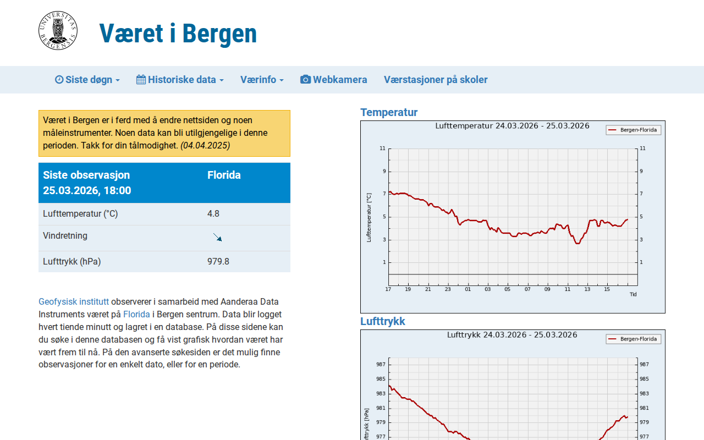 |
| `p1ordlb.uib.no` | `ERR_NAME_NOT_RESOLVED` |
| `www2.ii.uib.no` |  |
| `eecrg.uib.no` | `ERR_NAME_NOT_RESOLVED` |
| `humle.h.uib.no` | `ERR_NAME_NOT_RESOLVED` |
| `sujo.skyapp.uib.no` |  |
| `studblogg.uib.no` | `ERR_NAME_NOT_RESOLVED` |
| `tsm4500-hib.uib.no` | `ERR_NAME_NOT_RESOLVED` |
| `gnome.uib.no` | `ERR_NAME_NOT_RESOLVED` |
| `miside.pilot.uib.no` | `ERR_NAME_NOT_RESOLVED` |
| `hjemmekontor.uib.no` | `timeout` |
| `xn--pmelding-9za.uib.no` |  |
| `tsm4500.uib.no` | `ERR_NAME_NOT_RESOLVED` |
| `ithjelp.skyapp.uib.no` |  |
| `jensen.uib.no` | `ERR_NAME_NOT_RESOLVED` |
| `mailman3.fribyte.uib.no` | `timeout` |
| `www.h2.uib.no` | `ERR_NAME_NOT_RESOLVED` |
| `ubuntu.uib.no` |  |
| `git.app.uib.no` |  |
| `stats2.ii.uib.no` | `ERR_NAME_NOT_RESOLVED` |
| `smtp.rf.uib.no` | `ERR_NAME_NOT_RESOLVED` |
| `www.holbergprisen.uib.no` |  |
| `dashboard.iaas.uib.no` | `ERR_NAME_NOT_RESOLVED` |
| `rebell.app.uib.no` | `HTTP 502` |
| `tesx.uib.no` | `timeout` |
| `hild.uib.no` | `ERR_NAME_NOT_RESOLVED` |
| `sikker-vbackend.uib.no` | `ERR_NAME_NOT_RESOLVED` |
| `sinmara.uib.no` | `ERR_NAME_NOT_RESOLVED` |
| `p1rts01.uib.no` | `ERR_NAME_NOT_RESOLVED` |
| `mcallen.uib.no` | `timeout` |
| `sfb-fepool01.uib.no` | `ERR_NAME_NOT_RESOLVED` |
| `eitre.uib.no` | `ERR_NAME_NOT_RESOLVED` |
| `lydia2.uib.no` | `ERR_NAME_NOT_RESOLVED` |
| `cetcarbonplanner.uib.no` | 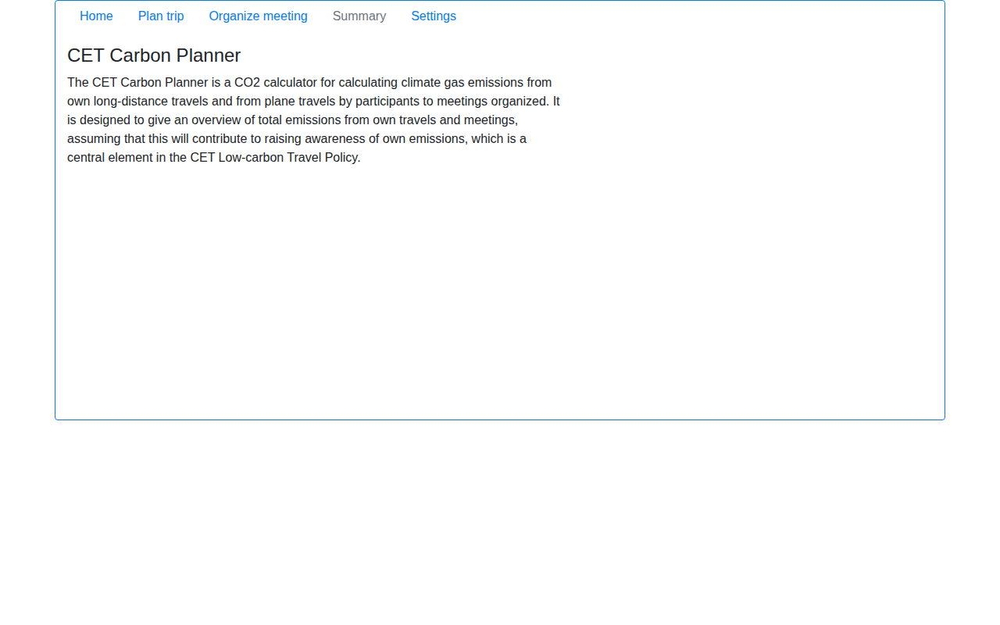 |
| `cran.uib.no` |  |
| `ise-pxgrid-351.uib.no` | `ERR_NAME_NOT_RESOLVED` |
| `normt.uib.no` | `ERR_NAME_NOT_RESOLVED` |
| `stats.test.uib.no` |  |
| `breidablik.uib.no` | `timeout` |
| `rodia.uib.no` | `timeout` |
| `tjinfo.uib.no` |  |
| `munin.uib.no` | `ERR_NAME_NOT_RESOLVED` |
| `www.pilot.uib.no` | `HTTP 400` |
| `ektedata.uib.no` |  |
| `webmail.samfunnet.uib.no` | `timeout` |
| `shared.testapp.uib.no` | `HTTP 403` |
| `resources.uib.no` | `ERR_NAME_NOT_RESOLVED` |
| `logstash.uib.no` | `ERR_NAME_NOT_RESOLVED` |
| `ru.uib.no` | `timeout` |
| `crysis.uib.no` | `ERR_NAME_NOT_RESOLVED` |
| `netdata.app.uib.no` | `timeout` |
| `p1oppdrag01.uib.no` | `ERR_NAME_NOT_RESOLVED` |
| `nav-repo.uib.no` | `ERR_NAME_NOT_RESOLVED` |
| `nettitaliensk.uib.no` | `ERR_NAME_NOT_RESOLVED` |
| `gru.uib.no` | `ERR_NAME_NOT_RESOLVED` |
| `www.norpol.uib.no` | `ERR_NAME_NOT_RESOLVED` |
| `lydiatest.uib.no` | `timeout` |
| `ahamodel.uib.no` |  |
| `veret.uib.no` |  |
| `hostel.uib.no` | `ERR_NAME_NOT_RESOLVED` |
| `test-fe.cbu.uib.no` | `ERR_NAME_NOT_RESOLVED` |
| `supermagx.uib.no` | `ERR_NAME_NOT_RESOLVED` |
| `hackmd.skyapp.uib.no` |  |
| `um.app.aws.uib.no` | `ERR_NAME_NOT_RESOLVED` |
| `munki.clortho.uib.no` | `ERR_NAME_NOT_RESOLVED` |
| `lticanvas.uib.no` |  |
| `berkeley.uib.no` | `timeout` |
| `arkiv.uib.no` | `ERR_NAME_NOT_RESOLVED` |
| `exch.uib.no` | `ERR_NAME_NOT_RESOLVED` |
| `dhcpadmintest.uib.no` | `ERR_NAME_NOT_RESOLVED` |
| `www.newsangler.uib.no` | `ERR_CONNECTION_REFUSED` |
| `gitlab.uib.no` | `ERR_NAME_NOT_RESOLVED` |
| `video.uib.no` |  |
| `prosjekt.eia.uib.no` | `ERR_NAME_NOT_RESOLVED` |
| `wiki.uib.no` | 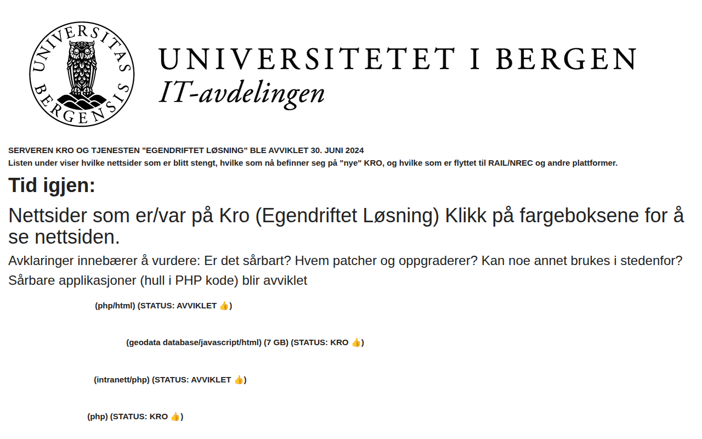 |
| `testing.publisering-test.aws.uib.no` | `ERR_NAME_NOT_RESOLVED` |
| `kalender2k7.uib.no` | `timeout` |
| `rd-sh06.uib.no` | `timeout` |
| `venkman.uib.no` | `ERR_NAME_NOT_RESOLVED` |
| `folk7.uib.no` | `ERR_NAME_NOT_RESOLVED` |
| `pop.student.uib.no` | `ERR_NAME_NOT_RESOLVED` |
| `digiforms.uib.no` | `HTTP 503` |
| `vis.uib.no` |  |
| `von.uib.no` | `ERR_NAME_NOT_RESOLVED` |
| `testnominasjonsweb.uib.no` | `ERR_NAME_NOT_RESOLVED` |
| `dbh.nsd.uib.no` | `ERR_NAME_NOT_RESOLVED` |
| `vivarium.h.uib.no` | `ERR_NAME_NOT_RESOLVED` |
| `serveradm.uib.no` | `ERR_NAME_NOT_RESOLVED` |
| `folk.uib.no` |  |
| `fulla.uib.no` | `ERR_NAME_NOT_RESOLVED` |
| `brage.uib.no` | `ERR_NAME_NOT_RESOLVED` |
| `chat.test.uib.no` | `timeout` |
| `klientadmin.uib.no` | `timeout` |
| `turing.uib.no` | `ERR_NAME_NOT_RESOLVED` |
| `pretest.uib.no` | `ERR_NAME_NOT_RESOLVED` |
| `moodle.uib.no` | `ERR_NAME_NOT_RESOLVED` |
| `melon.uib.no` | `ERR_NAME_NOT_RESOLVED` |
| `prom.app.aws.uib.no` | `ERR_NAME_NOT_RESOLVED` |
| `ping.app.uib.no` |  |
| `dikult105.k.uib.no` | `timeout` |
| `namur.uib.no` | `ERR_NAME_NOT_RESOLVED` |
| `seattle.uib.no` | `timeout` |
| `fremont.uib.no` | `timeout` |
| `redirect1.test.uib.no` | `ERR_NAME_NOT_RESOLVED` |
| `netdata.publisering.aws.uib.no` | `ERR_NAME_NOT_RESOLVED` |
| `rd-sh20.uib.no` | `timeout` |
| `watson.uib.no` | `ERR_NAME_NOT_RESOLVED` |
| `birkeland.uib.no` | 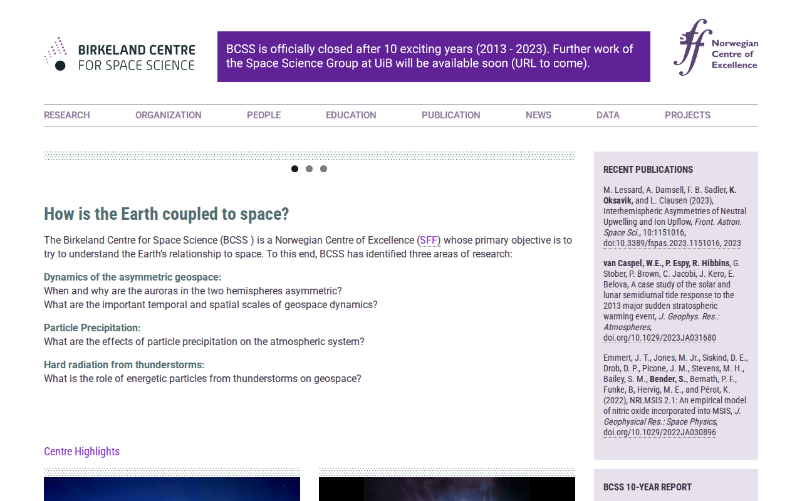 |
| `mathinfo-blogg.uib.no` | `timeout` |
| `mediasite.uib.no` | `ERR_NAME_NOT_RESOLVED` |
| `rd-sh18.uib.no` | `timeout` |
| `camperdown.uib.no` | `ERR_NAME_NOT_RESOLVED` |
| `eplebakst1.uib.no` | `ERR_NAME_NOT_RESOLVED` |
| `ki.ii.uib.no` | `ERR_NAME_NOT_RESOLVED` |
| `sandwich.medicine.b.uib.no` | `ERR_NAME_NOT_RESOLVED` |
| `foobar.h.uib.no` | `ERR_NAME_NOT_RESOLVED` |
| `buoyant.uib.no` | `ERR_NAME_NOT_RESOLVED` |
| `oppdrag.ub.uib.no` |  |
| `efn2.uib.no` | `ERR_NAME_NOT_RESOLVED` |
| `persille.uib.no` | `ERR_NAME_NOT_RESOLVED` |
| `rd-cb.uib.no` | `timeout` |
| `um.uib.no` |  |
| `caddy.skytest.uib.no` | `timeout` |
| `intern-filer.uib.no` | `ERR_NAME_NOT_RESOLVED` |
| `w3.pilot.uib.no` |  |
| `sudan.uib.no` | `ERR_NAME_NOT_RESOLVED` |
| `sefas.uib.no` | `ERR_NAME_NOT_RESOLVED` |
| `filer.uib.no` | `HTTP 403` |
| `ceres.apps.slate.uib.no` | `timeout` |
| `proxy-gw1.privnett.uib.no` | `ERR_NAME_NOT_RESOLVED` |
| `p1wiki01.uib.no` | `ERR_NAME_NOT_RESOLVED` |
| `gran.ii.uib.no` | `ERR_NAME_NOT_RESOLVED` |
| `w3.uib.no` |  |
| `munin.fribyte.uib.no` | `ERR_CONNECTION_REFUSED` |
| `m.uib.no` | `ERR_NAME_NOT_RESOLVED` |
| `industri.uib.no` | `ERR_NAME_NOT_RESOLVED` |
| `pomona.uib.no` | `timeout` |
| `retting.ii.uib.no` | `ERR_NAME_NOT_RESOLVED` |
| `www.fft.uib.no` | `ERR_NAME_NOT_RESOLVED` |
| `safir.uib.no` | `ERR_NAME_NOT_RESOLVED` |
| `gdcj.uib.no` | `ERR_NAME_NOT_RESOLVED` |
| `piwik.skolelab.uib.no` | `HTTP 401` |
| `shared.app.uib.no` |  |
| `dioto.skolelab.uib.no` | `ERR_NAME_NOT_RESOLVED` |
| `evaluation.uib.no` |  |
| `stjerne.uib.no` | `ERR_NAME_NOT_RESOLVED` |
| `tilbakemelding.skyapp.uib.no` |  |
| `webmail.skyapp.uib.no` |  |
| `mathinfo-it.uib.no` | `timeout` |
| `videonotat.uib.no` | `ERR_NAME_NOT_RESOLVED` |
| `registration.uib.no` |  |
| `rdb.nsd.uib.no` | `ERR_NAME_NOT_RESOLVED` |
| `radiance.uib.no` | `ERR_NAME_NOT_RESOLVED` |
| `rd-sh04.uib.no` | `timeout` |
| `sfb-fe03.uib.no` | `ERR_NAME_NOT_RESOLVED` |
| `nav-rh.uib.no` | `timeout` |
| `antivirus.uib.no` | `ERR_NAME_NOT_RESOLVED` |
| `fmri.uib.no` |  |
| `k.uib.no` | `timeout` |
| `romulus.uib.no` | `ERR_NAME_NOT_RESOLVED` |
| `pdf.test.uib.no` | `timeout` |
| `grane.uib.no` |  |
| `linkerd.app.aws.uib.no` | `ERR_NAME_NOT_RESOLVED` |
| `registrering.uib.no` |  |
| `olivetree.ii.uib.no` | `ERR_NAME_NOT_RESOLVED` |
| `piwik.app.uib.no` | `ERR_NAME_NOT_RESOLVED` |
| `ubo.uib.no` | `ERR_NAME_NOT_RESOLVED` |
| `p2rts01.uib.no` | `ERR_NAME_NOT_RESOLVED` |
| `rd-sh07.uib.no` | `timeout` |
| `sc12-ac2.klient.uib.no` | `ERR_NAME_NOT_RESOLVED` |
| `hillsboro.uib.no` | `timeout` |
| `igang.uib.no` |  |
| `mprintcolor.uib.no` | `HTTP 403` |
| `testnomination.uib.no` |  |
| `bergen-mp.uib.no` | `timeout` |
| `ibiblio.uib.no` |  |
| `p1box01.uib.no` | `ERR_NAME_NOT_RESOLVED` |
| `skjemaker.app.uib.no` |  |
| `student-ts.uib.no` | `timeout` |
| `rd-sh14.uib.no` | `timeout` |
| `glider.gfi.uib.no` | `timeout` |
| `t1masterlb.uib.no` | `timeout` |
| `hamster.sib.uib.no` | `HTTP 403` |
| `webmail2.fribyte.uib.no` | `timeout` |
| `nesstar-dev.nsd.uib.no` | `ERR_NAME_NOT_RESOLVED` |
| `www.fribyte.uib.no` | `ERR_NAME_NOT_RESOLVED` |
| `seqlab.uib.no` | `ERR_NAME_NOT_RESOLVED` |
| `mxpm.uib.no` | `timeout` |
| `elizabeth.uib.no` | `timeout` |
| `convection.uib.no` | `ERR_NAME_NOT_RESOLVED` |
| `subversion.uib.no` | `ERR_NAME_NOT_RESOLVED` |
| `rd-sh03.uib.no` | `timeout` |
| `unix.uib.no` | `ERR_NAME_NOT_RESOLVED` |
| `ii.uib.no` | `ERR_NAME_NOT_RESOLVED` |
| `jonia.uib.no` | `timeout` |
| `client.vmware.uib.no` | `timeout` |
| `synology2.geo.uib.no` | `ERR_NAME_NOT_RESOLVED` |
| `ivalde.uib.no` | `ERR_NAME_NOT_RESOLVED` |
| `testevuweb.uib.no` |  |
| `fribyte.uib.no` |  |
| `terrier.uib.no` | `ERR_NAME_NOT_RESOLVED` |
| `regler.publisering-test.aws.uib.no` | `ERR_NAME_NOT_RESOLVED` |
| `filemaker.uib.no` | `timeout` |
| `studentweb.uib.no` | 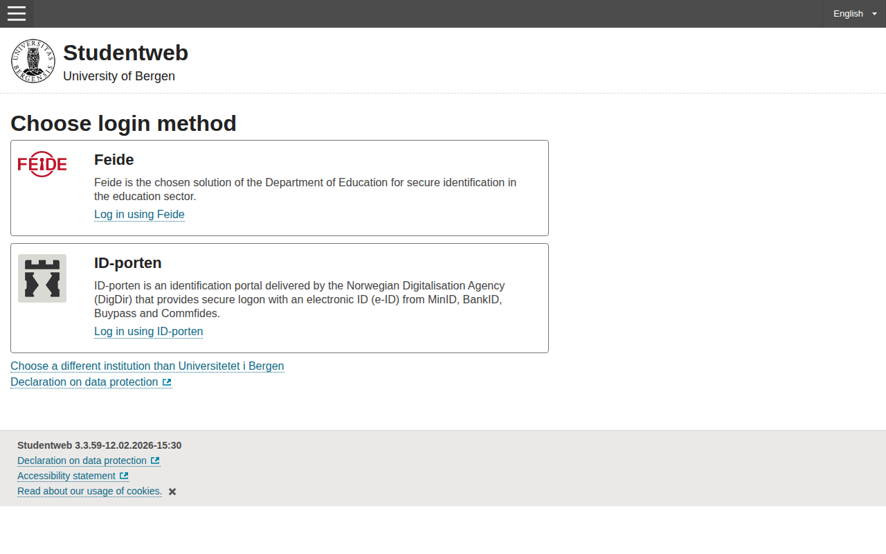 |
| `desktop.uib.no` | `timeout` |
| `holberg.uib.no` |  |
| `link.uib.no` | `ERR_NAME_NOT_RESOLVED` |
| `proxy-gw2.privnett.uib.no` | `ERR_NAME_NOT_RESOLVED` |
| `prosjekt.uib.no` |  |
| `videoarkiv.dig.uib.no` | `ERR_NAME_NOT_RESOLVED` |
| `www.bsj.uib.no` | `ERR_NAME_NOT_RESOLVED` |
| `it.uib.no` |  |
| `forskerskolen.uib.no` | `ERR_NAME_NOT_RESOLVED` |
| `pdf.uib.no` |  |
| `www.bjerknes.pilot.uib.no` | `ERR_NAME_NOT_RESOLVED` |
| `synology8.geo.uib.no` | `ERR_NAME_NOT_RESOLVED` |
| `yum.uib.no` |  |
| `paste.app.uib.no` |  |
| `mobileprint.uib.no` | `ERR_NAME_NOT_RESOLVED` |
| `privbin.app.uib.no` |  |
| `radius1.uib.no` | `ERR_NAME_NOT_RESOLVED` |
| `autodiscover.uib.no` | 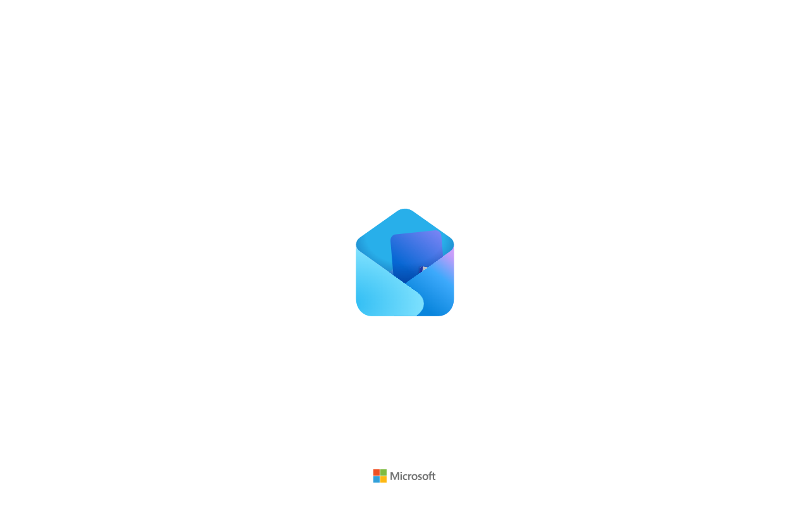 |
| `nav.uib.no` | `HTTP 403` |
| `melod.uib.no` |  |
| `redmine.uib.no` | `HTTP 403` |
| `test-app2.cbu.uib.no` | `ERR_NAME_NOT_RESOLVED` |
| `shepherd.ii.uib.no` | `ERR_NAME_NOT_RESOLVED` |
| `redirect.test.uib.no` | `ERR_NAME_NOT_RESOLVED` |
| `tm.skytest.uib.no` | `timeout` |
| `sharepoint.uib.no` | `timeout` |
| `scom-mgmt01.uib.no` | `timeout` |
| `plikt.gfi.uib.no` | `ERR_NAME_NOT_RESOLVED` |
| `munki.uib.no` | `HTTP 403` |
| `register.uib.no` |  |
| `rd-sh02.uib.no` | `ERR_NAME_NOT_RESOLVED` |
| `dhcpadmin.uib.no` | `timeout` |
| `w3.sky.uib.no` | `timeout` |
| `blog.fribyte.uib.no` | `timeout` |
| `sebra.uib.no` | `ERR_NAME_NOT_RESOLVED` |
| `apsara.uib.no` | `ERR_NAME_NOT_RESOLVED` |
| `norpol.uib.no` | `ERR_NAME_NOT_RESOLVED` |
| `oceanside.uib.no` | `timeout` |
| `p1masterlb.uib.no` |  |
| `seaweeds.uib.no` | 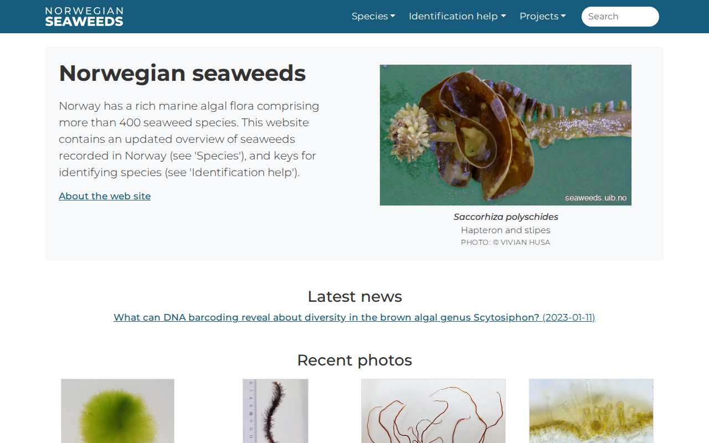 |
| `sak.uib.no` | 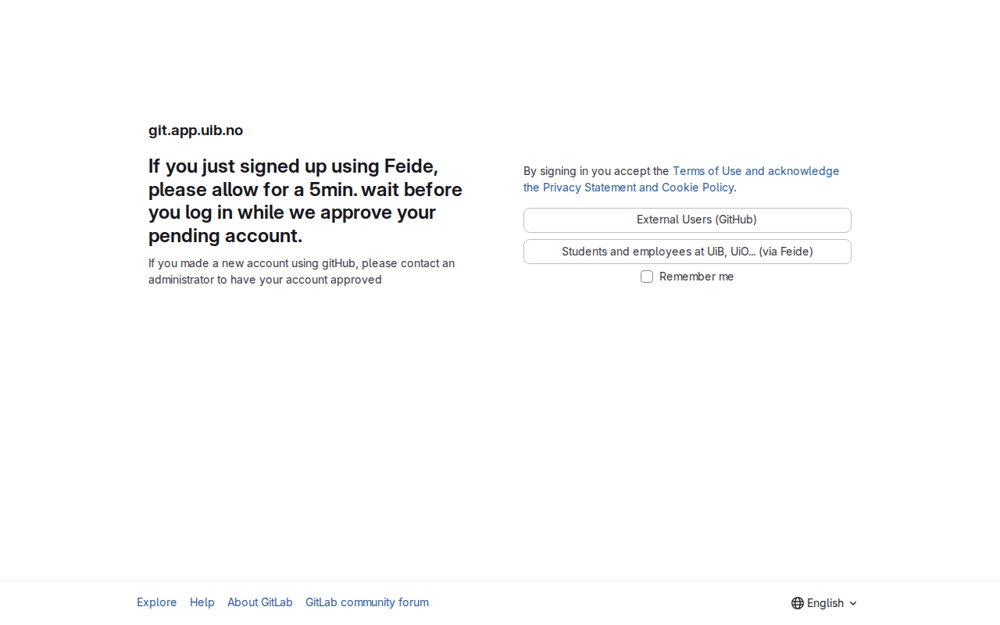 |
| `felleskalender.uib.no` | `ERR_NAME_NOT_RESOLVED` |
| `terrene.uib.no` | `ERR_NAME_NOT_RESOLVED` |
| `rd-web01.uib.no` | `timeout` |
| `bora.uib.no` | 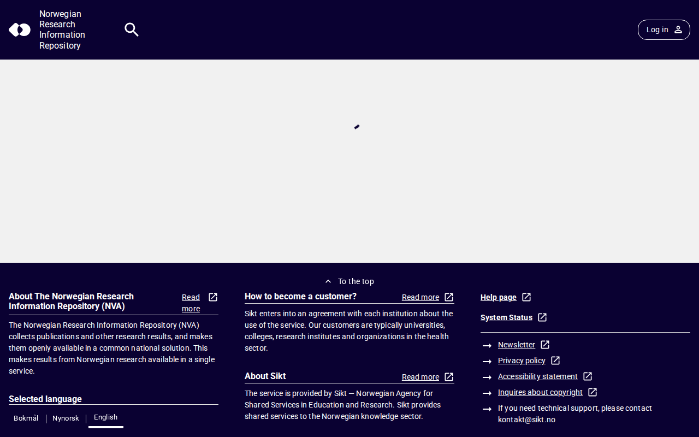 |
| `postgres.uib.no` | `ERR_NAME_NOT_RESOLVED` |
| `fdu.h.uib.no` | `ERR_NAME_NOT_RESOLVED` |
| `p1sak01.uib.no` | `ERR_NAME_NOT_RESOLVED` |
| `cmg01.uib.no` | `ERR_NAME_NOT_RESOLVED` |
| `sba.h.uib.no` | `ERR_NAME_NOT_RESOLVED` |
| `srcddb.fribyte.uib.no` | `timeout` |
| `tjatse.uib.no` | `timeout` |
| `sba.uib.no` | `ERR_NAME_NOT_RESOLVED` |
| `rd-sh05.uib.no` | `timeout` |
| `cerberus.uib.no` | `ERR_NAME_NOT_RESOLVED` |
| `netdata.app.aws.uib.no` | `ERR_NAME_NOT_RESOLVED` |
| `rhel.uib.no` | `ERR_NAME_NOT_RESOLVED` |
| `pamelding.uib.no` |  |
| `serveradmin.test.uib.no` | `ERR_NAME_NOT_RESOLVED` |
| `endor.uib.no` | `timeout` |
| `bor.uib.no` | `timeout` |
| `svar.nsd.uib.no` | `ERR_NAME_NOT_RESOLVED` |
| `search.test.uib.no` | `ERR_NAME_NOT_RESOLVED` |
| `pushgateway.app.aws.uib.no` | `ERR_NAME_NOT_RESOLVED` |
| `pierre.uib.no` | `timeout` |
| `lynctlf1.uib.no` | `ERR_NAME_NOT_RESOLVED` |
| `oralcancer.uib.no` | `timeout` |
| `leuven.uib.no` | `ERR_NAME_NOT_RESOLVED` |
| `cgps.uib.no` | `ERR_NAME_NOT_RESOLVED` |
| `exchange01.uib.no` | `ERR_NAME_NOT_RESOLVED` |
| `traefik.publisering.aws.uib.no` | `ERR_NAME_NOT_RESOLVED` |
| `git.ii.uib.no` | `ERR_NAME_NOT_RESOLVED` |
| `sb.uib.no` | `ERR_NAME_NOT_RESOLVED` |
| `o365smtp.uib.no` | `timeout` |
| `emojivoto.app.aws.uib.no` | `ERR_NAME_NOT_RESOLVED` |
| `portal.video.uib.no` | `ERR_NAME_NOT_RESOLVED` |
| `soju.skyapp.uib.no` |  |
| `my.traefik.azure.uib.no` | `timeout` |
| `min.uib.no` | `ERR_NAME_NOT_RESOLVED` |
| `malibu.uib.no` | `timeout` |
| `rd-sh01.uib.no` | `timeout` |
| `rt.fribyte.uib.no` | `timeout` |
| `w3-kurs.test.uib.no` | `timeout` |
| `jper.uib.no` |  |
| `bigfoot.uib.no` | `ERR_NAME_NOT_RESOLVED` |
| `service.uib.no` | `ERR_NAME_NOT_RESOLVED` |
| `pgboard.skyapp.uib.no` |  |
| `marcus.uib.no` | 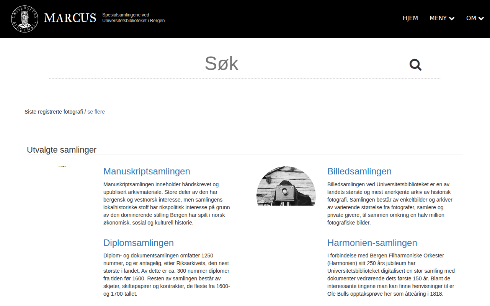 |
| `rts.uib.no` |  |
| `beta.skolelab.uib.no` |  |
| `pop.uib.no` | `ERR_NAME_NOT_RESOLVED` |
| `exchange.uib.no` | `timeout` |
| `prospective.uib.no` | `ERR_NAME_NOT_RESOLVED` |
| `uib.no` |  |
| `w3-staging.test.uib.no` | `timeout` |
| `executor.uib.no` | `ERR_NAME_NOT_RESOLVED` |
| `web-test.fribyte.uib.no` | `ERR_NAME_NOT_RESOLVED` |
| `skigard.uib.no` | 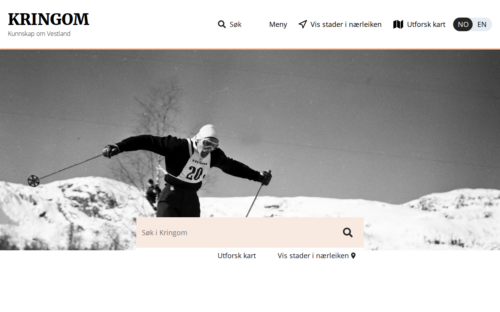 |
| `bs.uib.no` | `timeout` |
| `biostudent-ts03.uib.no` | `ERR_NAME_NOT_RESOLVED` |
| `noralf.uib.no` | `ERR_CONNECTION_REFUSED` |
| `www.slate.uib.no` |  |
| `manual.uib.no` |  |
| `oda.uib.no` |  |
| `pcvakt.uib.no` | `timeout` |
| `f.uib.no` | `ERR_NAME_NOT_RESOLVED` |
| `w3docs.h.uib.no` | `ERR_NAME_NOT_RESOLVED` |
| `webhotel.uib.no` | `timeout` |
| `mimir.uib.no` | `timeout` |
| `g.uib.no` | `ERR_NAME_NOT_RESOLVED` |
| `dev.uib.no` | `timeout` |
| `jira.uib.no` | `ERR_NAME_NOT_RESOLVED` |
| `meet.gfi.uib.no` | `ERR_NAME_NOT_RESOLVED` |
| `lakewood.uib.no` | `timeout` |
| `moodlehost.uib.no` | `ERR_NAME_NOT_RESOLVED` |
| `nethack.uib.no` | `timeout` |
| `interaktiv6.uib.no` | `ERR_NAME_NOT_RESOLVED` |
| `lync.uib.no` | `ERR_NAME_NOT_RESOLVED` |
| `cismacinternal.uib.no` | `ERR_NAME_NOT_RESOLVED` |
| `resp.nsd.uib.no` | `ERR_NAME_NOT_RESOLVED` |
| `smhn.uib.no` |  |
| `nymailman.fribyte.uib.no` | `timeout` |
| `skjemaker.test.uib.no` |  |
| `scala.uib.no` | `HTTP 403` |
| `nongnu.uib.no` |  |
| `bells.uib.no` |  |
| `synology3.geo.uib.no` | `ERR_NAME_NOT_RESOLVED` |
| `phppgadmin.fribyte.uib.no` | `timeout` |
| `beta.uib.no` | `timeout` |
| `lync02.video.uib.no` | `ERR_NAME_NOT_RESOLVED` |
| `brs.uib.no` | `timeout` |
| `nysmtp.fribyte.uib.no` | `timeout` |
| `grind.h.uib.no` |  |
| `slate.uib.no` |  |
| `chat.fribyte.uib.no` | `timeout` |
| `www.regler.uib.no` | `ERR_NAME_NOT_RESOLVED` |
| `paamelding.uib.no` |  |
| `bgrg.uib.no` | `ERR_NAME_NOT_RESOLVED` |
| `resp2.nsd.uib.no` | `ERR_NAME_NOT_RESOLVED` |
| `birgitta.uib.no` | 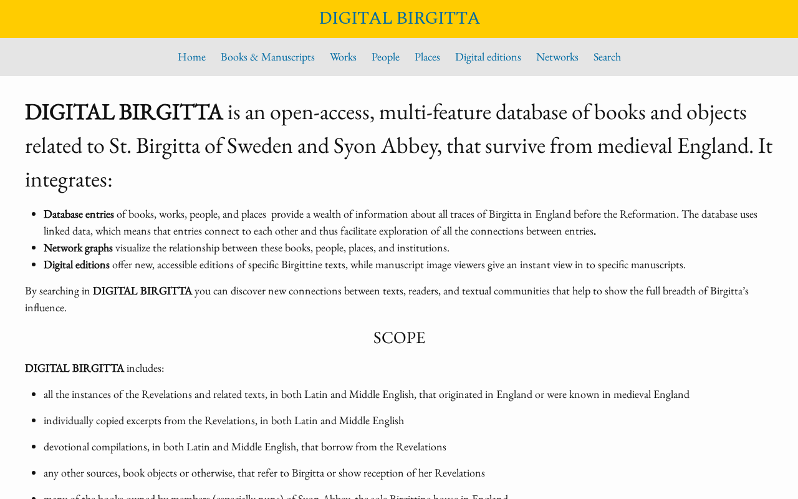 |
| `gainesville.uib.no` | `timeout` |
| `sikker.filer.uib.no` | `ERR_NAME_NOT_RESOLVED` |
| `exchange03.uib.no` | `ERR_NAME_NOT_RESOLVED` |
| `p1masterordlb.uib.no` | `timeout` |
| `wiki.ii.uib.no` | `ERR_NAME_NOT_RESOLVED` |
| `wsus2.uib.no` | `timeout` |
| `test.wab.uib.no` | `timeout` |
| `sw.uib.no` | `ERR_NAME_NOT_RESOLVED` |
| `kudu.sib.uib.no` |  |
| `stats.cbu.uib.no` | `ERR_NAME_NOT_RESOLVED` |
| `pclab.uib.no` |  |
| `newark.uib.no` | `timeout` |
| `gnualpha.uib.no` |  |
| `grafana.app.aws.uib.no` | `ERR_NAME_NOT_RESOLVED` |
| `synology1.geo.uib.no` | `ERR_NAME_NOT_RESOLVED` |
| `centos.uib.no` |  |
| `teklab.uib.no` | 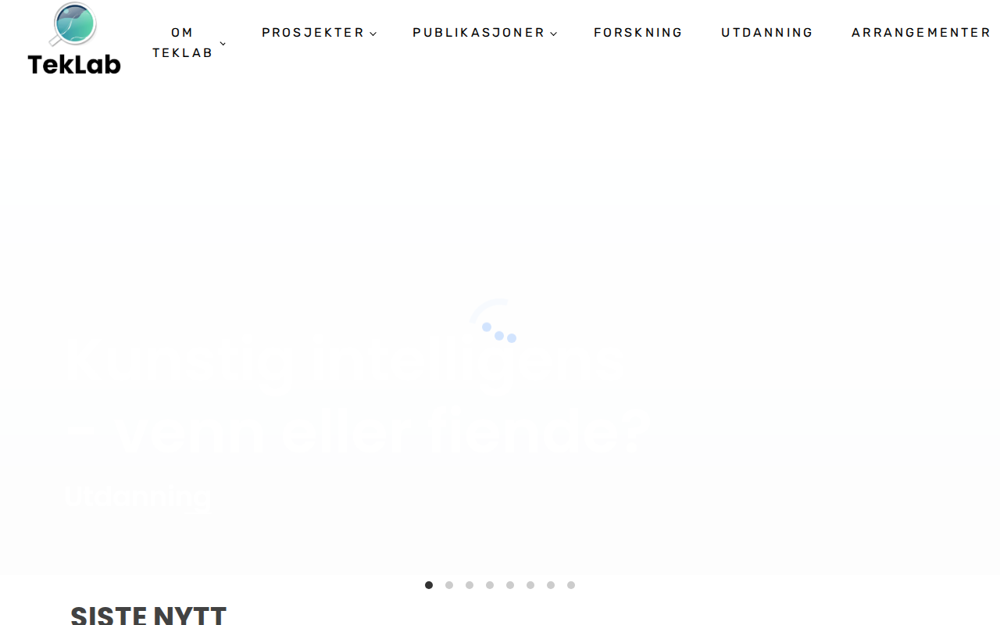 |
| `corellia.uib.no` | `ERR_NAME_NOT_RESOLVED` |
| `repo.fribyte.uib.no` | `timeout` |
| `eiktorn.uib.no` | `ERR_NAME_NOT_RESOLVED` |
| `bool.uib.no` | `timeout` |
| `svn.uib.no` | `ERR_NAME_NOT_RESOLVED` |
| `lam.fribyte.uib.no` | `timeout` |
| `rd-sh15.uib.no` | `timeout` |
| `test2.skytest.uib.no` | `timeout` |
| `chat.skyapp.uib.no` |  |
| `hogushg.uib.no` | `ERR_NAME_NOT_RESOLVED` |
| `sfb-fe01.uib.no` | `ERR_NAME_NOT_RESOLVED` |
| `org.uib.no` |  |
| `oncomatrix.uib.no` | `ERR_NAME_NOT_RESOLVED` |
| `blowfly-test.cbu.uib.no` | `ERR_NAME_NOT_RESOLVED` |
| `fd.uib.no` | `ERR_NAME_NOT_RESOLVED` |
| `kalender2.uib.no` | `timeout` |
| `bsj.skyapp.uib.no` |  |
| `www.fragment.uib.no` | 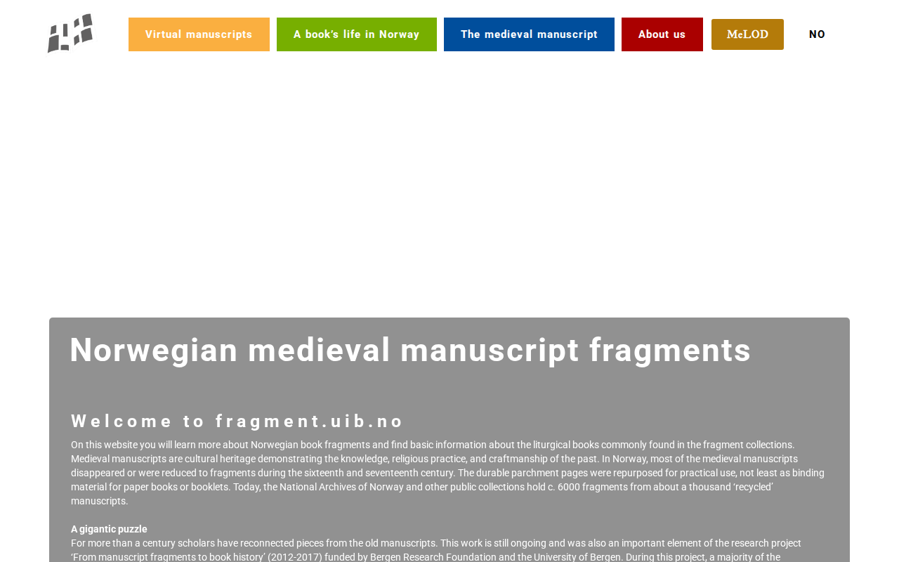 |
| `skule.uib.no` | `timeout` |
| `bespin.uib.no` | `timeout` |
| `clarino.uib.no` |  |
| `videokonferanse.uib.no` | `ERR_NAME_NOT_RESOLVED` |
| `crypt.clortho.uib.no` | `ERR_NAME_NOT_RESOLVED` |
| `gitlab.nsd.uib.no` | `ERR_NAME_NOT_RESOLVED` |
| `spaced.uib.no` | `ERR_NAME_NOT_RESOLVED` |
| `www.sars.uib.no` |  |
| `mitt.uib.no` |  |
| `nafa.h.uib.no` | `ERR_NAME_NOT_RESOLVED` |
| `hospits.uib.no` | `ERR_NAME_NOT_RESOLVED` |
| `mx1-test01.uib.no` | `timeout` |
| `havanna.uib.no` | `ERR_NAME_NOT_RESOLVED` |
| `www.norvana.uib.no` | `ERR_NAME_NOT_RESOLVED` |
| `ranch.skytest.uib.no` | `timeout` |
| `providence.uib.no` | `timeout` |
| `p1masterlb01.uib.no` | `ERR_NAME_NOT_RESOLVED` |
| `task.uib.no` | `ERR_NAME_NOT_RESOLVED` |
| `ordapi.skytest.uib.no` | `timeout` |
| `registry-bgo.skytest.uib.no` | `timeout` |
| `tk.beta.uib.no` | `ERR_NAME_NOT_RESOLVED` |
| `t1masterlb01.uib.no` | `ERR_NAME_NOT_RESOLVED` |
| `support.ii.uib.no` | `ERR_NAME_NOT_RESOLVED` |
| `interaktiv.uib.no` | `ERR_NAME_NOT_RESOLVED` |
| `boolean.h.uib.no` | `ERR_NAME_NOT_RESOLVED` |
| `aurora.uib.no` | 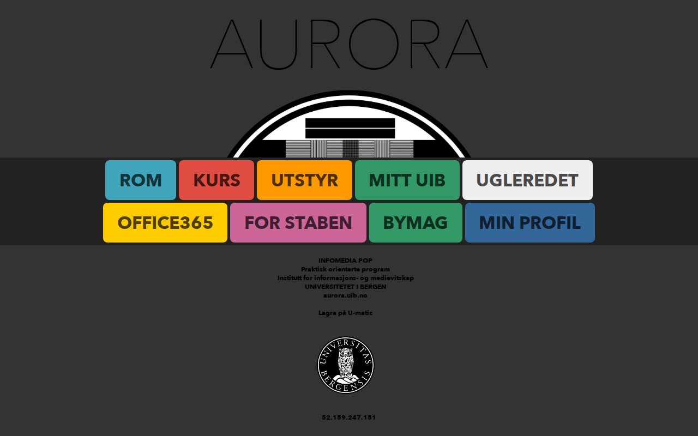 |
| `epos-no.uib.no` | 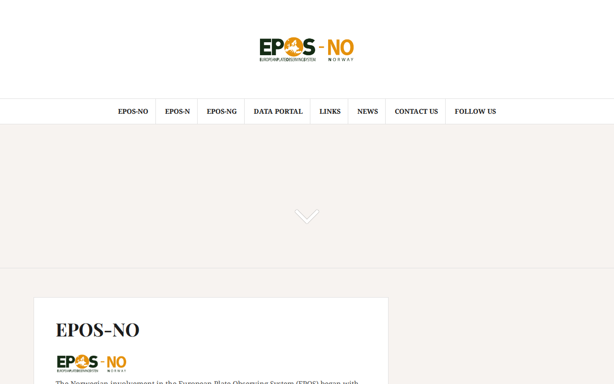 |
| `p1osd01.uib.no` | `ERR_NAME_NOT_RESOLVED` |
| `ramillies.uib.no` | `ERR_NAME_NOT_RESOLVED` |
| `flightgear.uib.no` | `ERR_NAME_NOT_RESOLVED` |
| `snipeit-test.dig.uib.no` | `ERR_NAME_NOT_RESOLVED` |
| `s3.skyapp.uib.no` | 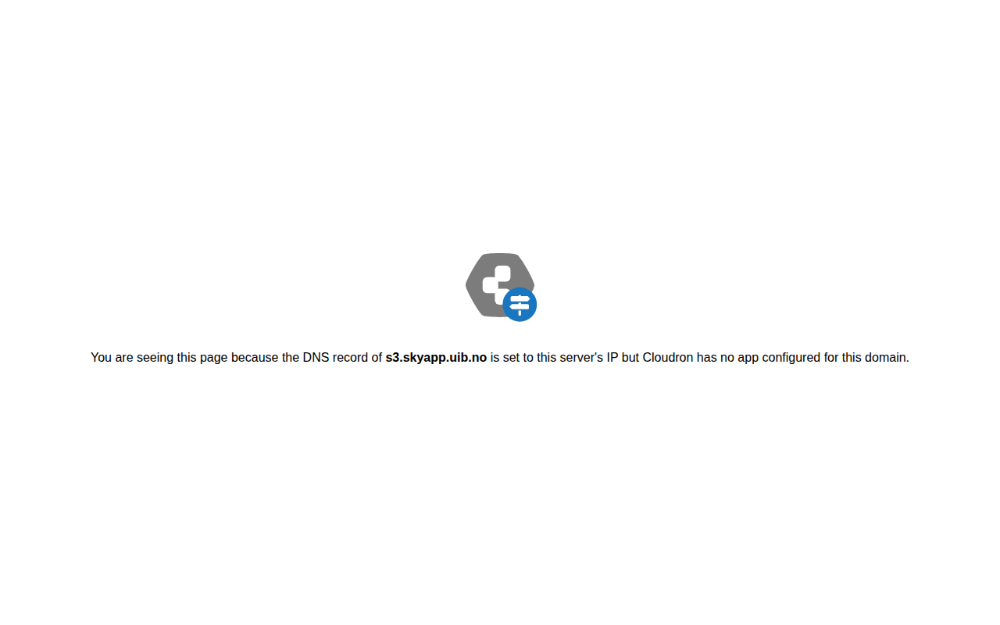 |
| `biostudent-ts01.uib.no` | `ERR_NAME_NOT_RESOLVED` |
| `nettkurs.uib.no` |  |
| `irving.uib.no` | `timeout` |
| `bdcj.uib.no` | `ERR_NAME_NOT_RESOLVED` |
| `jb.nsd.uib.no` | `ERR_NAME_NOT_RESOLVED` |
| `wix.slate.uib.no` | `HTTP 404` |
| `lydiatest2.uib.no` | `ERR_NAME_NOT_RESOLVED` |
| `innkjop.uib.no` | `HTTP 404` |
| `www.test.uib.no` | `ERR_NAME_NOT_RESOLVED` |
| `miside.uib.no` | `ERR_NAME_NOT_RESOLVED` |
| `titanic.uib.no` | `ERR_NAME_NOT_RESOLVED` |
| `lunde.ii.uib.no` | `ERR_NAME_NOT_RESOLVED` |
| `nelson.uib.no` | `timeout` |
| `mail.uib.no` | `ERR_NAME_NOT_RESOLVED` |
| `wptest2.skyapp.uib.no` |  |
| `dataviz.app.uib.no` | `HTTP 502` |
| `hayward.uib.no` | `timeout` |
| `webmail.test.uib.no` | `ERR_NAME_NOT_RESOLVED` |
| `eksamen.test.uib.no` | `ERR_NAME_NOT_RESOLVED` |
| `miside.felleskalender.uib.no` | `ERR_NAME_NOT_RESOLVED` |
| `sikkert-video.uib.no` | `ERR_NAME_NOT_RESOLVED` |
| `nettspansk.uib.no` |  |
| `www.eecrg.uib.no` | `ERR_NAME_NOT_RESOLVED` |
| `prosjekt.it.uib.no` | `ERR_NAME_NOT_RESOLVED` |
| `fullerton.uib.no` | `timeout` |
| `m.grind.app.uib.no` | `ERR_NAME_NOT_RESOLVED` |
| `sddownloads.uib.no` | `ERR_NAME_NOT_RESOLVED` |
| `my.skytest.uib.no` | `timeout` |
| `nyimap.fribyte.uib.no` | `timeout` |
| `box.skytest.uib.no` |  |
| `ise-policy-351.uib.no` | `ERR_NAME_NOT_RESOLVED` |
| `stargazer.uib.no` | `ERR_NAME_NOT_RESOLVED` |
| `naf2009.uib.no` | `ERR_NAME_NOT_RESOLVED` |
| `pop.samfunnet.uib.no` | `ERR_NAME_NOT_RESOLVED` |
| `digsscore.uib.no` |  |
| `heimekontor.uib.no` | `timeout` |
| `heid.uib.no` | `timeout` |
| `data.uib.no` |  |
| `admin.marcus.uib.no` | `HTTP 403` |
| `my.uib.no` | `ERR_NAME_NOT_RESOLVED` |
| `glidersa.gfi.uib.no` | `timeout` |
| `cptest.uib.no` | `timeout` |
| `webmail.asf.uib.no` | `timeout` |
| `wptest3.skyapp.uib.no` |  |
| `i2s.uib.no` | `ERR_CONNECTION_REFUSED` |
| `munkireponew.uib.no` | `timeout` |
| `tms.uib.no` | `ERR_NAME_NOT_RESOLVED` |
| `nominasjonsweb.uib.no` | `ERR_NAME_NOT_RESOLVED` |
| `regler.uib.no` |  |
| `p1piwik01.app.uib.no` | `ERR_NAME_NOT_RESOLVED` |
| `intern.filer.uib.no` | `HTTP 403` |
| `nominationweb.uib.no` | `ERR_NAME_NOT_RESOLVED` |
| `zeddemore.uib.no` | `timeout` |
| `inf115.k.uib.no` | `timeout` |
| `mautic.skyapp.uib.no` |  |
| `d8files.skytest.uib.no` | `timeout` |
| `pkg.uib.no` | `ERR_NAME_NOT_RESOLVED` |
| `uib-san2.uib.no` | `ERR_NAME_NOT_RESOLVED` |
| `testapp.uib.no` | `ERR_NAME_NOT_RESOLVED` |
| `radioweb.uib.no` |  |
| `faktura.uib.no` | `timeout` |
| `kalender.uib.no` | `timeout` |
| `w2.sky.uib.no` | `ERR_NAME_NOT_RESOLVED` |
| `dioto.uib.no` | `ERR_NAME_NOT_RESOLVED` |
| `itchat.uib.no` |  |
| `techblog.fribyte.uib.no` | `ERR_NAME_NOT_RESOLVED` |
| `keycloak.fribyte.uib.no` | `timeout` |
| `begonia.uib.no` | `timeout` |
| `mso.uib.no` |  |
| `p2oppdrag01.uib.no` | `ERR_NAME_NOT_RESOLVED` |
| `stats.uib.no` | 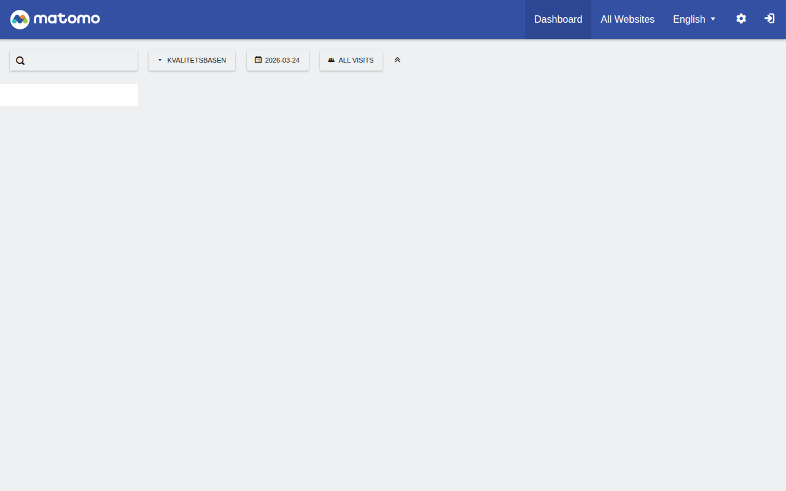 |
| `kibana.fribyte.uib.no` | `timeout` |
| `lexington.uib.no` | `timeout` |
| `digiforms.test.uib.no` | `HTTP 503` |
| `git.testapp.uib.no` | `timeout` |
| `eksam.uib.no` |  |
| `ubbstat.h.uib.no` | `ERR_NAME_NOT_RESOLVED` |
| `log.azure.uib.no` | `timeout` |
| `proxy-gw.privnett.uib.no` | `ERR_NAME_NOT_RESOLVED` |
| `record.uib.no` | `ERR_NAME_NOT_RESOLVED` |
| `magneto.uib.no` | `ERR_NAME_NOT_RESOLVED` |
| `lync-gw.uib.no` | `timeout` |
| `pop.asf.uib.no` | `ERR_NAME_NOT_RESOLVED` |
| `dorothyjdankel.b.uib.no` | `ERR_NAME_NOT_RESOLVED` |
| `puppet.fribyte.uib.no` | `ERR_CONNECTION_REFUSED` |
| `sc12-cm.klient.uib.no` | `ERR_NAME_NOT_RESOLVED` |
| `datatest.uib.no` | `ERR_NAME_NOT_RESOLVED` |
| `gnuftp.uib.no` |  |
| `adm.uib.no` | `ERR_NAME_NOT_RESOLVED` |
| `p2sak01.uib.no` | `ERR_NAME_NOT_RESOLVED` |
| `oppgaveseminar.uib.no` |  |
| `sikker-video.uib.no` |  |
| `engfly.bccs.uib.no` | `ERR_NAME_NOT_RESOLVED` |
| `imap.asf.uib.no` | `ERR_NAME_NOT_RESOLVED` |
| `andvare.uib.no` | `timeout` |
| `skolevalg1.nsd.uib.no` | `ERR_NAME_NOT_RESOLVED` |
| `skjema.uib.no` | `ERR_NAME_NOT_RESOLVED` |
| `rino.uib.no` |  |
| `www.sba.uib.no` | `ERR_NAME_NOT_RESOLVED` |
| `testnominationweb.uib.no` | `ERR_NAME_NOT_RESOLVED` |
| `olympiade.ii.uib.no` | `ERR_NAME_NOT_RESOLVED` |
| `vault.skyapp.uib.no` | `HTTP 502` |
| `ekt.uib.no` | `ERR_NAME_NOT_RESOLVED` |
| `audionovela.h.uib.no` | `ERR_NAME_NOT_RESOLVED` |
| `shreveport.uib.no` | `timeout` |
| `char.uib.no` | `ERR_NAME_NOT_RESOLVED` |
| `gitlabp1.uib.no` | `ERR_NAME_NOT_RESOLVED` |
| `nagios.fribyte.uib.no` | `ERR_CONNECTION_REFUSED` |
| `videoconference.uib.no` |  |
| `ordbruker.testapp.uib.no` | `ERR_NAME_NOT_RESOLVED` |
| `pepperrot.uib.no` | `ERR_NAME_NOT_RESOLVED` |
| `fft.uib.no` | `ERR_NAME_NOT_RESOLVED` |
| `rd-sh17.uib.no` | `timeout` |
| `docs.hpc.uib.no` | `ERR_NAME_NOT_RESOLVED` |
| `ekstern-filer.uib.no` | `ERR_NAME_NOT_RESOLVED` |
| `www.uib.no` |  |
| `var.uib.no` | `ERR_NAME_NOT_RESOLVED` |
| `avt2.apps.slate.uib.no` | `timeout` |
| `apicanvas.uib.no` | `ERR_NAME_NOT_RESOLVED` |
| `neolatin.uib.no` | `ERR_NAME_NOT_RESOLVED` |
| `streaming.videonotat.test.uib.no` | `ERR_NAME_NOT_RESOLVED` |
| `lingo.uib.no` | `ERR_NAME_NOT_RESOLVED` |
| `portal.ii.uib.no` | `ERR_NAME_NOT_RESOLVED` |
| `w2.pilot.uib.no` | `ERR_NAME_NOT_RESOLVED` |
| `perepigenomics.cbu.uib.no` | `ERR_NAME_NOT_RESOLVED` |
| `kirishima.uib.no` | `ERR_NAME_NOT_RESOLVED` |
| `irclog.fribyte.uib.no` | `timeout` |
| `uib-guest.privnett.uib.no` | `ERR_NAME_NOT_RESOLVED` |
| `www.nettkurs.uib.no` | `ERR_NAME_NOT_RESOLVED` |
| `intranett.uib.no` |  |
| `nml.uib.no` | `timeout` |
| `hoth.uib.no` | `ERR_NAME_NOT_RESOLVED` |
| `prat.app.uib.no` |  |
| `kalender3.uib.no` | `timeout` |
| `knutsinserver.uib.no` | `ERR_NAME_NOT_RESOLVED` |
| `webdesk.uib.no` | `timeout` |
| `marat.uib.no` | `ERR_NAME_NOT_RESOLVED` |
| `prosjekt.test.uib.no` | `ERR_NAME_NOT_RESOLVED` |
| `bluesky.uib.no` | `ERR_NAME_NOT_RESOLVED` |
| `piwik.fribyte.uib.no` | `timeout` |
| `bure.uib.no` | `ERR_NAME_NOT_RESOLVED` |
| `hilton.uib.no` | `ERR_NAME_NOT_RESOLVED` |
| `mprintfarge.uib.no` | `HTTP 403` |
| `itida.uib.no` | `ERR_NAME_NOT_RESOLVED` |
| `radisson.uib.no` | `ERR_NAME_NOT_RESOLVED` |
| `mxmp.uib.no` | `timeout` |
| `boap.uib.no` |  |
| `testsoknadsweb.uib.no` |  |
| `koronachat.skyapp.uib.no` | 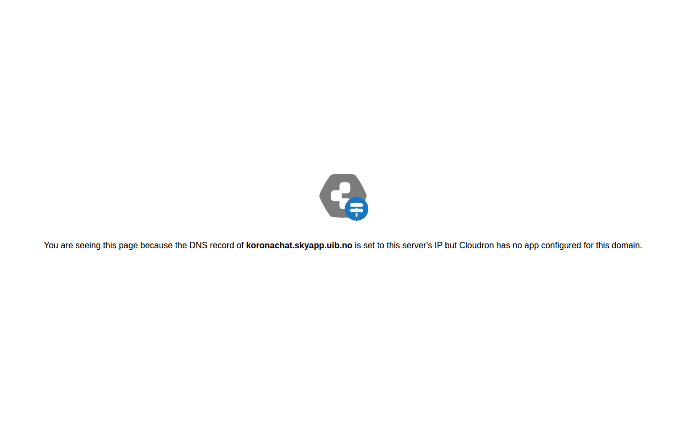 |
| `www.sky.uib.no` | `ERR_NAME_NOT_RESOLVED` |
| `sikkervideo.uib.no` |  |
| `rd-sh16.uib.no` | `timeout` |
| `nid.uib.no` | `timeout` |
| `sus.i.serken.uib.no` | `timeout` |
| `kmd.uib.no` | 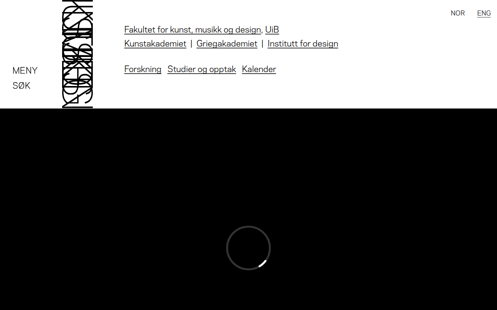 |
| `sip2.uib.no` | `ERR_NAME_NOT_RESOLVED` |
| `kurs.uib.no` |  |
| `cmc.uib.no` | `ERR_NAME_NOT_RESOLVED` |
| `litteraturkiosken.uib.no` |  |
| `glendale.uib.no` | `timeout` |
| `strategi.uib.no` | `ERR_NAME_NOT_RESOLVED` |
| `techblog.ii.uib.no` | `ERR_NAME_NOT_RESOLVED` |
| `uib-vpn-gw.uib.no` | `ERR_NAME_NOT_RESOLVED` |
| `myspace.uib.no` | `ERR_NAME_NOT_RESOLVED` |
| `test.skytest.uib.no` | `timeout` |
| `jenkins.uib.no` | `ERR_NAME_NOT_RESOLVED` |
| `impero.uib.no` | `ERR_NAME_NOT_RESOLVED` |
| `ultros.uib.no` | `ERR_NAME_NOT_RESOLVED` |
| `micromdm.uib.no` | `ERR_NAME_NOT_RESOLVED` |
| `grind.app.uib.no` | `ERR_NAME_NOT_RESOLVED` |
| `joshiweb.cbu.uib.no` |  |
| `geoip.app.uib.no` |  |
| `lyncwebext2.uib.no` | `timeout` |
| `lyncdiscoverinternal.uib.no` | `ERR_NAME_NOT_RESOLVED` |
| `news.skyapp.uib.no` | `HTTP 502` |
| `tegsvn.uib.no` |  |
| `admin.bjerknes.uib.no` | `ERR_NAME_NOT_RESOLVED` |
| `nybs.uib.no` | `ERR_NAME_NOT_RESOLVED` |
| `munkiwebadmin.clortho.uib.no` | `ERR_NAME_NOT_RESOLVED` |
| `iwanttousetheoldversion.uib.no` | `ERR_NAME_NOT_RESOLVED` |
| `expearth.uib.no` |  |
| `p2masterlb01.uib.no` | `ERR_NAME_NOT_RESOLVED` |
| `essdata.nsd.uib.no` | `ERR_NAME_NOT_RESOLVED` |
| `biostudent-ts06.uib.no` | `ERR_NAME_NOT_RESOLVED` |
| `kolab.fribyte.uib.no` | `timeout` |
| `testsokweb.uib.no` | `ERR_NAME_NOT_RESOLVED` |
| `brosing.h.uib.no` | `ERR_NAME_NOT_RESOLVED` |
| `dig.uib.no` | `ERR_NAME_NOT_RESOLVED` |
| `karib.h.uib.no` | `ERR_NAME_NOT_RESOLVED` |
| `radisson7.uib.no` | `ERR_NAME_NOT_RESOLVED` |
| `gitops.skyapp.uib.no` | `HTTP 502` |
| `b.uib.no` | `timeout` |
| `thon.uib.no` | `ERR_NAME_NOT_RESOLVED` |
| `jupyter-test.ii.uib.no` | `ERR_NAME_NOT_RESOLVED` |
| `voices.uib.no` | `ERR_NAME_NOT_RESOLVED` |
| `apps.uib.no` |  |
| `bbpager.uib.no` | `timeout` |
| `ntl.uib.no` | `ERR_NAME_NOT_RESOLVED` |
| `cisco.uib.no` | `ERR_NAME_NOT_RESOLVED` |
| `anno.skytest.uib.no` | `timeout` |
| `paste.skyapp.uib.no` |  |
| `mysql.uib.no` | `ERR_NAME_NOT_RESOLVED` |
| `eplebakst.uib.no` | `ERR_NAME_NOT_RESOLVED` |
| `gitlab-ci.nsd.uib.no` | `ERR_NAME_NOT_RESOLVED` |
| `pop.fribyte.uib.no` | `timeout` |
| `p1eia01.uib.no` | `ERR_NAME_NOT_RESOLVED` |
| `puffin-test.ii.uib.no` | `ERR_NAME_NOT_RESOLVED` |
| `app.uib.no` | `timeout` |
| `siv.uib.no` | `ERR_NAME_NOT_RESOLVED` |
| `esignering.skyapp.uib.no` |  |
| `www.sokogskriv.uib.no` | `ERR_NAME_NOT_RESOLVED` |
| `reco.la-lab.apps.slate.uib.no` | `timeout` |
| `trac.ii.uib.no` | `ERR_NAME_NOT_RESOLVED` |
| `hvitgran.ii.uib.no` | `ERR_NAME_NOT_RESOLVED` |
| `webmail.rf.uib.no` | `ERR_NAME_NOT_RESOLVED` |
| `skisse.skytest.uib.no` | `timeout` |
| `clara.uib.no` | `timeout` |
| `kurs7.uib.no` | `ERR_NAME_NOT_RESOLVED` |
| `alfons.uib.no` | `timeout` |
| `dill.uib.no` | `ERR_NAME_NOT_RESOLVED` |
| `driva.uib.no` | `ERR_NAME_NOT_RESOLVED` |
| `mckinney.uib.no` | `timeout` |
| `radius.uib.no` | `ERR_NAME_NOT_RESOLVED` |
| `eurosphere.nsd.uib.no` | `ERR_NAME_NOT_RESOLVED` |
| `string.uib.no` | `ERR_NAME_NOT_RESOLVED` |
| `radius2.uib.no` | `ERR_NAME_NOT_RESOLVED` |
| `testnomweb.uib.no` | `ERR_NAME_NOT_RESOLVED` |
| `biostudent-ts02.uib.no` | `ERR_NAME_NOT_RESOLVED` |
| `ocs.uib.no` | `ERR_NAME_NOT_RESOLVED` |
| `crush.uib.no` | `ERR_NAME_NOT_RESOLVED` |
| `nett8.uib.no` | `ERR_NAME_NOT_RESOLVED` |
| `studweb.uib.no` | `ERR_NAME_NOT_RESOLVED` |
| `mobilprint.uib.no` | `ERR_NAME_NOT_RESOLVED` |
| `biostudent-ts.uib.no` | `ERR_NAME_NOT_RESOLVED` |
| `mailman.uib.no` | `ERR_NAME_NOT_RESOLVED` |
| `rd-sh19.uib.no` | `timeout` |
| `alumni.uib.no` | `ERR_NAME_NOT_RESOLVED` |
| `meltzer.uib.no` | `ERR_NAME_NOT_RESOLVED` |
| `skyapp.uib.no` |  |
| `subversion.ift.uib.no` | `ERR_NAME_NOT_RESOLVED` |
| `mprintcolour.uib.no` | `HTTP 403` |
| `data.ub.uib.no` | `HTTP 403` |
| `streaming.mh.uib.no` | `ERR_NAME_NOT_RESOLVED` |
| `student-ts01.uib.no` | `timeout` |
| `melonny.uib.no` | `ERR_NAME_NOT_RESOLVED` |
| `imap.student.uib.no` | `ERR_NAME_NOT_RESOLVED` |
| `p2gitlab01.uib.no` | `ERR_NAME_NOT_RESOLVED` |
| `p2ordlb.uib.no` | `ERR_NAME_NOT_RESOLVED` |
| `webconf.uib.no` | `timeout` |
| `uib-guest.uib.no` | `ERR_NAME_NOT_RESOLVED` |
| `sip.uib.no` | `ERR_NAME_NOT_RESOLVED` |
| `ise-admin-351.uib.no` | `timeout` |
| `p1gitlab01.uib.no` | `ERR_NAME_NOT_RESOLVED` |
| `ts4500-hib.uib.no` | `ERR_NAME_NOT_RESOLVED` |
| `wsus.uib.no` | `timeout` |
| `test.iaas.uib.no` | `ERR_NAME_NOT_RESOLVED` |
| `masterark.uib.no` | `ERR_NAME_NOT_RESOLVED` |
| `fedora.uib.no` | 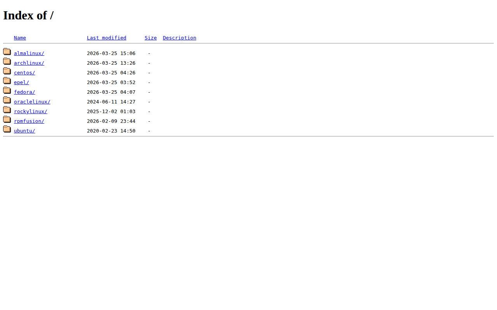 |
| `wptest1.skyapp.uib.no` | `HTTP 502` |
| `www.jper.uib.no` |  |
| `britannic.uib.no` | `ERR_NAME_NOT_RESOLVED` |
| `regler.app.uib.no` |  |
| `eksark.uib.no` | `ERR_NAME_NOT_RESOLVED` |
| `studentblogg.uib.no` | `ERR_NAME_NOT_RESOLVED` |
| `outlook.uib.no` | `ERR_NAME_NOT_RESOLVED` |
| `p2redirect01.uib.no` | `ERR_NAME_NOT_RESOLVED` |
| `grind.test.uib.no` | `HTTP 403` |
| `testbool.uib.no` | `ERR_NAME_NOT_RESOLVED` |
| `hoguslg.uib.no` | `ERR_NAME_NOT_RESOLVED` |
| `karlh.ii.uib.no` | `ERR_NAME_NOT_RESOLVED` |
| `docs.ub.uib.no` | `ERR_NAME_NOT_RESOLVED` |
| `norvana.uib.no` | `ERR_NAME_NOT_RESOLVED` |
| `prosopopeia.uib.no` | `ERR_NAME_NOT_RESOLVED` |
| `lyncwebext.uib.no` | `timeout` |
| `rancher.testapp.uib.no` | `timeout` |
| `ordbank-api.skytest.uib.no` | `timeout` |
| `macadmin.clortho.uib.no` | `ERR_NAME_NOT_RESOLVED` |
| `discretion.uib.no` |  |
| `riverside.uib.no` | `timeout` |
| `mx1-test01.test.uib.no` | `timeout` |
| `attika.uib.no` | `ERR_NAME_NOT_RESOLVED` |
| `backulf.uib.no` | `timeout` |
| `netdata.publisering-test.aws.uib.no` | `ERR_NAME_NOT_RESOLVED` |
| `tsmhsm.uib.no` | `timeout` |
| `testportal.video.uib.no` | `ERR_NAME_NOT_RESOLVED` |
| `scom-sql01.uib.no` | `timeout` |
| `double6.uib.no` | `ERR_NAME_NOT_RESOLVED` |
| `rd-sh08.uib.no` | `timeout` |
| `lesebag.skyapp.uib.no` | `HTTP 502` |
| `imap.fribyte.uib.no` | `timeout` |
| `blustar.uib.no` | `ERR_NAME_NOT_RESOLVED` |
| `sc12-ac1.klient.uib.no` | `ERR_NAME_NOT_RESOLVED` |
| `p1redirect01.uib.no` | `ERR_NAME_NOT_RESOLVED` |
| `sokweb.uib.no` | `ERR_NAME_NOT_RESOLVED` |
| `vurdering.uib.no` |  |
| `vurdering.test.uib.no` | `HTTP 404` |
| `sikker-vturn.uib.no` | `ERR_NAME_NOT_RESOLVED` |
| `www.bjerknes.uib.no` | 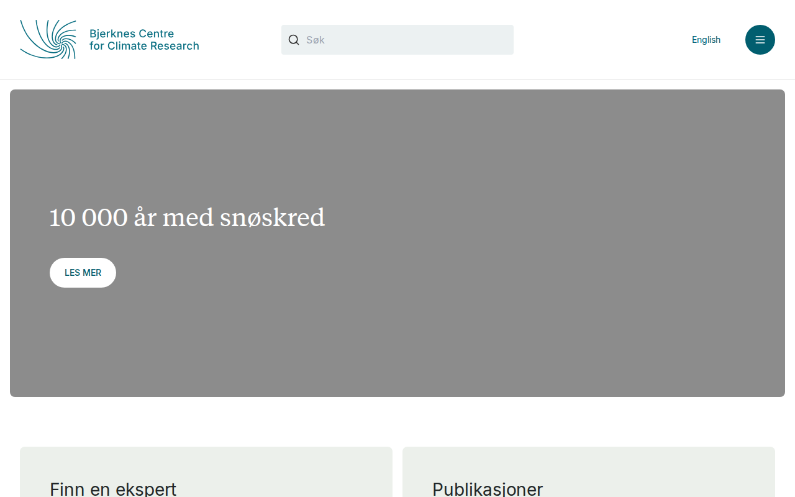 |
| `ellis.uib.no` | `timeout` |
| `nyheter.gfi.uib.no` |  |
| `um.publisering-test.aws.uib.no` | `ERR_NAME_NOT_RESOLVED` |
| `scom-mgmt03.uib.no` | `timeout` |
| `everyoneprint.uib.no` | `timeout` |
| `epletre.uib.no` | `ERR_NAME_NOT_RESOLVED` |
| `callmoo.uib.no` | `ERR_NAME_NOT_RESOLVED` |
| `web.gfi.uib.no` | 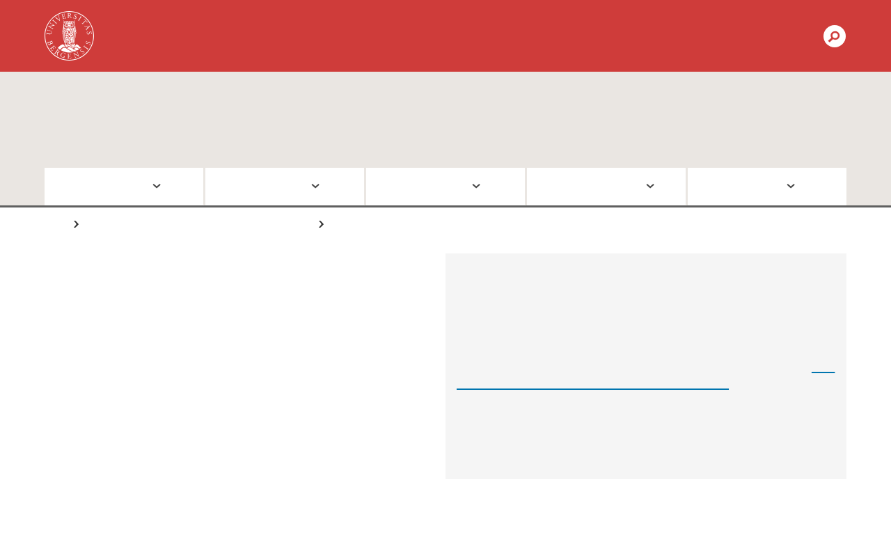 |
| `um.app.uib.no` | `ERR_NAME_NOT_RESOLVED` |
| `lakrisrot.uib.no` | `ERR_NAME_NOT_RESOLVED` |
| `cygwin.uib.no` | 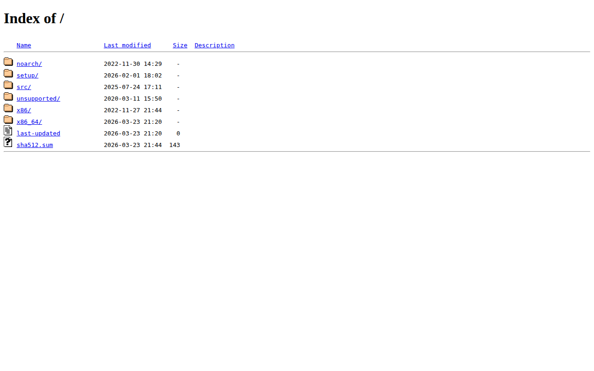 |
| `lyncadmin.uib.no` | `ERR_NAME_NOT_RESOLVED` |
| `scom-web01.uib.no` | `timeout` |
| `scom-sql02.uib.no` | `ERR_NAME_NOT_RESOLVED` |
| `ekstern.filer.uib.no` | `HTTP 403` |
| `smtp.asf.uib.no` | `ERR_NAME_NOT_RESOLVED` |
| `skrivebord.uib.no` | `timeout` |
| `imap.samfunnet.uib.no` | `ERR_NAME_NOT_RESOLVED` |
| `akuttmedisin.uib.no` | `ERR_NAME_NOT_RESOLVED` |
| `gliders.gfi.uib.no` | `timeout` |
| `metiri.uib.no` | `ERR_NAME_NOT_RESOLVED` |
| `prosjekt.nsd.uib.no` | `ERR_NAME_NOT_RESOLVED` |
| `macon.uib.no` | `timeout` |
| `salinas.uib.no` | `timeout` |
| `webmail.uib.no` |  |
| `munkiwebadmin.uib.no` | `ERR_NAME_NOT_RESOLVED` |
| `sardis.uib.no` | `timeout` |
| `rk-drupal.test.uib.no` | `ERR_NAME_NOT_RESOLVED` |
| `mprint.uib.no` | `HTTP 403` |
| `cbu.uib.no` |  |
| `puffin.ii.uib.no` | `ERR_NAME_NOT_RESOLVED` |
| `hollywood.uib.no` | `timeout` |
| `fairfield.uib.no` | `timeout` |
| `konferanse.uib.no` |  |
| `lydia.uib.no` |  |
| `darwin.uib.no` | 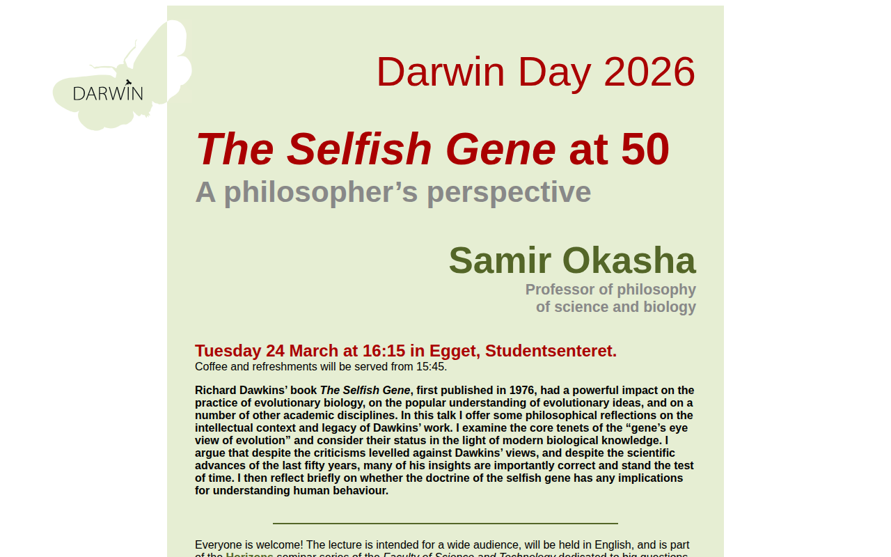 |
| `lynctlf2.uib.no` | `ERR_NAME_NOT_RESOLVED` |
| `alexandria.uib.no` | `ERR_NAME_NOT_RESOLVED` |
| `collingwood.uib.no` | `ERR_NAME_NOT_RESOLVED` |
| `phpmyadmin.fribyte.uib.no` | `timeout` |
| `rd-sh12.uib.no` | `timeout` |
| `ordbok.uib.no` |  |
| `tlt07.uib.no` | `ERR_NAME_NOT_RESOLVED` |
| `testfagpersonweb.uib.no` |  |
| `seqlab.test.uib.no` | `ERR_NAME_NOT_RESOLVED` |
| `rd-cb02.uib.no` | `timeout` |
| `phdportal.uib.no` | `ERR_NAME_NOT_RESOLVED` |
| `dashboard.test.iaas.uib.no` | `timeout` |
| `echo.uib.no` | 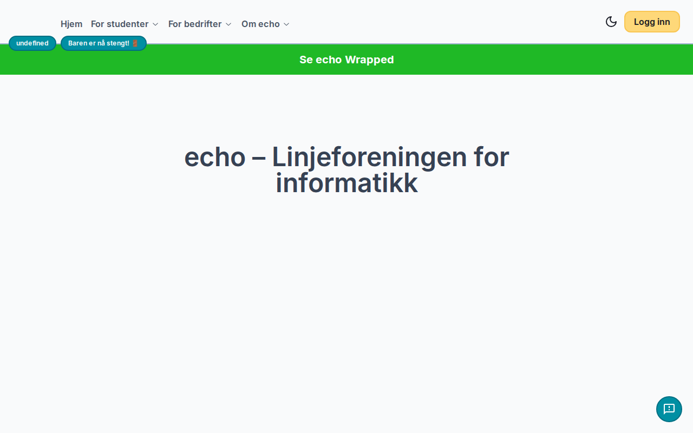 |
| `www.voices.uib.no` | `ERR_NAME_NOT_RESOLVED` |
| `valiant.uib.no` | `ERR_NAME_NOT_RESOLVED` |
| `ck-vi.uib.no` | `ERR_NAME_NOT_RESOLVED` |
| `presence.uib.no` | `ERR_NAME_NOT_RESOLVED` |
| `svn.fribyte.uib.no` | `timeout` |
| `lrs.avt2.apps.slate.uib.no` | `timeout` |
| `webhotell.uib.no` | `timeout` |
| `secure-video.uib.no` | `ERR_NAME_NOT_RESOLVED` |
| `angelica.uib.no` | `ERR_NAME_NOT_RESOLVED` |
| `gitlab.test.uib.no` | `timeout` |
| `clortho.uib.no` | `ERR_NAME_NOT_RESOLVED` |
| `preface.b.uib.no` | `ERR_NAME_NOT_RESOLVED` |
| `nomination.uib.no` | 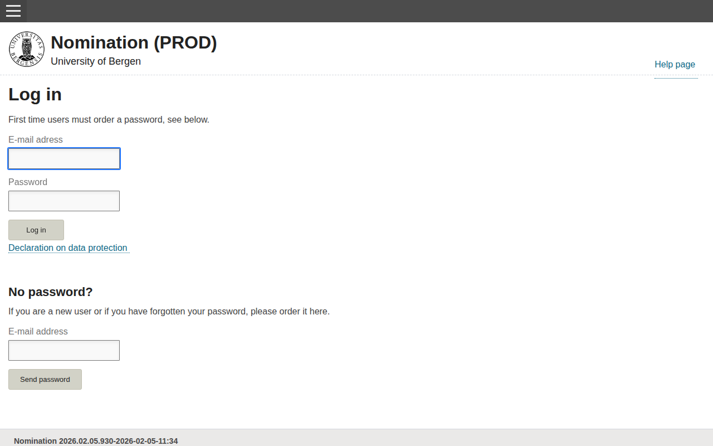 |
| `signicat.uib.no` |  |
| `c.uib.no` |  |
| `monarch.uib.no` | `ERR_NAME_NOT_RESOLVED` |
| `edgepool.uib.no` | `ERR_NAME_NOT_RESOLVED` |
| `w.uib.no` | 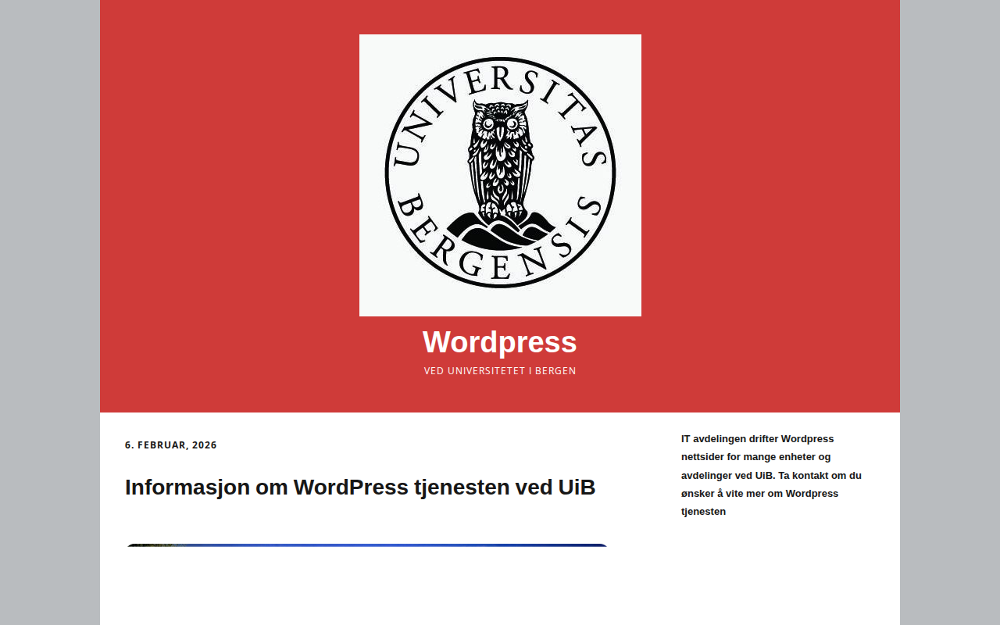 |
| `rosmarin.uib.no` | `ERR_NAME_NOT_RESOLVED` |
| `t2masterlb01.uib.no` | `ERR_NAME_NOT_RESOLVED` |
| `mailadm.fribyte.uib.no` | `timeout` |
| `skjemaker.uib.no` | `ERR_NAME_NOT_RESOLVED` |
| `stokkstein.ss.uib.no` | `ERR_NAME_NOT_RESOLVED` |
| `moskus.sib.uib.no` |  |
| `substr.uib.no` | `ERR_NAME_NOT_RESOLVED` |
| `nettfransk.uib.no` | `ERR_NAME_NOT_RESOLVED` |
| `sunlight.uib.no` | `ERR_NAME_NOT_RESOLVED` |
| `faktura.skyapp.uib.no` |  |
| `www.ii.uib.no` |  |
| `wikihost.uib.no` | `ERR_NAME_NOT_RESOLVED` |
| `surt.uib.no` | `timeout` |
| `www.holberg.uib.no` |  |
| `skolelab.uib.no` |  |
| `jambo.uib.no` |  |
| `lyncdiscover.uib.no` | `ERR_NAME_NOT_RESOLVED` |
| `imap.rf.uib.no` | `ERR_NAME_NOT_RESOLVED` |
| `rolf.uib.no` | `timeout` |
| `sardis2.uib.no` | `ERR_NAME_NOT_RESOLVED` |
| `mandel.uib.no` | `timeout` |
| `escheduler.uib.no` | `timeout` |
| `traefik.publisering-test.aws.uib.no` | `ERR_NAME_NOT_RESOLVED` |
| `kibana.uib.no` | `ERR_NAME_NOT_RESOLVED` |
| `pop.rf.uib.no` | `ERR_NAME_NOT_RESOLVED` |
| `lewisville.uib.no` | `timeout` |
| `testsw.uib.no` | `ERR_NAME_NOT_RESOLVED` |
| `digital-ub.uib.no` | `ERR_NAME_NOT_RESOLVED` |
| `nps2.uib.no` | `ERR_NAME_NOT_RESOLVED` |
| `artsapp.uib.no` |  |
| `my.traefik.app.aws.uib.no` | `ERR_NAME_NOT_RESOLVED` |
| `imbooking.uib.no` | `ERR_NAME_NOT_RESOLVED` |
| `elv.uib.no` |  |
| `rosenrot.uib.no` | `ERR_NAME_NOT_RESOLVED` |
| `venner.skyapp.uib.no` |  |
| `itschemistry.uib.no` | `ERR_NAME_NOT_RESOLVED` |
| `mx-service1.uib.no` | `timeout` |
| `sikker-skjema.uib.no` | `ERR_NAME_NOT_RESOLVED` |
| `build.skyapp.uib.no` |  |
| `skjemaker.testapp.uib.no` | `HTTP 403` |
| `streaming.videonotat.uib.no` |  |
| `synology9.geo.uib.no` | `ERR_NAME_NOT_RESOLVED` |
| `synology6.geo.uib.no` | `ERR_NAME_NOT_RESOLVED` |
| `prosjektportalen.uib.no` |  |
| `h.uib.no` | `timeout` |
| `my.skyapp.uib.no` |  |
| `studentportal.uib.no` | `ERR_NAME_NOT_RESOLVED` |
| `argument.uib.no` |  |
| `logstash.clortho.uib.no` | `ERR_NAME_NOT_RESOLVED` |
| `rd-sh13.uib.no` | `timeout` |
| `sd.uib.no` | `timeout` |
| `git.uib.no` | `ERR_NAME_NOT_RESOLVED` |
| `newsangler.uib.no` | `ERR_CONNECTION_REFUSED` |
| `ehandel.uib.no` | `timeout` |
| `archlinux.uib.no` | 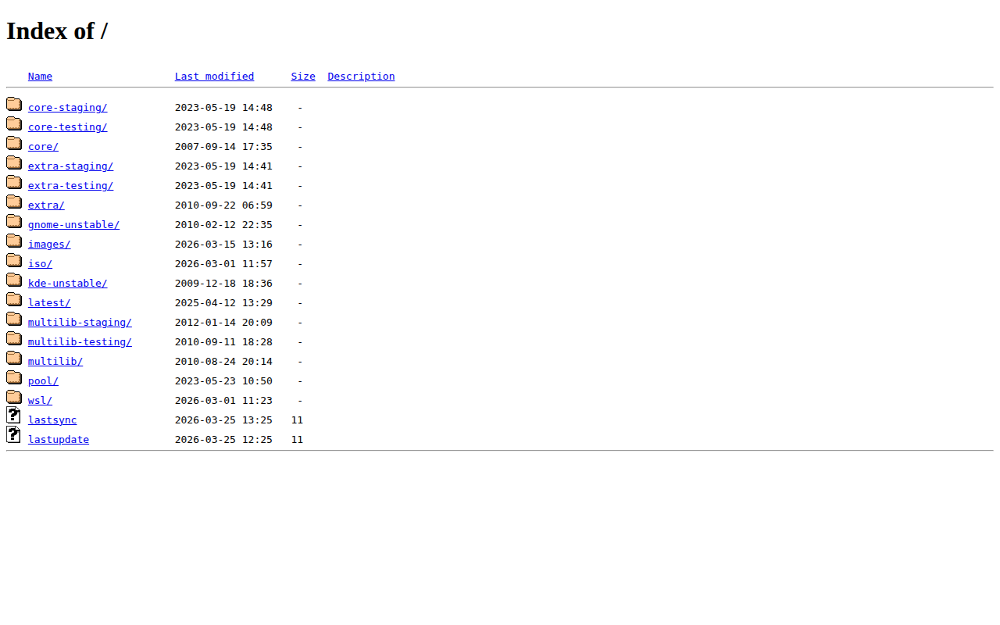 |
| `rettspraksis.h.uib.no` | `ERR_NAME_NOT_RESOLVED` |
| `scom-mgmt02.uib.no` | `timeout` |
| `dimp.nsd.uib.no` | `ERR_NAME_NOT_RESOLVED` |
| `webapps.uib.no` | `timeout` |
| `rebell.skyapp.uib.no` | `HTTP 502` |
| `nmr.uib.no` | `HTTP 403` |
| `bergmus.uib.no` | `ERR_NAME_NOT_RESOLVED` |
| `webmail.fribyte.uib.no` | `timeout` |
| `canvas.test.uib.no` | 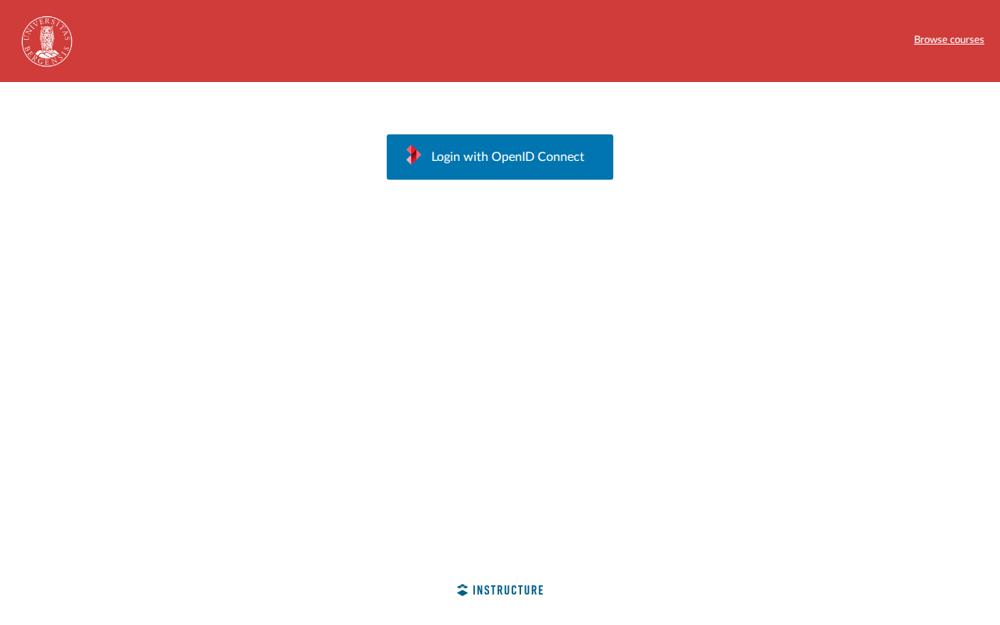 |
| `skolevalg2.nsd.uib.no` | `ERR_NAME_NOT_RESOLVED` |
| `ajax.uib.no` | `ERR_NAME_NOT_RESOLVED` |
| `zen.ii.uib.no` | `ERR_NAME_NOT_RESOLVED` |
| `ssis.uib.no` | `ERR_NAME_NOT_RESOLVED` |
| `assessment.uib.no` |  |
| `ibm-ts4500-taperobot-hib.mgmt.uib.no` | `timeout` |
| `ftp2.uib.no` | 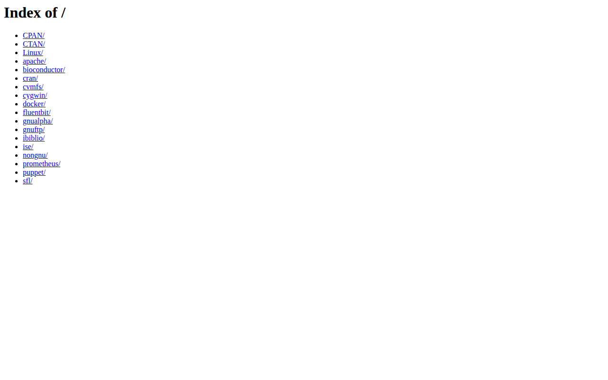 |
| `medvizvcbm.uib.no` | `ERR_NAME_NOT_RESOLVED` |
| `biostudent-ts07.uib.no` | `ERR_NAME_NOT_RESOLVED` |
| `teststudentweb.uib.no` | 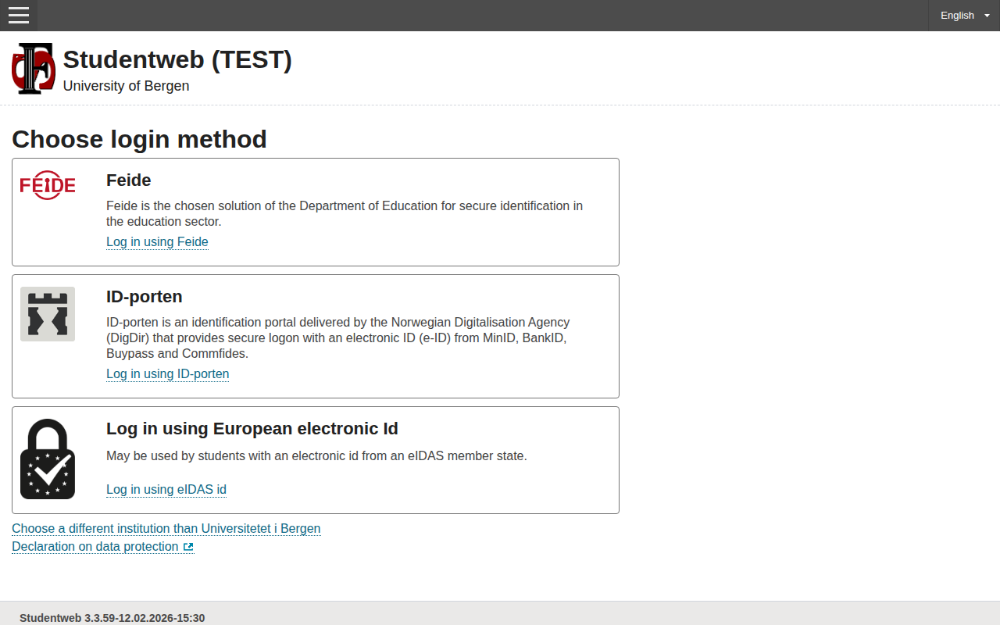 |
| `pita.uib.no` |  |
| `av.uib.no` | `timeout` |
| `rd-web02.uib.no` | `timeout` |
| `glidera.gfi.uib.no` | `timeout` |
| `d8.skytest.uib.no` | `timeout` |
| `baikal.fribyte.uib.no` | `timeout` |
| `digitalt.uib.no` | `timeout` |
| `epos-no.geo.uib.no` |  |
| `rasmus.uib.no` | `ERR_NAME_NOT_RESOLVED` |
| `brokk.uib.no` | `ERR_NAME_NOT_RESOLVED` |
| `colossus7.uib.no` | `ERR_NAME_NOT_RESOLVED` |
| `wiki.test.uib.no` | `ERR_NAME_NOT_RESOLVED` |
| `nomweb.uib.no` | `ERR_NAME_NOT_RESOLVED` |
| `outlook2.uib.no` | `ERR_NAME_NOT_RESOLVED` |
| `bjerknes.uib.no` |  |
| `sub.uib.no` |  |
| `iness.uib.no` | `timeout` |
| `dikult205.k.uib.no` | `timeout` |
| `crop.uib.no` | `timeout` |
| `midland.uib.no` | `timeout` |
| `studweb0.uib.no` | `ERR_NAME_NOT_RESOLVED` |
| `space.rokkan.uib.no` | `ERR_NAME_NOT_RESOLVED` |
| `rd-sh11.uib.no` | `timeout` |
| `sebrapilot.uib.no` | `ERR_NAME_NOT_RESOLVED` |
| `delta.geo.uib.no` | `timeout` |
| `rd-cb01.uib.no` | `timeout` |
| `mediaweb.uib.no` | `timeout` |
| `www.wix.slate.uib.no` | `HTTP 404` |
| `pearland.uib.no` | `timeout` |
| `open.uib.no` | `timeout` |
| `um.publisering.aws.uib.no` | `ERR_NAME_NOT_RESOLVED` |
| `alfred.uib.no` | `HTTP 403` |
| `itwiki.uib.no` |  |
| `software.ii.uib.no` | `ERR_NAME_NOT_RESOLVED` |
| `safecom-web.uib.no` | `timeout` |
| `crypt.uib.no` | `HTTP 403` |
| `pva.uib.no` |  |
| `evuweb.uib.no` |  |
| `synology4.geo.uib.no` | `ERR_NAME_NOT_RESOLVED` |
| `repo.clarino.uib.no` |  |
| `rowan.ii.uib.no` | `ERR_NAME_NOT_RESOLVED` |
| `sfb-webext01.uib.no` | `HTTP 503` |
| `kvase.uib.no` | `ERR_NAME_NOT_RESOLVED` |
| `ise-policy-292.uib.no` | `ERR_NAME_NOT_RESOLVED` |
| `exchange02.uib.no` | `ERR_NAME_NOT_RESOLVED` |
| `s3-bgo.skyapp.uib.no` | `HTTP 502` |
| `flyt.nsd.uib.no` | `ERR_NAME_NOT_RESOLVED` |
| `soknadsweb.uib.no` |  |
| `imap.uib.no` | `ERR_NAME_NOT_RESOLVED` |
| `vide.uib.no` | `ERR_NAME_NOT_RESOLVED` |
| `joshiapps.cbu.uib.no` |  |
| `hpc.uib.no` | `timeout` |
| `omod.uib.no` | `ERR_NAME_NOT_RESOLVED` |
| `ve.uib.no` | `ERR_NAME_NOT_RESOLVED` |
| `git.fribyte.uib.no` | `timeout` |
| `pollen.uib.no` | `ERR_NAME_NOT_RESOLVED` |
| `hibagon.uib.no` | `ERR_NAME_NOT_RESOLVED` |
| `www.discretion.uib.no` |  |
| `mode.uib.no` | `timeout` |
| `macadmin.uib.no` | `ERR_NAME_NOT_RESOLVED` |
| `sparql.birgitta.uib.no` | 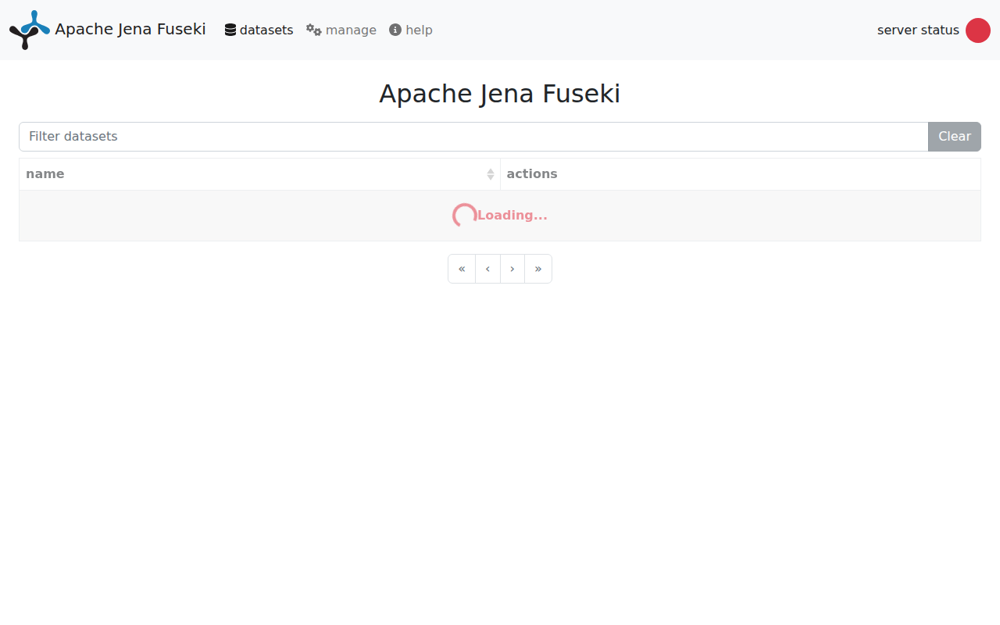 |
| `nps.uib.no` | `ERR_NAME_NOT_RESOLVED` |
| `kb.skyapp.uib.no` |  |
| `modesto.uib.no` | `timeout` |
| `files.skyapp.uib.no` |  |
| `biostudent-ts04.uib.no` | `ERR_NAME_NOT_RESOLVED` |
| `scalacm.uib.no` | `ERR_NAME_NOT_RESOLVED` |
| `dev.supermag.uib.no` | `ERR_NAME_NOT_RESOLVED` |
| `palmdale.uib.no` | `timeout` |
| `noffo.uib.no` | `timeout` |
| `opencsw.uib.no` | `ERR_NAME_NOT_RESOLVED` |
| `foreman.ii.uib.no` | `ERR_NAME_NOT_RESOLVED` |
| `rick.geo.uib.no` | `timeout` |
| `nps1.uib.no` | `ERR_NAME_NOT_RESOLVED` |
| `gunnlod.uib.no` | `ERR_NAME_NOT_RESOLVED` |
| `inventar.fribyte.uib.no` | `timeout` |
| `buf.uib.no` | `ERR_NAME_NOT_RESOLVED` |
| `dars.uib.no` | 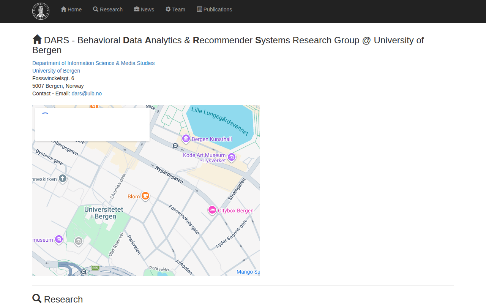 |
| `p1eark01.uib.no` | `timeout` |
| `float.uib.no` | `ERR_NAME_NOT_RESOLVED` |
| `testsokw.uib.no` | `ERR_NAME_NOT_RESOLVED` |
| `sfb-webpool01.uib.no` | `ERR_NAME_NOT_RESOLVED` |
| `auth.api.apps.slate.uib.no` | `timeout` |
| `testevuw.uib.no` | `ERR_NAME_NOT_RESOLVED` |
| `supermag.uib.no` | `ERR_NAME_NOT_RESOLVED` |
| `people.uib.no` | `ERR_NAME_NOT_RESOLVED` |
| `testfpweb.uib.no` | `ERR_NAME_NOT_RESOLVED` |
| `bioceed.uib.no` |  |
| `naglfar.uib.no` | `ERR_NAME_NOT_RESOLVED` |
| `mirrors.uib.no` |  |
| `alertmanager.app.aws.uib.no` | `ERR_NAME_NOT_RESOLVED` |
| `terminator.uib.no` | `ERR_NAME_NOT_RESOLVED` |
| `staticstat.app.uib.no` |  |
| `reg.skytest.uib.no` | `timeout` |
| `cismac.uib.no` | 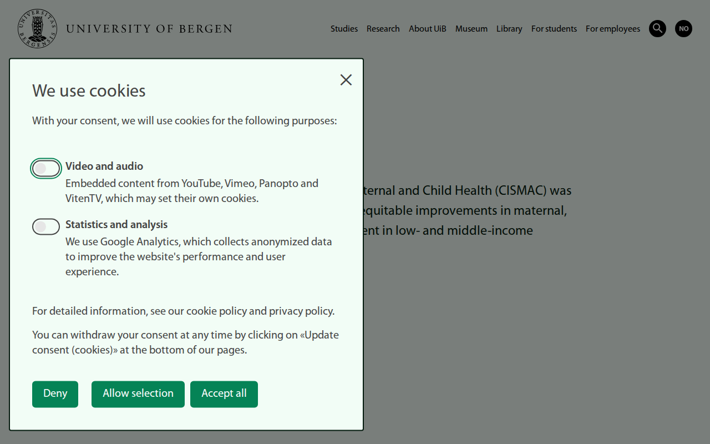 |
| `biostudent-ts05.uib.no` | `ERR_NAME_NOT_RESOLVED` |
| `sus.infomedia.uib.no` | `ERR_NAME_NOT_RESOLVED` |
| `tor.uib.no` | `ERR_NAME_NOT_RESOLVED` |
| `ascom.uib.no` | `timeout` |
| `booking.infomedia.uib.no` | `ERR_NAME_NOT_RESOLVED` |
| `smtp.uib.no` | `timeout` |
| `trygg.nsd.uib.no` | `ERR_NAME_NOT_RESOLVED` |
| `pad.skyapp.uib.no` |  |
| `epay.uib.no` | `ERR_NAME_NOT_RESOLVED` |
| `www.stats.cbu.uib.no` | `ERR_NAME_NOT_RESOLVED` |
| `sfb-fe02.uib.no` | `ERR_NAME_NOT_RESOLVED` |
| `sokogskriv.uib.no` | `ERR_NAME_NOT_RESOLVED` |
| `imdb.uib.no` | `ERR_NAME_NOT_RESOLVED` |
| `api.avt2.apps.slate.uib.no` | `timeout` |
| `esm.uib.no` | `HTTP 409` |
| `www.bells.uib.no` |  |
| `mattermost.ii.uib.no` | `ERR_NAME_NOT_RESOLVED` |
| `pad.app.uib.no` |  |
| `www.lingo.uib.no` | `ERR_NAME_NOT_RESOLVED` |
| `vlerce.skytest.uib.no` | `timeout` |
| `colossus6.uib.no` | `ERR_NAME_NOT_RESOLVED` |
| `rd-sh09.uib.no` | `timeout` |
| `eclipse.uib.no` | `ERR_NAME_NOT_RESOLVED` |
| `www.blak.uib.no` | `ERR_NAME_NOT_RESOLVED` |
| `skrotogskriv.app.uib.no` | `ERR_NAME_NOT_RESOLVED` |
| `ferdighetssenteret.uib.no` |  |
| `whitespire.ii.uib.no` | `ERR_NAME_NOT_RESOLVED` |
| `hjelp.uib.no` |  |
| `test.search.uib.no` | `timeout` |
| `scholar.uib.no` | `ERR_NAME_NOT_RESOLVED` |
| `apendix2.uib.no` | `ERR_NAME_NOT_RESOLVED` |
| `epost.uib.no` |  |
| `borodino.uib.no` | `ERR_NAME_NOT_RESOLVED` |
| `www.student.uib.no` | `ERR_NAME_NOT_RESOLVED` |
| `bldl.ii.uib.no` |  |
| `half.uib.no` | `HTTP 403` |
| `smtp.student.uib.no` | `timeout` |
| `blak.h.uib.no` | `ERR_NAME_NOT_RESOLVED` |
| `enterprise.uib.no` | `ERR_NAME_NOT_RESOLVED` |
| `purlmoo.uib.no` | `ERR_NAME_NOT_RESOLVED` |
| `dialin.uib.no` | `HTTP 503` |
| `dac2000.uib.no` | `ERR_NAME_NOT_RESOLVED` |
| `milwaukee.uib.no` | `timeout` |
| `blak.uib.no` | `ERR_NAME_NOT_RESOLVED` |
| `mx1.test.uib.no` | `ERR_NAME_NOT_RESOLVED` |
| `regonline.uib.no` |  |
| `portal.uib.no` | `timeout` |
| `inn.uib.no` | `ERR_NAME_NOT_RESOLVED` |
| `dikultba.h.uib.no` | `ERR_NAME_NOT_RESOLVED` |
| `read.app.uib.no` | `HTTP 502` |
| `mine.uib.no` | `ERR_NAME_NOT_RESOLVED` |
| `webscheme.uib.no` | `ERR_NAME_NOT_RESOLVED` |
| `payprint.uib.no` | `HTTP 403` |
| `dep.uib.no` | `ERR_NAME_NOT_RESOLVED` |
| `mib.uib.no` | `timeout` |
| `ise-admin-292.uib.no` | `ERR_NAME_NOT_RESOLVED` |
| `mx1-bt01.uib.no` | `timeout` |
| `structure.uib.no` | `ERR_NAME_NOT_RESOLVED` |
| `dmnx.uib.no` | `timeout` |
| `killeen.uib.no` | `timeout` |
| `redmine.it.uib.no` | `ERR_NAME_NOT_RESOLVED` |
| `birgitta.test.uib.no` | `timeout` |
| `eprint.uib.no` | `ERR_NAME_NOT_RESOLVED` |
| `gfi063011.uib.no` | `ERR_NAME_NOT_RESOLVED` |
| `vedlegg.uib.no` | `ERR_NAME_NOT_RESOLVED` |
| `ujour.skyapp.uib.no` |  |
| `ubsc.uib.no` | `ERR_NAME_NOT_RESOLVED` |
| `smtp.samfunnet.uib.no` | `ERR_NAME_NOT_RESOLVED` |
| `peoria.uib.no` | `timeout` |
| `marimbaconsole.uib.no` | `ERR_NAME_NOT_RESOLVED` |
| `nymail.fribyte.uib.no` | `timeout` |
| `rts.test.uib.no` | `ERR_NAME_NOT_RESOLVED` |
| `webmail3.fribyte.uib.no` | `timeout` |
| `esm.test.uib.no` |  |
| `search.uib.no` |  |
| `bjerknes.pilot.uib.no` | `ERR_NAME_NOT_RESOLVED` |
| `iveret.gfi.uib.no` | 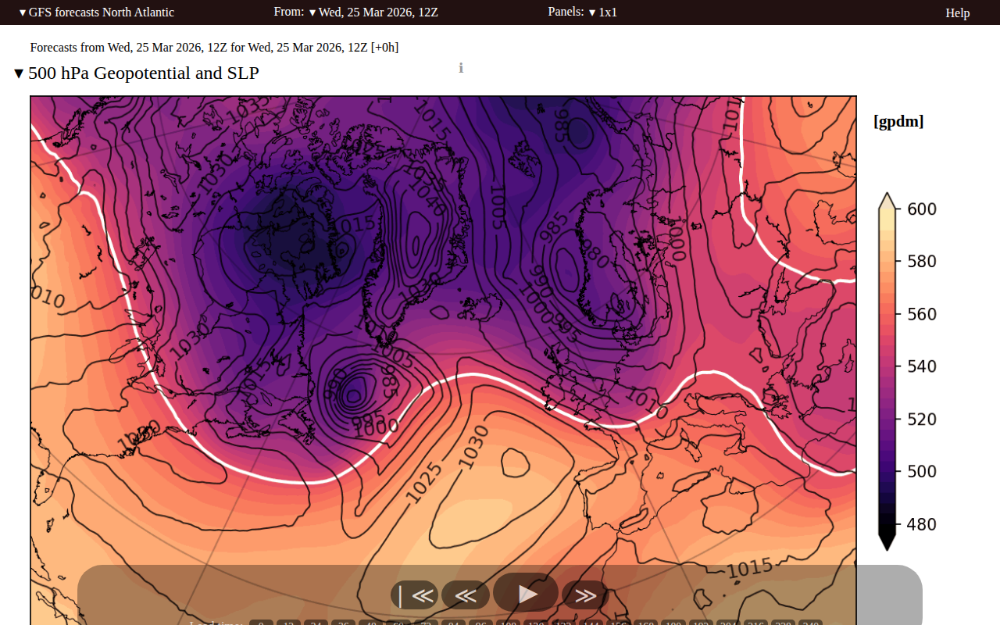 |
| `scom-ssrs01.uib.no` | `timeout` |
| `webmail.testapp.uib.no` | `ERR_NAME_NOT_RESOLVED` |
| `mirror.ii.uib.no` | `ERR_NAME_NOT_RESOLVED` |
| `independence.uib.no` | `timeout` |
| `sujo-test.skyapp.uib.no` |  |
| `edda.uib.no` | `timeout` |
| `scom.uib.no` | `timeout` |
| `sikre.filer.uib.no` | `ERR_NAME_NOT_RESOLVED` |
| `rd-sh10.uib.no` | `timeout` |
| `esx.uib.no` | `timeout` |
| `synology5.geo.uib.no` | `ERR_NAME_NOT_RESOLVED` |
| `apache.uib.no` |  |
| `uib-san1.uib.no` | `ERR_NAME_NOT_RESOLVED` |
| `agamemnon.uib.no` | `ERR_NAME_NOT_RESOLVED` |
| `orontes.uib.no` | `ERR_NAME_NOT_RESOLVED` |
| `friends.skyapp.uib.no` |  |
| `cpan.uib.no` |  |
| `aka.uib.no` | `timeout` |
| `baia-lab.uib.no` | `ERR_NAME_NOT_RESOLVED` |
| `www.i2s.uib.no` | `ERR_CONNECTION_REFUSED` |
| `beta.asf.uib.no` | `ERR_NAME_NOT_RESOLVED` |
| `meet.uib.no` | `HTTP 503` |
| `lelle.publisering-test.aws.uib.no` | `ERR_NAME_NOT_RESOLVED` |
| `w2.uib.no` |  |
| `jupyter.ii.uib.no` | `ERR_NAME_NOT_RESOLVED` |
| `supertimon.cbu.uib.no` | `ERR_NAME_NOT_RESOLVED` |
| `board.skyapp.uib.no` |  |
| `exam.uib.no` |  |
| `elkat.uib.no` | `ERR_NAME_NOT_RESOLVED` |
| `mdm.uib.no` | `ERR_NAME_NOT_RESOLVED` |
| `myrte.uib.no` | `timeout` |
| `attila.uib.no` | `ERR_NAME_NOT_RESOLVED` |
| `esm.dev.uib.no` | `HTTP 409` |
| `ggzgamingzone.uib.no` | `ERR_NAME_NOT_RESOLVED` |
| `trud.uib.no` | `ERR_NAME_NOT_RESOLVED` |
| `sc12-cm.uib.no` | `ERR_NAME_NOT_RESOLVED` |
| `ganeti.fribyte.uib.no` | `ERR_CONNECTION_REFUSED` |
| `inf101.ii.uib.no` | `ERR_NAME_NOT_RESOLVED` |
| `minside.uib.no` | `ERR_NAME_NOT_RESOLVED` |
| `hyperion.uib.no` | `ERR_NAME_NOT_RESOLVED` |
| `huld.uib.no` | `timeout` |
| `synology7.geo.uib.no` | `ERR_NAME_NOT_RESOLVED` |
| `serveradmin.uib.no` | `timeout` |
| `atrium.uib.no` | `ERR_NAME_NOT_RESOLVED` |
| `test.uib.no` | `ERR_NAME_NOT_RESOLVED` |
| `replay.video.uib.no` | `ERR_NAME_NOT_RESOLVED` |
| `bigs.uib.no` | `ERR_NAME_NOT_RESOLVED` |
| `fragment.uib.no` | 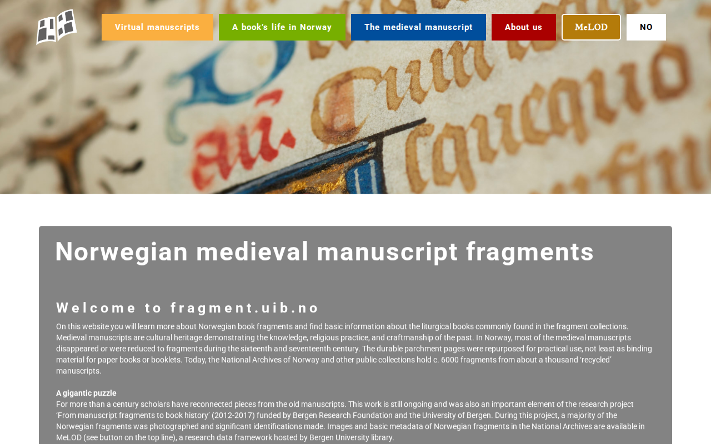 |
| `ctan.uib.no` |  |
| `real.uib.no` | `ERR_NAME_NOT_RESOLVED` |
| `api.apps.slate.uib.no` | `timeout` |
| `teststudweb.uib.no` | `ERR_NAME_NOT_RESOLVED` |
| `eksamen.uib.no` |  |
