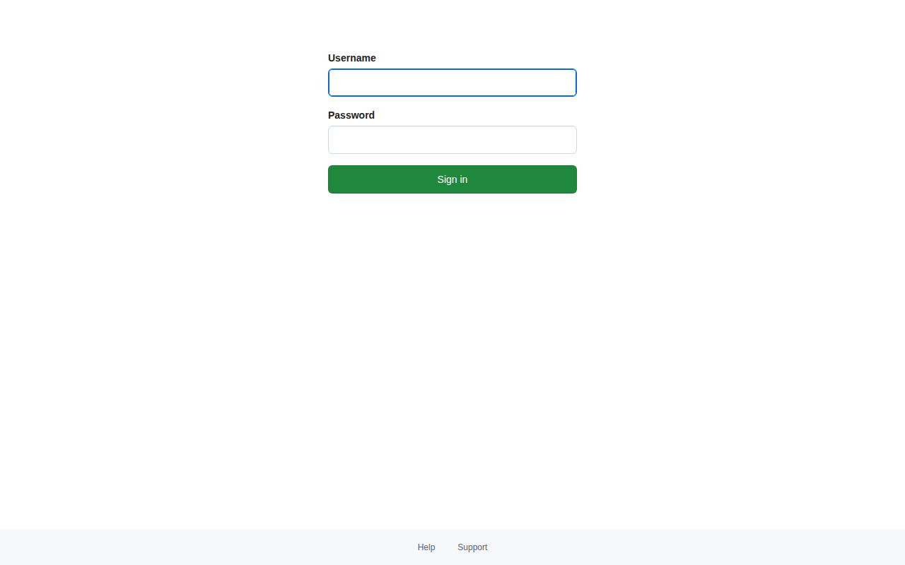

# uio.no — 2026-03-23_14-17-50

Certificates queried from [crt.sh](https://crt.sh/?q=%.uio.no).

**50 unique domain(s) found.**

| Domain | Screenshot |
|--------|-----------|
| `absolute-test.uio.no` | *(screenshot unavailable)* |
| `adds.exprod.uio.no` | *(screenshot unavailable)* |
| `adds.exutv.uio.no` | *(screenshot unavailable)* |
| `admin.uio.no` | *(screenshot unavailable)* |
| `adminkiosk.uio.no` | *(screenshot unavailable)* |
| `alambic.github.uio.no` |  |
| `alanine.uio.no` | *(screenshot unavailable)* |
| `alumnus.uio.no` | *(screenshot unavailable)* |
| `an.dmlf.hf.uio.no` | *(screenshot unavailable)* |
| `analytics.ifi.uio.no` | *(screenshot unavailable)* |
| `api-gw-prod01.uio.no` | *(screenshot unavailable)* |
| `api-ha-staging01.uio.no` | *(screenshot unavailable)* |
| `api-ha-staging02.uio.no` | *(screenshot unavailable)* |
| `api-ha-staging03.uio.no` | *(screenshot unavailable)* |
| `api-ha-staging04.uio.no` | *(screenshot unavailable)* |
| `api-ha-staging05.uio.no` | *(screenshot unavailable)* |
| `api-ha-staging06.uio.no` | *(screenshot unavailable)* |
| `api-ha-staging07.uio.no` | *(screenshot unavailable)* |
| `api-ha-staging08.uio.no` | *(screenshot unavailable)* |
| `api-ha-staging09.uio.no` | *(screenshot unavailable)* |
| `api-ha-staging10.uio.no` | *(screenshot unavailable)* |
| `api-ha-staging11.uio.no` | *(screenshot unavailable)* |
| `api-ha-staging12.uio.no` | *(screenshot unavailable)* |
| `api-ha-staging13.uio.no` | *(screenshot unavailable)* |
| `api-ha-staging14.uio.no` | *(screenshot unavailable)* |
| `api-ha-staging15.uio.no` | *(screenshot unavailable)* |
| `api-ha-staging16.uio.no` | *(screenshot unavailable)* |
| `api-ha-staging17.uio.no` | *(screenshot unavailable)* |
| `api-ha-staging18.uio.no` | *(screenshot unavailable)* |
| `api-ha-staging19.uio.no` | *(screenshot unavailable)* |
| `api-ha-staging20.uio.no` | *(screenshot unavailable)* |
| `api-pilot.usit.uio.no` | *(screenshot unavailable)* |
| `api-staging-gateway.uio.no` | *(screenshot unavailable)* |
| `api-staging.uio.no` | *(screenshot unavailable)* |
| `api-staging01.uio.no` | *(screenshot unavailable)* |
| `api-staging02.uio.no` | *(screenshot unavailable)* |
| `api-staging03.uio.no` | *(screenshot unavailable)* |
| `api-staging04.uio.no` | *(screenshot unavailable)* |
| `api-staging05.uio.no` | *(screenshot unavailable)* |
| `api-staging06.uio.no` | *(screenshot unavailable)* |
| `api-staging07.uio.no` | *(screenshot unavailable)* |
| `api-staging08.uio.no` | *(screenshot unavailable)* |
| `api-staging09.uio.no` | *(screenshot unavailable)* |
| `api-staging10.uio.no` | *(screenshot unavailable)* |
| `api-staging11.uio.no` | *(screenshot unavailable)* |
| `api-staging12.uio.no` | *(screenshot unavailable)* |
| `api-staging13.uio.no` | *(screenshot unavailable)* |
| `api-staging14.uio.no` | *(screenshot unavailable)* |
| `api-staging15.uio.no` | *(screenshot unavailable)* |
| `api-staging16.uio.no` | *(screenshot unavailable)* |
